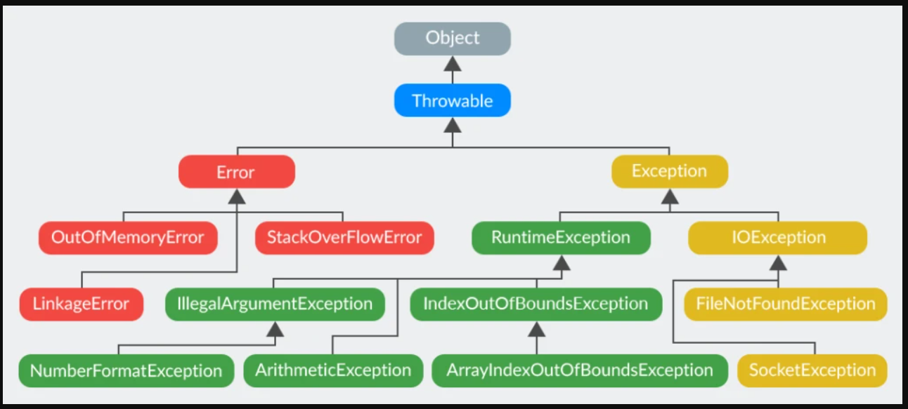

# Exceptions
Здесь будет все об Исключениях

начнем с разбора вопросов с [этого](https://telegra.ph/Voprosy-CORE-1-02-04) источника

## Содержание
- [Что такое исключения?](#что-такое-исключения)
- [Опишите иерархию исключений](#опишите-иерархию-исключений)
- [Расскажите про обрабатываемые и необрабатываемые исключения](#расскажите-про-обрабатываемые-и-необрабатываемые-исключения)
- [Какой оператор позволяет принудительно выбросить исключение?](#какой-оператор-позволяет-принудительно-выбросить-исключение)
- [О чем говорит ключевое слово throws?](#о-чем-говорит-ключевое-слово-throws)
- [Как создать собственное (пользовательское) исключение?](#как-создать-собственное-пользовательское-исключение)
- [Расскажите про механизм обработки исключений в Java (Try-catch-finally)](#расскажите-про-механизм-обработки-исключений-в-java-try-catch-finally)
- [Возможно ли использование блока try-finally (без catch)?](#возможно-ли-использование-блока-try-finally-без-catch)
- [Всегда ли выполняется блок finally? Существуют ли ситуации, когда блок finally не будет выполнен?](#всегда-ли-выполняется-блок-finally-существуют-ли-ситуации-когда-блок-finally-не-будет-выполнен)
- [Может ли метод main() выбросить исключение во вне и если да, то где будет происходить обработка данного исключения?](#может-ли-метод-main-выбросить-исключение-во-вне-и-если-да-то-где-будет-происходить-обработка-данного-исключения)
- [В каком порядке следует обрабатывать исключения в catch блоках?](#в-каком-порядке-следует-обрабатывать-исключения-в-catch-блоках)
- [Что такое механизм try-with-resources?](#что-такое-механизм-try-with-resources)
- [Что произойдет если исключение будет выброшено из блока catch после чего другое исключение будет выброшено из блока finally?](#что-произойдет-если-исключение-будет-выброшено-из-блока-catch-после-чего-другое-исключение-будет-выброшено-из-блока-finally)
- [Что произойдет если исключение будет выброшено из блока catch после чего другое исключение будет выброшено из метода close() при использовании try-with-resources?](#что-произойдет-если-исключение-будет-выброшено-из-блока-catch-после-чего-другое-исключение-будет-выброшено-из-метода-close-при-использовании-try-with-resources)

## Вопросы

### Что такое исключения?

Это некое событие, которое встречается при выполнении программы И прерывает стандартный ход ее выполнения

в Java это -- обхекты/ экземпляры класса. они могут пораждаться не только автоматически, но и создаваться самим разработчиком

все классы-исключения наследуются от `Throwable` (могут быть брошенными через слово `throw`)

### Опишите иерархию исключений



все от `Throwable`

`Error` - ошибки виртуальной машины. Примеры:
- `StackOverflowError` — возникает, например, когда метод бесконечно вызывает сам себя
- `OutOfMemoryError` - недостаточно памяти для создания новых объектов
- `NoClassDefFoundError` - не нашел класс

Желательно `Error` не обрабатывать

Философия `Exception` такая, что -- проблемы в программе, которые в приницпе решаемы и предсказуемы

примеры `RuntimeException`-ов(названия в принципе оправдыют себя):
- `ArithmeticException` -- при делении на 0
- `IndexOutOfBoundException` - тип индекса вышел за допустимые пределы
- `IllefalArgumentException` - неверный аргумент при вызове метода
- `NullPointerException`
- `NumberFormatException` - при преобразовании строки в число
- `ArrayIndexOutOfBoundException` -- за пределы массива выход

### Расскажите про обрабатываемые и необрабатываемые исключения

Типы исключений:
- `checked`(проверяемые) -- должны обрабатываться(блок catch) или описываться в сигнатуре метода. Эти моменты проверяются на этапе компиляции. все проверяемы исключения наследуются от `Exception`

- `unchecked`(непроверяемые) -- это `Error` и `RuntimeException`(и его наследники). их Можно и не обрабатывать и не писать в сигнатуре метода (то есть -- можно и написать, но можно и не писать). наличие/обработка такого исключения происходит на этапе выполнения программы

### Какой оператор позволяет принудительно выбросить исключение?

*throw new Exception();*

### О чем говорит ключевое слово throws?

этот модификатор прописывается в сигнатуре метода и указывает на то, что метод потенциально может выбросить исключение с указанным типом

### Как создать собственное (пользовательское) исключение?

нужно унаследоваться от `Exception` или `RuntimeException`

### Расскажите про механизм обработки исключений в Java (Try-catch-finally)

- `try` - ключевое слово, что исп. для отметки начала блока кода, где Может возникнуть ошибка/исключительная ситуация

- `catch` - ключевое слово, что исп. для отметки начала блока кода, что предназначен для перехвата и обработки исключений в Случае их возникновения

- `finally` - ключевое слово, что исп. для отметки начала блока кода, который будет выполнен в любом случае (ну точнее -- есть случаи, когда он не выполниться, но об этом ниже) -- в независимости от того, брошено исключение или нет. является необзятельным (т.е. -- этот блок можно и не писать) И так же помещается после последнего блока `catch`

```java
try { 
    ...
} catch(SomeException1 e ) {
    ...
} catch(SomeException2 e ) {
    ...
} ... {

} catch(SomeExceptionN e ) {
    ...
} finally { 
    ...
}
```

### Возможно ли использование блока try-finally (без catch)?

да

```java
try { 
    ...
} finally { 
    ...
}
```
### Может ли один блок catch отлавливать сразу несколько исключений?

да

```java
try { 
    ...
} catch(SomeException1 | SomeException2 | ... | SomeExceptionN e ) {
    ...
} 
```

### Всегда ли выполняется блок finally? Существуют ли ситуации, когда блок finally не будет выполнен?

не всегда, есть такие ситуации:
- когда `System.exit(o)` вызывается из блока `try`

- когда в JVM нехватает памяти (само исключение `OutOfMemoryException` как бы не является причиной, а именно сам уже Факт того, что Реально не хватает памяти) (крч -- критические ошибки JVM: `OutOfMemoryException`, `StackOverflowError` и тд)

- когда Java-процесс принудительно убит (из задачи, или из консоли, комп отлючился Сам) -- аварийное заверщение JVM

- условие взаимоблокироваки потоков в блоке `try` (мб не совсем корректно, ведь -- мы даже не дошли до блока. спорный момент, нужно быть аккуратным наверное)

### Может ли метод main() выбросить исключение во вне и если да, то где будет происходить обработка данного исключения?

может и оно будет переданно в JVM

### В каком порядке следует обрабатывать исключения в catch блоках?

нужно обрабатывать от Младшего к Старшему по иерархии. 
иначе если поставить в начале *catch(Exception e)*, то он будет принемать все исключения, а до последующих блоков и не дойдет (Exception -- родитель всех исключений(ну кроме Error))

### Что такое механизм try-with-resources?

такая конструкция (появилась в Java 7), что позволяет использовать блок `try-catch` не заботясь о закрытии ресурсов, что используются в данном сегменте кода.

ресурсы объявляеются в скобках перед *try*, а далее компилятор сам неявно создает секцию *finally*, где и происходит освобождения ресурса

Ресурсы в данном контексте -- те, кто реализует интерфейс `java.lang.Autocloseable`

```java
try(/*объявление ресурсов*/) {

  //...

} catch(Exception ex) {

  //...

} finally {

  //...

}
```
Замечание: блоки *catch* и *finally* выполняются уже после того, как закрываются ресурсы в неявном *finally*

### Что произойдет если исключение будет выброшено из блока catch после чего другое исключение будет выброшено из блока finally?

Если исключение выбрасывается в блоке `catch`, а затем другое исключение выбрасывается в блоке `finally`, то:
- исключение из `finally` перезапишет исключение из `catch`
- наружу выйдет именно исключение из `finally`
- исключение из `catch` будет потеряно (если его специально не сохранить)

Аналогично:
- если одно исключение возникло в `try`,
- а второе — в `finally`, то наружу выйдет исключение из `finally`.

### Что произойдет если исключение будет выброшено из блока catch после чего другое исключение будет выброшено из метода close() при использовании try-with-resources?

Если исключение возникает в основном блоке `try`, а затем другое исключение выбрасывается в методе `close()` ресурса (в конструкции `try-with-resources`), то:

- основным (*primary*) считается исключение из блока `try`
- исключение из `close()` не теряется, а становится подавленным (*suppressed*)
- оно автоматически добавляется к основному исключению с помощью метода
`Throwable.addSuppressed()`, который вызывается компилятором неявно

Получить подавленные исключения можно через:

```java
Throwable[] suppressed = exception.getSuppressed();
```