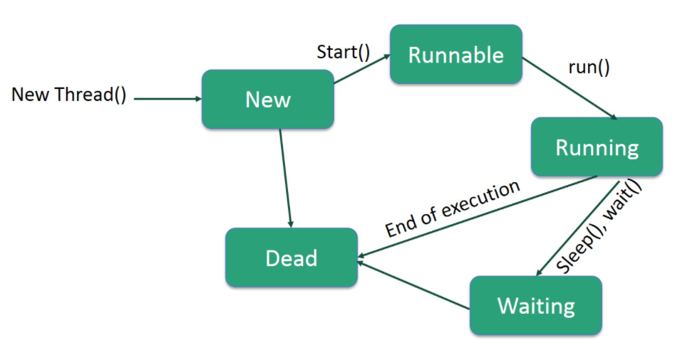
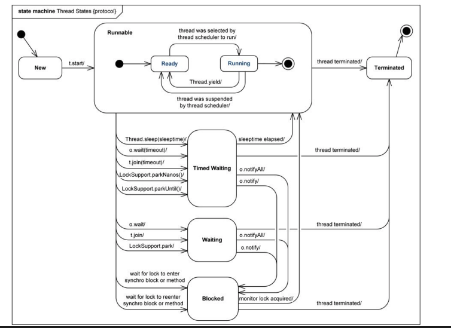
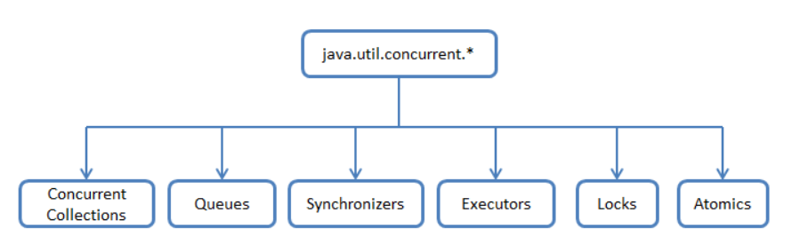

# Multithreading
## Введение
здесь будет собрана вся информация об Многопоточности 

начнем с разбора вопросов с [этого](https://telegra.ph/Voprosy-po-mnogopotochnosti-02-04) источника \
так же я добавил сюда вопросы с [поступашек](https://t.me/postypashki_old/1507) \
и так же с [лошади](https://github.com/enhorse/java-interview/blob/master/concurrency.md#%D0%A0%D0%B0%D1%81%D1%81%D0%BA%D0%B0%D0%B6%D0%B8%D1%82%D0%B5-%D0%BE-%D0%BC%D0%BE%D0%B4%D0%B5%D0%BB%D0%B8-%D0%BF%D0%B0%D0%BC%D1%8F%D1%82%D0%B8-java) \
так же советую ознакомиться с конспектом с [Т-Академии](../T-Academy/1-semester/multithreading.md) -- тут про все новые подходы, проблемы, паттерны проектирования и так далее

## Содержание
некоторые общие вопросы отсылают к тем, что в новом или старом API, в которых уже написано и как оно реализовано в Java

так же последовательность вопросов немного не последовательная

- Общие вопросы
    - [Чем процесс отличается от потока?](#чем-процесс-отличается-от-потока)
    - [Что такое монитор?](#что-такое-монитор-как-монитор-реализован-в-java)
    - [Жизненный цикл потока и его состояния в Java](#жизненный-цикл-потока-и-его-состояния-в-java)
    - [Что такое синхронизация?](#что-такое-синхронизация-какие-способы-синхронизации-существуют-в-java)
    - [Что такое потоки демоны? Для чего они нужны? Как создать поток-демон?](#что-такое-потоки-демоны-для-чего-они-нужны-как-создать-поток-демон)
    - [Что такое приоритет потока? На что он влияет? Какой приоритет у потоков по умолчанию?](#что-такое-приоритет-потока-на-что-он-влияет-какой-приоритет-у-потоков-по-умолчанию)
    - [Что такое deadlock?](#что-такое-deadlock)
    - [Что такое livelock?](#что-такое-livelock)
    - [Что такое race condition?](#что-такое-race-condition)

- Старый API
    - [Об классе Thread](#об-классе-thread)
    - [Чем Thread отличается от Runnable? Когда нужно использовать Thread, а когда Runnable?](#чем-thread-отличается-от-runnable-когда-нужно-использовать-thread-а-когда-runnable)
    - [Что такое монитор? Как монитор реализован в java?](#что-такое-монитор-как-монитор-реализован-в-java)
    - [Что является монитором у статического синхронизированного класса?](#что-является-монитором-у-статического-синхронизированного-класса)
    - [Что является монитором у нестатического синхронизированного класса?](#что-является-монитором-у-нестатического-синхронизированного-класса)
    - [Что такое синхронизация? Какие способы синхронизации существуют в java?](#что-такое-синхронизация-какие-способы-синхронизации-существуют-в-java)
    - [Как работают методы wait(), notify() и notifyAll()?](#как-работают-методы-wait-notify-и-notifyall)
    - [Как работает Thread.join()? Для чего он нужен?](#как-работает-threadjoin-для-чего-он-нужен)
    - [Что такое семафор? Как он реализован в Java?](#что-такое-семафор-как-он-реализован-в-java)
    - [Что обозначает ключевое слово volatile? Почему операции над volatile переменными не атомарны?](#что-обозначает-ключевое-слово-volatile-почему-операции-над-volatile-переменными-не-атомарны)
    - [Для чего нужны Atomic типы данных? Чем отличаются от volatile?](#для-чего-нужны-atomic-типы-данных-чем-отличаются-от-volatile)
    - [Чем отличаются методы yield() и sleep()?](#чем-отличаются-методы-yield-и-sleep)
    - [Как правильно остановить поток? Для чего нужны методы .stop(), .interrupt(), .interrupted(), .isInterrupted().](#как-правильно-остановить-поток-для-чего-нужны-методы-stop-interrupt-interrupted-isinterrupted)
    - [Можно ли вызвать start() для одного потока дважды?](#можно-ли-вызвать-start-для-одного-потока-дважды)
- Новый API
    - [Чем Runnable отличается от Callable?](#чем-runnable-отличается-от-callable)
    - [Что такое FutureTask?](#что-такое-futuretask)
    - [Что такое Фреймворк Fork/Join? Для чего он нужен?](#что-такое-фреймворк-forkjoin-для-чего-он-нужен)
    - [util. Concurrent поверхностно.](#util-concurrent-поверхностно)
    - [Stream API & ForkJoinPool. Как связаны, что это такое.](#stream-api--forkjoinpool-как-связаны-что-это-такое)
    - [CompletableFuture](#completablefuture)

- Вопросы из какого-то левого источника (на их все мне помогал отвечать Gemini 3 Pro) 
    - [How is calculated amount of threads in Parallel Stream](#how-is-calculated-amount-of-threads-in-parallel-stream)
    - [Different thread pools (Cached, Fixed, ForkJoin, Scheduled)](#different-thread-pools-cached-fixed-forkjoin-scheduled)
    - [Virtual threads problem with pinning/synchronized](#virtual-threads-problem-with-pinningsynchronized)
    - [CAS + ABA problem](#cas--aba-problem)

    - [Heap Young/Old generation, Eden, Survivor](#heap-youngold-generation-eden-survivor)
    - [What is Stop-the-world](#what-is-stop-the-world)
    - [G1 vs ZGC vs Shenandoah](#g1-vs-zgc-vs-shenandoah) 
    - [Reference counting vs tracing GC](#reference-counting-vs-tracing-gc)
    - [How GC detects garbage](#how-gc-detects-garbage)

- [вопросы с этого источника(java middle)](../../sources/files/middle_java_что-то-с-тг.pdf)(на них мне помогал отвечать Gemini)
    - из общего понятия многопоточности
        - Что такое structured concurrency?
    - больше о CompletableFuture
        - Как создать CompletableFuture, который уже завершён с результатом?
        - В чём разница между handle(), exceptionally() и whenComplete()?
        - Что делает метод anyOf() и в каких случаях он полезен?
        - Как указать свой Executor для CompletableFuture? 
        - Почему важно избегать блокирующих операций в CompletableFuture?
        - Как отменить выполнение CompletableFuture?
        - Можно ли повторно использовать один CompletableFuture в нескольких цепочках?
        - Что делает метод orTimeout() в Java 9+? 
        - Как тестировать код с CompletableFuture?
        - Как реализовать retry логику с помощью CompletableFuture?

## Вопросы

### Чем процесс отличается от потока?

процесс состоит из потоков

Потоки
- имеет стек / свою память для исполнения
- потоки выполнения существуют как составные элементы процессов
- несколько потоков выполнения внутри процесса вместе используют инфу о состоянии, а так же память и лругие вычислительные ресурсы. и так же адресное пространство 
- переключение контекста между потоками выполняется в одном процессе быстрее, чем контекст между процессами
- расходуют значительно меньше ресурсов

Процессы
- это совокупность кода и данных, что функционируют в одном адресном пространстве
- они как правило независимы
- несут значительно больше инфы о состоянии
- Операционная система для любого процесса создает свое виртуальное адресное пространство, к которому процесс имеет прямой доступ
- процессы взаимодействуют друг с другом через предоставленный механизм связывания (например -- файлы)

при запуске приложения, начинает выполняться главный поток, от которого уже пораждаются дочерние. и как правило -- этот главный поток и завершает выполнение программы

---

### Об классе Thread

чтобы управлять главным потоком, можно воспользоваться классом `Thread`

какие у него есть методы:
- Статчиеские, Класса
    - `currentThread()`
- Объекта
    - `long getId()`
    - `getName()`
    - `int getPriority()`
    - `isAlive()`
    - `void setPriority(int)` 
    - `isDaemon()`
    - `setDaemon()`
    - `join()` -- ожидает завершение потока. есть так же вариант с "ожидание завершения потока в течении millis милисекунд"
    - `run()`
    - `sleep()`
    - `start()` -- запускает поток. если просто запустить `run()`, то просто вывполнится код, и при чем не паралелльно
    - `State getStatee()`

    - `void interrupr()` -- прерывание выполнения потока
    - `void notify` и `notifyAll` -- пробуждение всех потоков, что ожидают Сигнал
    - `void wait()` -- приостановка потока, пока другой поток не вызовет метод `notify()`. есть вариант с millis. тут приостановка на millis, либо пока не notify другой поток


В классе `Thread` много констуркторов, где самый просто -- чего-то есть, чего-то нет. и самый большой из них
```java
Thread(ThreadGroup group, Runnable target, String name);
```
где не сразу всем знакомым параметром явялется `group` -- группа, к которой относиться поток

группы потоков удобные, кгда нужно одинаково управлять насколькими потоками (пример: отменить печать принтеров всей группе)


---

### Чем Thread отличается от Runnable? Когда нужно использовать Thread, а когда Runnable?

- `Thread`
    - более протсой
    - в таком случае можно наследоваться только от Thread
    - Свои конструкторы и методы 
    - <далее там пример, как мы сделали класс, что extends Thread и где просто переопределили run>

- `Runnable`
    - более гибкий способ
    - можно передать сразу в несколько потоков
    - можно имплементировать много интерфейсов (множественное наследование Java)
    - функциональный интерфейс
    - только метод `run()`
    - <далее пример, где мы сделали класс и implements Runnable, там определили run() и потом в main методе сделали new Thread(new OurClassWithRunnable())>

---

### Жизненный цикл потока и его состояния в Java





Жизненый цикл (я не буду писать кто после какой операции приходит, это видно с картинки)
- `New` -- мы его создали, но не запустили. Еще не считается `Живым`
- `Runnable` -- работоспособный. кроме `start()`, может перейти в это состояние из `Running` или из `Blocked`. Он как бы считается `Живым`
- `Running` -- переходит в это состояние из `Runnable`, когда `Планировщик потоков` выбирает этот поток
- в состояних далее поток `Живой, но не работоспособный`
    - `Waiting`
        - ждет, пока другой поток выполнит свою задачу
        - переходит обрадно в `Running` когда будет можно
        - по ожиданием бывает
            - либо по событию
            - либо по прошедшему времени
    - `Sleeping`
    - `Blocked`
        - именно когда ожидает какой-то ресурс или тп
        - в последствии переходит в `Runnable`
    - `Dead`
        - либо завершил свою задачу
        - завершился инным образом
        - не может перейти в какое либо состояние

```java
public enum State
{
    NEW, — поток создан, но еще не запущен;
    RUNNABLE, — поток выполняется;
    BLOCKED, — поток блокирован;
    WAITING, — поток ждет окончания работы другого потока;
    TIMED_WAITING, — поток некоторое время ждет окончания другого потока;
    TERMINATED; — поток завершен.
}
```

---

### Что такое монитор? Как монитор реализован в java?

`Мютекс`(взаимное исклбчение) -- наз объект для синхронизации процессов. состояния: занят или свободен

Если Нить хочет монополить над объектом. то она помечеяет его как Занят. Закончив свою деяния: Свободна

Мютекс есть у каждого объекта в Java. прямой доступ к нему есть только у JVM. а работать с ним можно с помощью монитора

`Монитор` -- механизм(кусок кода), что гарантирует что только 1 поток Может выполнять данный раздел(ы). в Java реализован с помощью ключевого слова `synchronized`. 

как это работает
- в начале блока добавляется код, который отмечает мютекс как занятый
- в конце -- код, что делает мютекс свободным
- перед словом `synchronized`, код смотрит. не занят ли мютекс. если занят, то Нить должна ждать его освобождения

так же, важно помнить -- все immutable объкты Они `thread-safe`

объекты, к котороым приходят из разных нитей, должны быть `thread-safe`

только методы и блоки могут быть синхронизированы, но не переменные и классы (только если не static методы -- они привязаны по классу)

```java
public class Counter {
    private int count = 0;

    public synchronized void increment() {
        count++;
    }

    public void incrementBlock() {
        synchronized (this) {
            count++;
        }
    }
}
```

---

### Что такое синхронизация? Какие способы синхронизации существуют в java?

`Синхронизация` -- механизм, что позволяет обеспечить целостность какого-либо ресурса, когда он используется несколькими процессами или потоками в случайном порядке

либо иначе

`Синхронизация` -- процесс, который позволяет выполнять потоки параллельно

в Java любой объект имеет одну блокировку

недостаток `synchronized` -- другие потоки вынуждены ждать, пока метод/ объект освободятся  -- `bottle neck`

какие есть способы в Java:
- `Системная с wait`. использовать `wait()` *у объекта* -- чтобы текущий поток Ждал пока кто-либо из других потоков не вызовет `notify(All)()` *для того же объекта* \
то есть 
    - `wait()` -- он освобождает монитор объекта и переводит поток в состояние Ожидания, а ждет он `notify()`
    - другой поток взял этот монитор, что-то что хотел сделал, вызвал `notify()`
    - и тот, который изначально сделал `wait()`, просыпается

в обоих случаях: монитор нужно захватывать в явном виде, через `synchronized`-блок, ибо `wait` или `notify` не синхронизированы

```java
public class WaitNotifyExample {
    private final Object lock = new Object();
    private boolean ready = false;

    public void produce() {
        synchronized (lock) {
            System.out.println("Готовим даные...");
            ready = true;
            lock.notify()
        }
    }

    public void consume() {
        synchronized (lock) {
            while (!ready) {
                try {
                    lock.wait();
                } catch (InterruptedException e) {
                    e.printStackTrace();
                }
            }
            System.out.println("Данные получены!");
        }
    }
}
```

- `Системная с join`.
    метод `join()` вызывается у объекта класса `Thread`. позволяет current-потоку остановиться до того момента, как поток, связанный с этим экземпляром, закончит свою работу

```java
Thread worker = new Thread(() -> {
    System.out.println("Я что-то долго считаю...");
    try {
        Thread.sleep(2000)
    } catch (InterruptedException e) {

    }
});

worker.start();
System.out.println("Жду воркера...");
worker.join() // текущий поток остановиться здесь, пока worker не умрет
System.out.println("Воркер закончил, продолжаем!");
```

- `Классы из java.util.concurrent`: `Atomic`, `Lock`, `Semaphore`, `ForkJoinTask` и другие

---

### Как работают методы wait(), notify() и notifyAll()?

поток -> входит в `synchronized -> монитор занят -> дальше либо \
либо -> потоку не хватает условий и он блочит всем путь \
либо -> wait -- поток ждет, но монитор освобождается и другие могут дальше пользоваться 

но как уведомить?

`notify()` -- вызывается у объета-монитора и только тогда, когда монитор занят. а явным признаком того, что монитор занят -- это когда он в `synchronized`-блоке

на `wait()` могут висеть сразу несколько потоков одного монитора

после `notify()` не сразу известно какой выйдет

---

### Как работает Thread.join()? Для чего он нужен?

`void join()` -- приостанавливает текущий поток, пока не закончит другой поток

если прерывается -- `InterruptedException`

есть перегруженная версия с ожиданием
- либо время
- либо пока другой не закончится

---

### Что такое семафор? Как он реализован в Java?

`Semaphore` -- новый тип синхронизации в java: семаформ со счетчиком, что реализует шаблон синхронизации семафор

доступ управляется с помощью счетчика. его изначальное значение можно задать в конструкторе

поток 
- зашел в заданный блок -- значние счетчика уменьшилось на единицу
- вышел -- увеличилось на единицу

пример ситуации:
- защита дорогих ресурсов, которые доступны в ограниченном количестве (пулы БД)

```java
Semaphore(int permits, boolean fair) // `fair = true` -- задает очередность. ожидающие раставлены в том порядке, в котором пришли
void acquire(int permits) throws InterruptedВxception // есть без параметров. для разрешения
// после вызова этого метода, пока поток не получит разрешения, он блокируется

// после окончания работы с ресурсом, его нужно освободить
void release(int permits) // есть и без параметром
```

---

### Что обозначает ключевое слово volatile? Почему операции над volatile переменными не атомарны?

этот модификатор вынуждает потоки отлючить оптимизацию доступа и использовать единственный экземпляр переменной

Если переменная -- примитив, то для потокобезопастности этого достаточно

Если ссылка -- то значение ссылки потокобезопастно, но вот то что по ней лежит -- нет

Ситуация
- кеш ядра 1 (поток 1) взял и изменил переменную И кеш ядра 2(поток 2) возьмет ее же и изменит ее. 
- возможно, что она не будет равна. тогда кеши не будут когерентны ("равны")

`volitile`(изменчивый) -- переменная может быть изменена, она не будет кэшироваться  (будет находиться в главной памяти), гарантирует когерентность кэшей

типичный пример:
- операция i++ (операция, которая требует более одной операции чтения/записи)
- она эквивалентна i = i + 1
- то есть она делает 
    - чтение
    - +1
- это Не атомарная операция
- другой поток может перезаписать i между чтением и записью

```java
 private static volatile boolean active = true; 
```
---

### Для чего нужны Atomic типы данных? Чем отличаются от volatile?

Операция называется `Атомарной`, если ее можно безопасно выполнить при параллельных вычислениях в нескольких потоках, не используя при этом ни блокировок, ни синхронизацию `synchronized` (иначе -- действие в программировании, выполняемое как единое целое, которое невозможно прервать или выполнить частично.)

`volitile` говорит использовать один экземпляр переменной, но не обещает атомарности

вместо `i++` можно использовать `AtomicInteger::getAndIncrement()`

---

### Что такое потоки демоны? Для чего они нужны? Как создать поток-демон?

`потоки-демоны` работают в фоновом режиме вместе с программой, но не являются неотемливой ее частью

пример, когда уместно
- если какой-то процесс может выполняться на фоне работы основных потоков выполнения и его деятельность -- обслуживание основных потоков, то вот хороший пример

Как его сделать
- использовать `setDaemon(true)` До его запуска (когда он в состоянии `New`)

Свойство
- возможность основного потока приложения завершить выполнение с окончанием кода main(), и не важно что поток-демон еще работает

---

### Что такое приоритет потока? На что он влияет? Какой приоритет у потоков по умолчанию?

он используется для планировщика потоков для его решения какой поток выбрать. 

теоретически: чем больше приоритет тем больше в Среднем времени на поток. 

Но на практике -- зависит от другого

Как задать:
```java
void setPriority(int priority)

Thread.MIN_PRIORITY == 1
Thread.NORMAL_PRIORITY == 5
Thread.MAX_PRIORITY == 10
```

---

### Чем отличаются методы yield() и sleep()?

- `yield()` -- может сделать только эвристическую попытку (зависит от платформы и планировщика) приостановить выполнение текущего потока. без гарантии того, когда он будет запланирован назад
- `sleep()` -- может заставить планировщик приостановить выполнение текущего потока как минимум на указанный период времени в качестве его параметра

---

### Как правильно остановить поток? Для чего нужны методы .stop(), .interrupt(), .interrupted(), .isInterrupted().

- `stop()` -- не потокобезопасен. просто останавливает поток без лишних слов
- `boolean interrupt()` -- устанавливает статус, что он может быть прерван. он только сообщает, дальше это дело разработчика. так же он Может вывести из состояния спячки
    - если мы вызваем `sleep` или `wait` И потом мы вызываем `interrupt`, то выбрасывается `InterruptedException`, так еще и состояние прерывается И флаг не меняеются 
- `boolean isInterrupted()`

---

### Чем Runnable отличается от Callable?

- оба нужны для представления задачи, которая может выполняться несколькими потоками
- `Runnable` запускается с помощью `Thread` и `ExecuterService`, а `Callable` -- только `ExecuterService`
- `Runnable.run()` 
    - не принимает никаких параметров.
    - ничего не возвращает 
    - не может выбрасить проверяемые исключения
    - Java 1.0
- `Callable.call()`
    - возвращает что-то (просто является Generic-ом)
    - возвращает `Future`, которое Может содержать результат
    - избавляет от необходимости на проверяемые писать `try-catch`
    - Java 5.0
---

### Что такое FutureTask?

это отменяемое ассинхронное вычисление в Java

`java.util.concurrent.Future` -- базовая реализация `Future` с  методами
- для запуска и остановки вычислений
- для запроса состояния и извлечения результатов

результат можно получить только после завершения, иначе метод получения будет заблокирован

использовать `FutureTask` как обертка `Callable` и `Runnable`. Он реализует `Runnable`

---

### Что такое deadlock?

это `взаимная блокировка` -- Это ситуация, при которой два или более потоков бесконечно ждут освобождения ресурсов, которые заняты друг другом

происходит, когда достаются состояния:
- `взаимное исключение`. как минимум один ресурс занят в режиме неделимости и следовательно только один поток может использовать ресурс в любой данный момент времени
- `удержания и ожидания`. поток удерживает как минимум один ресурс и запращивает дополнительные ресурсы, которые удерживаются Другим потоком
- `отсутствия предосчистки(Отсутствие принудительного вытеснения (изъятия) ресурса)`. операционная система не переназначивает ресурсы: если они уже заняты, они должны отдаваться удерживающим потокам сразу же 
- `циклического ожидания`. поток ждет освобождения ресурса другим потоком, который в свою очередь Ждет освобождения ресурса заблокированного первым потоком

```java
public class DeadlockExample {
    private static final Object LockA = new Object();
    private static final Object LockB = new Object();

    public static void main(String[] args) {
        Thread thread1 = new Thread(() -> {
            synchronized (LockA) {
                System.out.println("Thread 1: Захватил LockA");
                try { Thread.sleep(100); } catch (InterruptedException e) {}
                
                System.out.println("Thread 1: Ждет LockB...");
                synchronized (LockB) {
                    System.out.println("Thread 1: Захватил LockB");
                }
            }
        });

        Thread thread2 = new Thread(() -> {
            synchronized (LockB) {
                System.out.println("Thread 2: Захватил LockB");
                try { Thread.sleep(100); } catch (InterruptedException e) {}
                
                System.out.println("Thread 2: Ждет LockA...");
                synchronized (LockA) {
                    System.out.println("Thread 2: Захватил LockA");
                }
            }
        });

        thread1.start();
        thread2.start();
    }
}
/**
 * виды решения
 * - упорядочить ресурсы (lock ordering)
 * - tryLock с таймаутом (о нем ниже) (против учержания и ожидания)
 */

import java.util.concurrent.TimeUnit;
import java.util.concurrent.locks.Lock;
import java.util.concurrent.locks.ReentrantLock;

Lock lock1 = new ReentrantLock();
Lock lock2 = new ReentrantLock();

public void safeMethod() throws InterruptedException {
    if (lock1.tryLock(1, TimeUnit.SECONDS)) { // если не получилось получить замок за 1 секунду, то отпускаем свои замки и пробуем позже. 
        try {
            if (lock2.tryLock(1, TimeUnit.SECONDS)) {
                try {
                    // work
                } finally {
                    lock2.unlock();
                }
            }
        } finally {
            lock1.unlock();
        }
    }
}
```
---

### Что такое livelock?

тип взаимной блокировки, когда несколько потоков выполняют бесполезную работу, попадая в зациклинность при попытке получения каких либо ресурсов. при этом их состояния постоянно изменяется в зависимости лруг от друга. Ошибки как бы нет, но КПД 0%

причина -- предотвращение deadlock

пример:
- два человека в узском коридоре
- оба вежливые и уступают
- но отходят в одну сторону
- и так бесконечно переграждают друг другу

```java
class Spoon {
    private Worker owner;
    public Spoon(Worker w) {
        owner = w;
    }
    public synchronized void setOwner(Worker d) {
        owner = d;
    }
    public synchronized void use() {
        System.out.printf("%s ест!%n", owner.name);
    }
}

class Worker {
    public String name;
    private boolean isHungry = true;

    public Worker(String n) {
        name = n;
    }

    public void eatWith(Spoon spoon, Worker spouse) {
        while (isHungry) {
            if (spoon.getOwner() != this) {
                try {
                    Thread.sleep(1);
                } catch (InterruptedException e) {
                    continue;
                }
                continue;
            }

            if (spouse.isHungry) {
                System.out.println(name + ": Ой, " + spouse.name + ", ты же голоден, бери ложку!");
                spoon.setOwner(spouse);
                continue; 
            }

            spoon.use();
            isHungry = false;
            System.out.println(name + ": Я наелся!");
            spoon.setOwner(spouse);
        }
    }
}

public class LivelockDemo {
    public static void main(String[] args) {
        final Worker husband = new Worker("Муж");
        final Worker wife = new Worker("Жена");
        final Spoon spoon = new Spoon(husband);

        new Thread(() -> husband.eatWith(spoon, wife)).start();
        new Thread(() -> wife.eatWith(spoon, husband)).start();
    }
}
```

как исправить `livelock`?
- ввести случайность -- подождать случайное количество времени, если возникла коллизиця/"вежливость"
- приритеты -- если спор, побеждает тот, у кого приоритет выше
- арбитр -- внешний объект-менеджр, который сам решает

---

### Что такое race condition?

ошибка проектирования многопоточной системы, при которой эта работа напрямую зависит от того, в каком порядке выполняются потоки

состояние гонки возникает, когда поток, который должен использоваться в начале, проиграл гонку и первым исполняется другой

поведение меняется, из-за чего возникают недетерминированные (непредопределенные) ошибки

способы решения
- использование локальной копии. (в переменную потока). это работает тогда, когда переменная одна и операция копирования атомарна
- синхронизация -- операция над разделяемым ресурсом происходит в синхронизированном блоке
- комбинировать -- типо "копировать то что нужно в синхронизированном блоке"

нет способов очевидных выявить это состояние

```java
public class RaceConditionDemo {
    private int counter = 0; // в качестве решения -- AtomicInteger

    public void increment() {
        counter++; // counter.incrementAndGet()
    }

    public int getCounter() {
        return counter;
    }

    public static void main(String[] args) throwa InterruptedException {
        RaceConditionDemo demo = new RaceConditionDemo();

        Runnable task = () -> {
            for (int i = 0; i < 10000; i++) {
                demo.increment();
            }
        };

        Thread t1 = new Thread(task);
        Thread t2 = new Thread(task);
        t1.start();
        t2.start();
        t1.join();
        t2.join();

        // Мы ожидаем 20 000, но почти всегда будет меньше (например, 14532)
        System.out.println("Результат: " + demo.getCounter());
    }
}
/**
 * либо Locks
 * 
 * можно воспользоваться статическими анализаторами, стрестестами и прочим
 * либо использовать immutable объекты
 */ 
```

идеи решения:
- Синхронизацией (synchronized, Lock).
- Атомарными классами (AtomicInteger).
- Переходом к неизменяемым (Immutable) объектам.
- Использованием потокобезопасных коллекций (ConcurrentHashMap вместо HashMap).

---

### Что такое Фреймворк Fork/Join? Для чего он нужен?

java 7.0. 
набор классов и интерфейсов.
разработан для выполнения задач, которые можно рекурсивно разбить на маленькие подзадачи, которые можно решать параллельно 

этапы
- `Fork` -- деление большой задачи до неделимых
- `Join` -- решения собираются, пока не получится решение всей задачи

решение всех задач И их распараллерование -- происходит параллельно

для некоторых задач этап `Join` не требуется
- QuikSort -- массив рекурсивно делиться на все меньшие и меньшие диапазоны, пока не вырождается в тривиальный случай из 1 элемента

еще одно преимущество -- реализован `work-stealing` алгоритм
- потоки, которые завершили выполнение собственных подзадач, могут "украсть" подзадачи у других потоков, которые все еще заняты

--- 

### Что является монитором у статического синхронизированного класса?

если создаем экземпляр статического вложенного класса, то все что можно достать из объекта, принадлежит статическому классу

память статистического метода выделяется только 1 раз при загрузке класса

таким образом -- при выполнении статического метода весь класс блокируется, и тем самым другие статические методы так же блокируются

---

### Что является монитором у нестатического синхронизированного класса?

объект 

в случае нетатического синхронизированного метода память выделяется многократно при каждом вызове метода

---

### util. Concurrent поверхностно.



Java 5.0

- `ConcurrentCollections` -- вместо враппера `Collections.synchronizedList()` с блокированием доступа ко всей коллекции используется блокировки по сегментам данных или же оптимизируется работа для параллельного чтения данных по `wait-free` алгоритмам

- `Queues` -- это 
    - неблокирующие и 
        - заточены на скорость и работу без блокирования потоков
    - блокирующие очереди 
        - когда нужно "притормозить" потоки "Producer" или "Consumer", если не выполняются какие-либо условия (пример: когда очередь пуста или переполнена)
    
- `Synchronizers` -- вспомогательные утилиты для синхронизации потоков

- `Executers` -- содержит в себе отличные фреймворки для создания пулов потоков, планирования ассинхронных задач с получением резульататов

- `Locks` -- альтернативные и более гибкие механизмы синхронизации потоков по сравнению с базовыми `synchronized`, `wait`, `notify(All)`

- `Atomics` -- классы с поддержкой атомарных операций над примитивами и ссылками

---

### Можно ли вызвать start() для одного потока дважды?

Нельзя стартовать поток больше, чем единожды. В частности, поток не может быть перезапущен, если он уже завершил выполнение.
Выдает: IllegalThreadStateException

---

### Stream API & ForkJoinPool. Как связаны, что это такое.

в `Stream API` есть способ распараллеливания потока с помощью `.parallel()` или `parallelStream()`

по умолчанию `parallel stream` использует `ForkJoinPool.commonPool` (создается статически и живет, пока не будет вызван `System::exit`). то есть -- если не указывать конкретный пул, то будет использоваться общий пул

по умолчанию, размер пула равен <количество ядер компа> - 1

когда Некий поток отравляет задачу в `common pool`, то пул может использовать вызывающий поток (`caller-thread`) в качестве воркера. `ForkJoinPool` пытается загрузить своими задачами и вызывающиий поток

---

### CompletableFuture

это класс пакета `java.util.concurrent`, что предоставляет возможности для асинхронного программирования. \
он поддерживает 
- выполнение задач в фоновом режиме
- цепочки задач
- обработку исключений
- и тд

методы 
- `supplyAsync()` -- используется для асинхронного выполнения задачи, возвращающей результат. Задача выполняется в фоновом потоке, предосталвяемом `ForkJoinPool.commonPool()`, если не указан другой `Executor`
- `runAsync()` -- тоже самое, что и `supplyAsync()`, просто не возвращает результат
- `thenApply()` -- используется для обработки результата `CompletableFuture` и возвращает новый `CompletableFuture` с преобразованным результатом
- `thenAccept()` -- принимает результат `CompletableFuture` и выполняет действие, при этом не возвращая новое значение. Хорош для случаев, когда нужно просто обрабатывать результат
- `thenRun()` -- выполняет указанное дейсвтие после завершения `CompletableFuture`, неиспользуя его результат. это хорошо полходит для логирования или освобождения ресурсов. можно связывать и объединять различные задачи
- `thenCompose()` -- используется для объединения двух зависимых задач
- `thenCombine()` -- используется для объединения результатов двух независимых задач
- `allOf()` -- позволяет запускать несколько задач параллельно и ждать их завершения 
- `exceptionally()` -- позволяет обработать исключение и вернуть значение, которое заменит результат завершившегося с ошибкой `CompleatableFuture`. срабатывает Только если выпало исключение
- `handle()` -- позволяет обработать как успешный результат, так и исключение, используя `BiFunction`, принимающий результат или исключение в качестве аргументов. он вседа выполняется независимо была ошибка или нет
- `copleteOnTimeout()` -- позволяет установить значение, которое будет возвращено, если задача не завершиться в течении указанного времени

так же важно отметить: `Stream API` -- ленивый (Lazy), а вот `CompletableFuture` -- энергичный (eager). то есть -- как только я написал `CompletableFuture.supplyAsync(...)` -- задача сразу пошла на выполнение. и вот мы "описывали план", да -- он сразу начинал выполняться. все такие моменты я постарался прокомментировать в коде

пример кода
```java
// процесс обработки заказа в интернет-магазине
public class OrderProccessingApp {

    public static void main(String[] args) throws Exception {
        // получить id заказа
        CompletableFuture<String> orderFuture = CompletableFuture.supplyAsync(() -> { // ПРОЦЕСС НАЧАЛСЯ
            simulateDelay(500);
            System.out.println("1. закакз получен Id 12345");
            return "Order_12345";
        });

        // ищем пользователя по id заказа
        // задачи у нас зависимы напрямую
        CompletableFuture<String> userFuture = orderFuture.thenCompose(orderId -> // "как только заказ найдется, начни искать пользователя
            CompletableFuture.supplyAsync(() -> {
                simulateDelay(500);
                return "Иван Иванов (VIP)";
            });
        );

        // получили пользователя И применяем к нему преобразование
        CompletableFuture<String> enrichedUserFuture = userFuture.thenAply(user -> "Клиент: " + user); // "как только нашелся клиент, начни преобразовывать"

        // пошли за скидкой
        CompletableFuture<Double> discountFuture = CompletableFuture.supplyAsync(() -> { // ПРОЦЕСС ПОШЕЛ
            simulateDelay(300);
            return 0.15;
        }).completeOnTimeout(0.0, 1, TimeUnit.SECONDS); // если долго скидка идет, то просто 0 дадим и пойдем дальше

        // объединяем две задачи, которые были как бы независимы 
        CompletableFuture<String> finalPriceFuture = enrichedUserFuture.thenCombine(discountFuture, (user, discount) -> { // "когда оба (пользователь и скидка) будут готовы, объедини их"
            return user + " со скидкой " + (discount * 100) + "%"
        });

        // если на каком-то этапе случиться ошибка, то мы вернем запасной вариант
        CompletableFuture<String> safeFuture = finalPriceFuture.exceptionally(ex -> {
            System.err.println("Ошибка: " = ex.getMessage());
            return "Ошибка обработки заказа. Обратитесь в поддержку";
        });


        // проверяем, у на по итогу ошбика или норм 
        CompletableFuture<String> handleFuture = safeFuture.handle((res, ex) -> {
            if (ex != null) 
                return "Критический сбой";
            return res + "[Проверенно системой]";
        });

        // просто выводим результат в консоль, нам обратно ничего не нужно
        handleFuture.thenAccept(finalResult -> 
            System.out.println("Финальный чек: " + finalResult);
        );

        // просто дейсвтие в конце, что Не использует результат
        handledFuture.thenRun(() -> 
            System.out.println("Лог: цепочка обработки заказа завершена")
        );

        // объявляем еще несколько задач
        CompletableFuture<Void> notifyEmail = CompletableFuture.runAsync(() -> { // ПРОЦЕСС ПОШЕЛ
            simulateDelay(1000);
            System.out.println("Побочка: Email отправлен");
        });

        CompletableFuture<Void> updateStock = CompletableFuture.runAsync(() -> { // ПРОЦЕСС ПОШЕЛ
            simulateDelay(1000);
            System.out.println("Побочка: Склад обновлен");
        });

        // выполняем все наши задачи
        CompletableFuture<Void> allTasks = CompletableFuture.allOf(notifyEmail, updateStock);

        allTasks.join(); // ждем, пока выполнятся все задачи
        System.out.println("Программа завершена");
    }

    private static void simulateDelay(int ms) {
        try { Thread.sleep(ms); } catch (InterruptedException e) {}
    }
}

/**
 * - версии с суфиксом ...Async -- отправляет задачу в пул, а версия метода Без -- в том же потоке
 * - join и get -- как будто разница только в выбрасываемых исключениях
 */ 
```

---

### How is calculated amount of threads in Parallel Stream

1.  **Общий пул (Common Pool):**
    Параллельные стримы по умолчанию используют общий пул потоков всего приложения — **`ForkJoinPool.commonPool()`**.

2.  **Формула по умолчанию:**
    Количество потоков в этом пуле рассчитывается как **`количество логических ядер процессора - 1`**.
    *   Например, если у тебя 8-ядерный процессор (с гиперпоточностью), размер пула будет **7**.
    *   **Почему «минус 1»?** Потому что в вычислениях участвует еще и тот поток, который вызвал стрим (main или любой другой рабочий поток). Таким образом, задействуются все доступные ядра.

3.  **Как изменить это число?**
    Можно управлять размером общего пула через системную переменную при запуске JVM:
    `-Djava.util.concurrent.ForkJoinPool.common.parallelism=N`
    *(Но это повлияет на все параллельные стримы в приложении сразу).*

4.  **Важный нюанс (совет для Senior-ответа):**
    Параллельные стримы лучше всего подходят для **CPU-bound** задач (вычисления в памяти). Их **не рекомендуется** использовать для блокирующих операций (I/O, запросы в БД), так как они могут забить общий пул потоков, и все остальные части приложения, использующие параллельные стримы, «встанут» в очередь.

**Короткая шпаргалка:**
*   **Движок:** `ForkJoinPool.commonPool()`.
*   **Количество:** `Runtime.getRuntime().availableProcessors() - 1`.
*   **Где менять:** Системная проперти `parallelism`.
*   **Когда использовать:** Только для быстрых вычислений в памяти.

### Different thread pools (Cached, Fixed, ForkJoin, Scheduled)

#### 1. FixedThreadPool (`Executors.newFixedThreadPool(n)`)
*   **Как работает:** Имеет строго фиксированное количество потоков.
*   **Очередь:** Использует безграничную очередь `LinkedBlockingQueue`.
*   **Когда использовать:** Когда нагрузка стабильна и предсказуема. Мы точно знаем, сколько ресурсов (потоков) готовы выделить.
*   **Минус:** Если задачи поступают быстрее, чем обрабатываются, очередь может бесконечно расти, что приведет к `OutOfMemoryError`.

#### 2. CachedThreadPool (`Executors.newCachedThreadPool()`)
*   **Как работает:** Создает новые потоки по мере необходимости. Если поток простаивает 60 секунд, он удаляется.
*   **Очередь:** Использует `SynchronousQueue` (очередь с нулевой емкостью — поток передает задачу сразу «в руки» другому потоку).
*   **Когда использовать:** Для большого количества коротких, быстрых задач. Пул быстро подстраивается под «взрывную» нагрузку.
*   **Минус:** При бесконечном поступлении тяжелых задач может создать тысячи потоков и «уронить» систему по памяти или лимитам ОС.

#### 3. ScheduledThreadPool (`Executors.newScheduledThreadPool(n)`)
*   **Как работает:** Позволяет запускать задачи с задержкой или периодически (например, «каждые 5 минут»).
*   **Очередь:** Использует `DelayedWorkQueue`, которая сортирует задачи по времени их запуска.
*   **Когда использовать:** Замена классическому классу `Timer`. Подходит для фоновых задач обслуживания (очистка кэша, отправка отчетов).

#### 4. ForkJoinPool (`ForkJoinPool.commonPool()` или `new ForkJoinPool()`)
*   **Как работает:** Реализует алгоритм **Work-Stealing** (кража работы). Потоки не просто берут задачи из одной очереди, а «крадут» подзадачи друг у друга, если освободились.
*   **Когда использовать:** Для рекурсивных задач, которые можно раздробить (Divide and Conquer). Это «движок» для Parallel Streams и CompletableFuture.
*   **Отличие:** В отличие от обычных пулов, он эффективнее всего работает с мелкими задачами, которые порождают другие задачи.

| Пул | Очередь | Кол-во потоков | Главная фишка |
| :--- | :--- | :--- | :--- |
| **Fixed** | LinkedBlockingQueue | Фиксировано | Ограничение ресурсов |
| **Cached** | SynchronousQueue | Гибкое (0...Integer.MAX) | Быстрая реакция на всплески |
| **Scheduled** | DelayedWorkQueue | Фиксировано | Работа по расписанию |
| **ForkJoin** | Work-stealing queues | Обычно по кол-ву ядер | Максимальная загрузка CPU |

**Совет для ответа:** Если спросят «Какой выбрать?», отвечай: «Зависит от типа задач. Для I/O лучше Cached или большой Fixed, для вычислений — ForkJoin или Fixed по количеству ядер».

---

### Virtual threads problem with pinning/synchronized 

**1. Что такое Pinning?**
В норме, когда виртуальный поток натыкается на блокирующую операцию (например, I/O), он «отмонтируется» от реального потока ОС (Carrier Thread), освобождая его для других задач.
**Pinning** — это ситуация, когда виртуальный поток «прилипает» к потоку ОС и **не может** от него отсоединиться. В итоге блокируется не только виртуальный поток, но и реальный поток ОС.

**2. Почему это происходит? (Главные причины)**
Существует две основные ситуации, вызывающие Pinning:
*   **Использование `synchronized` блоков или методов:** Если внутри `synchronized` происходит блокирующая операция (чтение из сети, сон и т.д.), JVM пока не умеет освобождать поток-носитель.
*   **Вызов Native-методов:** Если поток зашел в нативный код через JNI и там заблокировался.

**3. В чем опасность?**
Если много виртуальных потоков «запинятся» на своих потоках-носителях, пул реальных потоков ОС (Carrier Pool) быстро опустеет. Система перестанет обрабатывать новые задачи, и масштабируемость, ради которой внедряли виртуальные потоки, упадет до нуля (возникнет **Starvation** — голодание пула).

**4. Как это решать?**
*   **Замена на ReentrantLock:** Вместо `synchronized` рекомендуется использовать `java.util.concurrent.locks.ReentrantLock`. Он полностью поддерживает виртуальные потоки и не вызывает Pinning.
*   **Уменьшение критических секций:** Если нельзя отказаться от `synchronized`, нужно следить, чтобы внутри них не было долгих операций ввода-вывода.

**5. Важное уточнение (для Java 24+):**
Начиная с **Java 24**, разработчики JVM практически устранили проблему пиннинга для `synchronized`. Теперь виртуальные потоки могут отмонтироваться даже внутри синхронизированных блоков. Но для текущих LTS-версий (Java 21) эта проблема всё еще актуальна.

**Шпаргалка для ответа:**
*   **Определение:** Виртуальный поток блокирует поток ОС и не дает ему выполнять другие задачи.
*   **Причина:** Ключевое слово `synchronized` или Native-код.
*   **Последствие:** Исчерпание пула реальных потоков и зависание системы.
*   **Решение:** Перейти на `ReentrantLock`.

---

### CAS + ABA problem

#### 1. Что такое CAS (Compare-And-Swap)?

**CAS** — это базовая атомарная инструкция процессора, которая позволяет реализовать **lock-free** (неблокирующие) алгоритмы. Вместо того чтобы «запирать» ресурс, поток пытается обновить его «оптимистично».

**Как работает CAS (3 операнда):**
1.  **Адрес памяти ($V$):** где лежит значение.
2.  **Ожидаемое старое значение ($A$):** то, что поток считал ранее.
3.  **Новое значение ($B$):** то, что мы хотим записать.

**Логика:** Процессор проверяет: «Если в памяти до сих пор лежит $A$, то запиши туда $B$ и верни `true`. Если там уже что-то другое — ничего не делай и верни `false`». В случае неудачи поток обычно уходит на новый цикл чтения-попытки (CAS-loop).

#### 2. Что такое ABA-проблема?

Это классическая логическая ловушка алгоритмов на базе CAS.

**Суть проблемы:**
1.  Поток №1 считал значение переменной — оно равно **A**.
2.  Пока Поток №1 вычислял новое значение, Поток №2 изменил переменную с **A** на **B**, а затем снова на **A**.
3.  Поток №1 просыпается, делает CAS, видит в памяти **A** и думает: «О, значение не менялось!», и успешно завершает запись.

**В чем подвох?**
Хотя значение *выглядит* таким же, состояние системы могло измениться. 
*Классический пример:* В неблокирующем стеке за это время могли удалить старый узел «А» и создать новый объект «А» по тому же адресу в памяти. Поток №1 может ошибочно привязать структуру данных к «мусору» или некорректному указателю.

#### 3. Как решается ABA-проблема?

Главный способ решения — **версионирование (stamping)**.

В Java для этого есть специальный класс: **`AtomicStampedReference`**.
*   Вместо того чтобы проверять только само значение, мы проверяем пару: **(Значение + Метка/Версия)**.
*   Даже если значение вернулось из $B$ в $A$, номер версии (штамп) инкрементировался и стал другим. CAS увидит несовпадение версии и отклонит операцию.


> «**CAS** — это аппаратная атомарная операция 'сравни и замени', на которой построены все Atomic-классы в Java. Она быстрее блокировок, но подвержена **ABA-проблеме**, когда значение успевает измениться и вернуться в исходное состояние незаметно для потока. Мы решаем это с помощью **AtomicStampedReference**, добавляя к значению уникальную метку версии».

---

### Heap Young/Old generation, Eden, Survivor  

Вся память Heap разделена на два основных поколения: **Young Generation** и **Old Generation**.

##### 1. Young Generation (Молодое поколение)
Здесь создаются все новые объекты. Оно в свою очередь делится на три части:
*   **Eden (Эдем):** «Место рождения». Все новые объекты попадают сюда. Когда Eden заполняется, запускается **Minor GC** (малая очистка).
*   **Survivor Spaces (S0 и S1):** Две небольшие области (их еще называют From и To). 
    *   При Minor GC выжившие объекты из Eden перемещаются в один из Survivor-слотов.
    *   Важно: в любой момент времени один из Survivor-слотов всегда пуст. Объекты «кочуют» между S0 и S1 при каждой очистке, увеличивая свой «возраст» (счетчик итераций).

##### 2. Old Generation (Старое поколение / Tenured)
Сюда попадают объекты-долгожители.
*   Если объект пережил определенное количество очисток в Young Generation (по умолчанию 15), он перемещается («продвигается») в **Old Generation**.
*   Здесь хранятся тяжелые объекты, кэши, синглтоны и всё то, что живет на протяжении почти всей работы программы.
*   Когда заполняется Old Generation, запускается **Major GC** (или Full GC), который работает значительно дольше и тяжелее.

#### Как происходит движение объекта (Алгоритм):
1.  Объект рождается в **Eden**.
2.  Происходит Minor GC: живые объекты из Eden копируются в **S0**. Eden очищается.
3.  Следующий Minor GC: живые объекты из Eden и **S0** копируются в **S1**. S0 очищается.
4.  ...это повторяется, пока объект не наберет нужный «возраст».
5.  Объект переезжает в **Old Generation**.

#### Почему это эффективно?
Очистка в Young Generation происходит очень быстро, потому что сборщику нужно только скопировать живые объекты (которых обычно мало), а всю остальную память Eden просто объявить свободной. Это гораздо быстрее, чем искать мусор среди миллионов старых объектов.

**Шпаргалка для ответа:**
*   **Eden:** Новые объекты.
*   **Survivor (S0/S1):** Промежуточный этап для выживших.
*   **Old Gen:** Для долгожителей.
*   **Minor GC:** Чистит только Young (быстро).
*   **Major/Full GC:** Чистит Old или всё сразу (медленно).

---

### What is Stop-the-world  

**Stop-the-World (STW)** — это фаза в работе сборщика мусора, во время которой выполнение всех потоков приложения полностью приостанавливается.

#### 1. Почему это необходимо?
Чтобы сборщик мусора мог безопасно выполнять свою работу. Представь, что GC пытается переместить объект в памяти или удалить его, а в это время какой-то поток приложения пытается к нему обратиться или изменить ссылку на него. Это привело бы к повреждению памяти.
STW гарантирует **согласованность данных**: GC видит «застывший снимок» всех объектов и может спокойно их перемещать или очищать.

#### 2. Как это происходит (Safe Points)?
JVM не может остановить поток в любую наносекунду. Потоки останавливаются в так называемых **Safe Points** (точках безопасности). Это места в коде (например, выход из метода, итерация цикла), где JVM может гарантировать, что состояние потока стабильно и его можно безопасно приостановить.

#### 3. Какие операции вызывают STW?
Чаще всего это Garbage Collection, но STW случается и в других случаях:
*   Деоптимизация кода (JIT-компилятором).
*   Снятие дампов потоков (Thread Dump).
*   Некоторые операции по отзыву блокировок (Revoke bias).

#### 4. В чем главная проблема?
Главный минус — **задержки (Latency)**. Если STW длится долго (например, несколько секунд при Full GC), пользователь видит, что приложение «зависло». 
*   Для высоконагруженных систем (биржи, игры) длинные паузы STW критичны.
*   Современные сборщики (ZGC, Shenandoah) борются именно за то, чтобы сократить STW до миллисекунд, выполняя большую часть работы параллельно с работающим приложением.

#### Итог для собеседования:
> «**Stop-the-World** — это пауза всех прикладных потоков для выполнения системных задач JVM, чаще всего сборки мусора. Она нужна для того, чтобы GC мог безопасно перемещать объекты и обновлять ссылки, не опасаясь, что потоки приложения изменят состояние памяти в процессе. Главная цель современных сборщиков мусора — свести время этих пауз к минимуму, чтобы они были незаметны для пользователя».

---

### G1 vs ZGC vs Shenandoah  

Это сравнение трех современных сборщиков мусора, которые решают разные задачи. Основная борьба здесь идет между **пропускной способностью** (throughput) и **задержками** (latency).

#### 1. G1 (Garbage First)
*   **Статус:** Сборщик по умолчанию (начиная с Java 9).
*   **Принцип:** Делит всю кучу (Heap) на множество небольших регионов. Он отслеживает, в каких регионах больше всего мусора, и чистит их в первую очередь (отсюда и название).
*   **Особенности:**
    *   Пытается соблюсти баланс между скоростью работы приложения и временем пауз.
    *   Позволяет задать желаемое максимальное время паузы (например, `-XX:MaxGCPauseMillis=200`).
*   **Минус:** Паузы Stop-the-World всё еще ощутимы (могут быть 100–500 мс) на больших объемах данных.

#### 2. ZGC (Z Garbage Collector)
*   **Статус:** Доступен с Java 11, готов к продакшену с Java 15.
*   **Цель:** **Ультра-низкие задержки.** Паузы не превышают **1 миллисекунду**, даже на терабайтных объемах памяти.
*   **Как это работает:** Почти вся работа (перемещение объектов, разметка) выполняется **параллельно** с работающим приложением. Использует технику «цветных указателей» (colored pointers) и «барьеров чтения» (load barriers).
*   **Минус:** За экстремально низкие паузы мы платим снижением общей пропускной способности (CPU тратит много ресурсов на помощь сборщику).

#### 3. Shenandoah
*   **Статус:** Разработан Red Hat, доступен во многих сборках JDK (OpenJDK).
*   **Цель:** Аналогична ZGC — минимизация пауз (Low-latency GC) независимо от размера кучи.
*   **Отличие от G1:** G1 перемещает объекты молодого поколения во время паузы. Shenandoah умеет перемещать объекты (эвакуация) **одновременно** с работой потоков приложения.
*   **Особенности:** Очень похож на ZGC по философии, но использует другие внутренние механизмы (Brooks pointers или Load Reference Barriers).


#### Сводная таблица для ответа:

| Сборщик | Главный приоритет | Макс. время паузы | Размер кучи |
| :--- | :--- | :--- | :--- |
| **G1** | Баланс (пропускная способность + паузы) | ~200 мс (настраиваемо) | От средних до больших |
| **ZGC** | Минимальная задержка (Latency) | **< 1 мс** | От средних до огромных (ТБ) |
| **Shenandoah** | Минимальная задержка (Latency) | Очень низкая (~мс) | Большие кучи |


#### Что выбрать? (Совет для Senior-ответа):
1.  **G1** — лучший выбор «по умолчанию» для большинства серверных приложений.
2.  **ZGC / Shenandoah** — стоит включать, если ваше приложение очень чувствительно к задержкам (например, торговые платформы, real-time системы) или если у вас гигантская куча (16ГБ+), на которой G1 начинает давать длинные паузы.

**Важно:** Переход на ZGC может снизить общую производительность ( throughput) на 5-15%, так как фоновая сборка мусора «отъедает» процессорное время у бизнес-логики.

---

### Reference counting vs tracing GC  

Это два принципиально разных подхода к тому, как автоматика понимает, что объект больше не нужен и его пора удалить.

#### 1. Reference Counting (Подсчет ссылок)

**Как это работает:**
В каждый объект встроено поле-счетчик.
*   Когда мы создаем ссылку на объект — счетчик увеличивается на 1.
*   Когда ссылка удаляется или выходит из области видимости — счетчик уменьшается на 1.
*   Как только **счетчик стал равен 0** — объект немедленно удаляется.

**Плюсы:**
*   Мусор удаляется мгновенно (не нужно ждать специальной фазы очистки).
*   Простая реализация.

**Минусы (почему этого нет в Java):**
*   **Циклические ссылки:** Если Объект А ссылается на Объект Б, а Б ссылается на А, их счетчики никогда не станут равны 0, даже если всё остальное приложение про них забыло. Возникает утечка памяти.
*   **Накладные расходы:** Процессору приходится обновлять счетчик при каждой (!) операции присваивания, что сильно замедляет работу.

*Где используется:* Python, Swift (там это называется ARC), PHP.

#### 2. Tracing GC (Трассировка / Поиск достижимости)

**Как это работает (именно так работает Java):**
Сборщик мусора не следит за каждой ссылкой постоянно. Вместо этого он периодически проводит «инвентаризацию».
1.  Он берет список **GC Roots** (корневых точек): это активные потоки, локальные переменные в стеке, статические переменные классов.
2.  От этих «корней» он идет по ссылкам, как по цепочке, помечая все объекты, до которых смог дотянуться.
3.  Все объекты, которые **не были помечены** (до которых нельзя дойти от корней), считаются мусором и удаляются.

**Плюсы:**
*   **Легко решает проблему циклов:** Если А и Б ссылаются друг на друга, но до них нельзя дойти от «корней», они оба будут удалены.
*   Нет накладных расходов на каждое присваивание переменной в коде.

**Минусы:**
*   Нужны паузы **Stop-the-World** для анализа памяти.
*   Мусор удаляется не сразу, а только когда придет GC.

#### Сводная таблица для ответа

| Характеристика | Reference Counting | Tracing GC (Java) |
| :--- | :--- | :--- |
| **Основная идея** | Считать количество ссылок на объект | Проверить, достижим ли объект от "корней" |
| **Циклические ссылки** | Не умеет удалять (утечка) | Удаляет без проблем |
| **Когда удаляет?** | Сразу (детерминировано) | Когда решит сборщик мусора |
| **Производительность** | Постоянные мелкие затраты | Редкие, но крупные затраты (паузы) |

#### Итог для собеседования:
> «**Reference Counting** удаляет объект, как только счетчик ссылок на него обнуляется, но он не справляется с циклическими ссылками. **Tracing GC**, который используется в Java, строит дерево достижимости от корней (GC Roots). Всё, что не попало в это дерево, считается мусором. Это позволяет Java легко чистить циклы и не тратить ресурсы на обновление счетчиков при каждой операции».

---

### How GC detects garbage

Этот вопрос логически продолжает тему **Tracing GC**. В Java процесс обнаружения мусора строится на понятии **достижимости (Reachability)**.

Вот как это происходит пошагово:

#### 1. Определение GC Roots (Корни)
Первым делом сборщик мусора определяет «точки входа» в программу — объекты, которые точно считаются живыми. Они называются **GC Roots**. 
К ним относятся:
*   **Локальные переменные** и параметры методов, которые сейчас находятся в стеке (текущие выполняемые методы).
*   **Активные потоки** (Threads).
*   **Статические переменные** классов.
*   **Ссылки из JNI** (Native код).

#### 2. Построение графа достижимости (Tracing)
Сборщик мусора начинает обход от этих «корней» по всем ссылкам:
1.  Он заходит в каждый объект-корень и помечает его как «живой».
2.  Затем он смотрит на все поля этого объекта, которые ссылаются на другие объекты, и переходит к ним.
3.  Процесс продолжается рекурсивно, пока не будут пройдены все возможные цепочки ссылок.

Это похоже на покраску графа: всё, до чего мы смогли «дотянуться» от корней, окрашивается в живой цвет.

#### 3. Выявление мусора (Unreachable objects)
После завершения обхода все объекты в памяти делятся на две категории:
*   **Достижимые (Reachable):** Те, до которых есть цепочка ссылок от GC Roots. Они остаются в памяти.
*   **Недостижимые (Unreachable):** Те, до которых нельзя дойти от корней. **Это и есть мусор.**

Даже если недостижимые объекты ссылаются друг на друга (циклическая ссылка), но при этом вся эта группа «оторвана» от корней — они всё равно будут помечены как мусор и удалены.

#### 4. Фаза очистки (Sweep / Compact)
Когда мусор обнаружен, GC делает одно из двух:
*   **Sweep:** Просто помечает место в памяти как свободное.
*   **Compact:** Перемещает живые объекты вплотную друг к другу, чтобы устранить фрагментацию (пустые дырки в памяти) и получить один большой кусок свободного пространства.

#### Итог для собеседования:
> «Обнаружение мусора в Java работает по принципу **анализа достижимости**. Сборщик берет базовые точки — **GC Roots** (стек, статические поля, потоки) — и идет по их ссылкам, выстраивая граф живых объектов. Все объекты, которые не попали в этот граф (недостижимы), считаются мусором. Этот подход позволяет эффективно удалять даже группы объектов с циклическими ссылками, если они больше не используются программой».

---