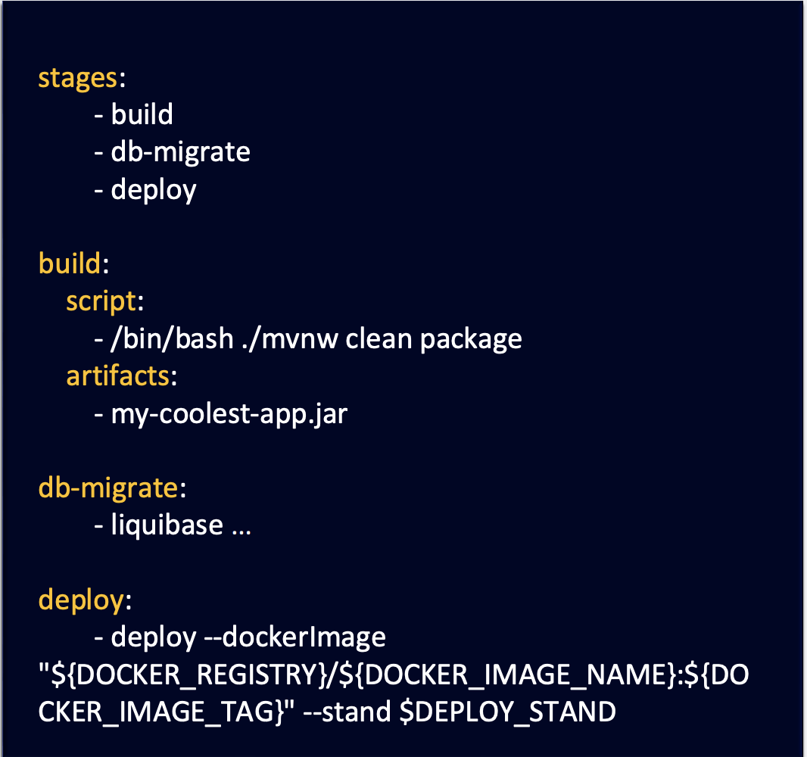

# CI/CD

про CI CD и нетолько

## Процесс в общем
процесс такой
- Билдим приложение
- Копируем jar-ники, библиотеки
- идем к серверу
- копируем скрипты и исходники на сервак
- запускаем прилагу. разбираемся, почему не запустилось
- проверяем работоспособность. делаем правки
- готово

но мы хотим его автоматизиоровать

к примеру: с помощью Shell-скриптов

проблемы
- запускать и отслеживать скрипт нужно вручную 
- для больших сервисов становится сложным поддерживать/дорабатывать такие скрипты
- сложно отмасштабировать
- зависит от стека разработки

## Подходы к автоматизации

Императивный
- описываем алгоритм

Декларативный
- описываем, что хотим получить

Domain Specific Language -- язык, ориентированный на решении задач в конретной предметной области

пример
- html
- sql
- yaml
- ...

Java, Cpp и прочие -- это языки общего назначения. они сложнее. то есть -- цель DSL упростить процесс

## CI и CD

Continuous Integration 
- бесшовная интеграция нового кода в существующее ПО

Continuous Deployment/Delivery
- бесшовное развертывание и доставка кода на продконтур

Пример инстурментов
- Gitlab CICD
- Github Actions
- ...

пример скрипта

## Kubernetes чуть чуть 

Можно развернуть как через Virtual Machine, так и Контейнеры
- Virtual Machine
    - работает на базе гипервизора (VirtualBox, например)
    - каждая машина содержит свою гостевую ОС
    - имеет свое собственное вириуальное оборудование (процессор, память, диск)
    - максимально изолирована и безопасна
- Контейнеры (Docker)
    - на базе движка контейнера поверх ОС
    - все контейнеры делят одно общее ядро хостовой ОС
    - изолируют только приложение и их зависимости
    - изоляция только на уровне процессов -- это не так строго, как у VM
    - меньше потребляет памяти, быстрее запускается быстрее, на диске весит меньше

## Стратегии развертывания

пусть у нас есть Три ноды версии 1. мы хотим развернуть версию 2

- Recreate
    - вырубаем ВСЕ версии 1
    - включаем версии 2
    - минус очевиден -- приложение лежит, пока мы это делаем. то есть -- релизить стоит ночью

- Rolling Update
    - по одной ноде удаляем и развертываем
    - но да, важно -- обратная совместимость
        - готовы ли мы к тому, что -- запрос пользователя может перейти на ноду второй версии?

- Blue-green deployment
    - развернули ВСЕ версии 2
    - переключили
    - и только потом версии 1 отрубили
    - минусы
        - это нам нужно в два раза больше ресурсов. это Может быть дорого
        - но это вероятно хорошо для очень Важных сервисов

- Canary Deployment
    - тут обще между Rolling Update (по одной) и BG (до всех под)
    - пока мы развертываем, мы только часть трафика переводим на ноду версии 2
    - тем самым -- можем удленить процесс релиза И лучше выявлять ошибки в проде