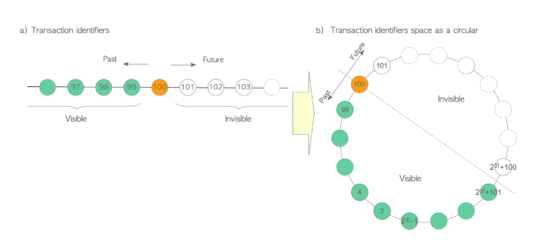

# Postgres

## Введение

здесь будет храниться все, что я успел узнать о Postgres. Общие знания лежат в файле [До](../common.md)

Источники, которые я использовал для составления ответов
- [Мой ментор порекомндовал этот имбовый источник](https://www.interdb.jp/pg/)

## Содержание
- [Конспект источника ментора](#конспект-источника-ментора)
    - [1. Database Cluster, Databases and Tables](#database-cluster-databases-and-tables)
        - [The logical structure of a database cluster](#the-logical-structure-of-a-database-cluster)
        - [The physical structure of a database cluster](#the-physical-structure-of-a-database-cluster)
        - [The internal layout of a heap table file](#the-internal-layout-of-a-heap-table-file)
        - [The methods of writing and reading data to a table](#the-methods-of-writing-and-reading-data-to-a-table)

    - [3. Query Processing](#query-processing)
        - [Overview](#overview)
        - [Cost Estimation in Single-Table Query](#cost-estimation-in-single-table-query)
        - [Creating the Plan Tree of a Single-Table Query](#creating-the-plan-tree-of-a-single-table-query)
        - [Executor Performance](#executor-performance)
        - [Join Operations](#join-operations)
        - [Creating the Plan Tree of Multiple-Table Query](#creating-the-plan-tree-of-multiple-table-query)
        - [Parallel Query](#parallel-query)

    - [5. Concurrency Control](#concurrency-control)
        - [Transaction ID](#transaction-id)
        - [Tuple Structure](#tuple-structure)
        - [Inserting, Deleting and Updating Tuples](#inserting-deleting-and-updating-tuples)
        - [Commit Log (clog)](#commit-log-clog)
        - [Transaction Snapshot](#transaction-snapshot)
        - [Visibility Check Rules](#visibility-check-rules)
        - [Visibility Check](#visibility-check)
        - [Preventing Lost Updates](#preventing-lost-updates)
        - [Serializable Snapshot Isolation](#serializable-snapshot-isolation)
        - [Required Maintenance Processes](#required-maintenance-processes)

## Конспект источника ментора

### Database Cluster, Databases and Tables

#### The logical structure of a database cluster

- Database Cluster
    - это единый экземпляр запущенного сервера PostgreSQL, что управляет Одной Конкретной областью хранения данных. Это Не группа серверов

    - Вообще физически -- это просто каталог на диске, в котором лежат все конфиги, логи, подкаталоги с самими данными

    - Один запущенный процесс Postgres работает ровно с одним кластером. если хочется два кластера на одном компе -- нужно запустить два процесса на разных портах, И каждый будет смотреть в свою папку

    - 1 кластер может содержать Много баз данных

- БД и ее объекты
    - в 1 кластере, БД-ых логически изолированы. в Postgres ты подключаешься к конкретной бд из кластера.

    - Основные объекты
        - Таблицы -- основное хранилище
        - Индексы -- структуры для ускарения поиска
        - Предсталения (Views) -- виртуальные таблицы (больше как сохраненные запросы)
        - Функции и Процедуры
        - Последовательности -- генераторы уникальных чисел

    - иеррархия такая
        - Cluster -> DB - > Schema -> Object

- Как управляется внутри 
    - Внутри все работает на OID, а все названия таблиц и тп -- просто ярлыки
    - что такое OID?
        - это unsigned 32-bit integer. каждый объект в postgres получает свой unique номер (в рамках определенных каталогов)
    - где это хранится?
        - в System Catalogs
        - данные о бд-ых лежат в table по имени pg_database
        - данные о таблицах, индексах, представлениях -- pg_class
    - как получить OID?
        - 
        ```sql 
        SELECT oid, datname FROM pg_database; --- всех баз
        SELECT oid, relname FROM pg_class WHERE relname = 'name_table'; --- конкретной таблицы
        SELECT 'table_name'::regclass::oid; --- приведение типов
        ```
    - и что мне делать с этим OID как разработчику?
        - вижу в логах ошибка. там какой-то файл 16384 поврежден. и с OID я могу понять, какая именно таблица или что поломались
        - некоторые системы мониторинга принимают именно OID

- из истории
    - раньше OID добавлялся в каждую Строку как скрытий первичный ключ
    - проблемы были очевидными
        - 4 байта -- +- 4.2 миллиарда. в Big Data этого мало. если OID зациклиться и будут дубликаты -- тоже проблема
        - ну и это лишняя информация -- лишний расход памяти -- зачем?
    - и сейчас OID используется только для системных объектов 

#### The physical structure of a database cluster

- initdb
    - создается Database Cluster как директория на диске (PGDATA). там все содержимое нашего сервера
    - при этой команде
        - создаются базовые директории
        - файлы конфигурации
        - системные каталоги (таблицы метаданных)
        - шаблонные БД (template1 и posgres)

- Layout of a Database Cluster
    - files
        - PG_VERSION
            - содержит тупо версию Postgres
        - current_logfiles
            - файл-указатель на текущий активный (куда сейчас пишут)файл логов
            - если включен logging_collector, то pg начинает писать логи работы сервера
            - а так как логов может быть много И они могут ротироваться, то внешним программам трудно понять, какой файл сейчас "живой"
            - а логи -- для всего Кластера
            - это не логи данных (WAL), а именно текстовый журнал событий для администратора
         - pg_hba.conf
            - Host Based Authentication
            - главный файл безопастности
            - описано, Кому, Откуда и по какому методу (пароль, md5, trust) разрешено подключаться к базе
        - pg_ident.conf
            - файл для маппинга имен user-ов ОС-мы на имена пользователей БД
        - postgresql.conf
            - основной конфигурационный фалй. тут настраиваются порты, объемы памяти, параметры автовакуума и тп
        - postgresql.auto.conf
            - специальный файл для настроек, что изменены через SQL: ALTER SYSTEM
            - pg читает его последним, поэтому настройку отсюда перекрывают файл описанный выше
        - postmaster.opts
            - сохранены параметры CLI, с которыми был запущен сервер в последний раз
    - subdirectories
        - base 
            - содержит поддиректории для каждой БД в кластере.
            - имя каждой директории -- это OID.
            - тут файлы таблиц и индексов
        - global
            - тут общие таблицы кластера
            - например -- список пользователей, роли, инфа о самих БД
        - pg_commit_ts
            - данные о Transaction Commit Timestamps
            - позволяет узнат, когда именно была закоммичена та или иная транзация 
            - работает, если включен параметр track_commit_timestamp
        - pg_dynshmem
            - Dynamic Shared Memory
            - используется подсистемой динамической памяти для взаимодействия между процессами postgres.
            - если сервер выключен, то тут пусто
        - pg_logical
            - статус логического декодирования
            - хранятся данные для логической репликации (инфа о состоянии слотов репликации и изменнеия, что нужно передать подписчикам и тп)
        - pg_multixact
            - статус мультитранзакций
            - используется для поддержки разделяемых блокировок строк
            - если на одно строку наложено несколько блокировов разными транзакциями, то pg объединяет их в MultiXact ID
        - pg_notify
            - данные команд LISTEN/NOTIFY
            - хранит состояние подсистемы уведомлений
        - pg_repslot
            - данные слотов репликации 
            - содержит информацию о текущем состоянии каждого созданного слота репликации, что гарантирует, что сервер не удалит нужные Write-Ahead-Logging файлы, пока их не заберет реплика
        - pg_serial
            - данные о транзакциях с уровнем изоляции Serializable
            - информация о зафиксированных транзакциях, что необходима для предотвращения аномалий сериализации
        - pg_snapshots
            - экспортированные снимки данных
            - когда транзакция экспортирует свой snapshot, то данные сохраняются тут
        - pg_stat
            - постоянные файлы подсистемы статистики
            - хранится накопленная статистика (количество чтений, записей, попаданий в кэш), что сохраняется между перезапусками сервера
        - pg_stat_tmp
            - временные файлы статистики
            - текущая оперативная статистика
        - pg_subtrans
            - статус вложенных транзакций
            - хранит инфу о связях между родительсикими и дочерними транзакциями
        - pg_tblspc
            - символьные ссылки на таблицы (tablespaces)
            - если я создал tablespace на другом диске, то здесь появится "символьная ссылка", что указыает на реальное расположение данных
        - pg_twophase
            - файлы двухфазного коммита
            - если используется подготовленные тразакции, их состояние до окончательного коммита или отката хранится здесь
        - pg_wal (раньше pg_xlog)
            - Журналы предзаписи
            - сюда пишуться все изменения данных до того6 как они попадут в основные файлы таблицы
            - что позволяет поставновить БД после сбоя питания, например
        - pg_xact (раньше pg_clog)
            - Transaction Commit Status
            - здесь в битовом виде хранится инфа о том, была ли транзакция успешно завершена или отменена
        
- Layout of Databases
    - бд -- это просто поддиректория base/
    - путь выглядит как base/DATABASE_OID

- Layout of Files Associated with Tables and Indexes
    - о том, как хранятся сами данные таблиц
    - внутри папки БД файлы называются цифрами
        - relfilenode -- номер файла на диске для конкретной таблицы или индекса
        - обычно он совпадает с OID, но если выполнить команду, что пересоздает таблицу физически (VACUUM FULL, CLUSTER или REINDEX), то OID останется прежним, а этот поменяется
        - чтобы найти файл некоторой таблицы
        ```sql
        SELECT pg_relation_filepath('your_table');
        ```
    - pg не хранит таблицу в одном бесконечном фале
        - максимальный размер файла-сегмента -- 1Гб
        - если таблица весит 3.5 гб, то будет 4 файла
            - 16385 (первый гигабайт)
            - 16385.1
            - 16385.2
            - 16385.3 (остаток)
    - у каждой таблицы есть Три типа файлов (ветвей)
        - Main Fork -- сам файл с данными. имя -- relfilenode
        - Free Space Map
            - имя: relfilenode_fsm
            - хранит биты, указывающие на -- является ли все строки на странице "видимыми" для всех транзакций. это важно для
                - ускорения VACUUM (пропускает страницы, где ничего не менялось)
                - Index Only Scans -- получить данные из индекса, не смотря в саму таблицу, если бит в VM это подтверждает

- Tablespaces
    - если вы создаете Tablespace в папке /home/user/pg_ts
        - в pg_tblspc/ создается символьная ссылка. имя ссылки -- это OID созданного Tablespace
        - и она ведет в /home/user/pg_ts
        - внутри этой папки pg создает поддиректорию. что специфична для версии. пример: PG_14_202107181
        - а уже внутри этой версии уже создаются папки с OID БД, а в них -- файлы таблиц
    - цель всего это -- разнести данные по разным физическим дискам. например -- индексы на быстрый SSD, а редко используемые таблицы -- на дешевый HDD

#### The internal layout of a heap table file

- что такое Page и Block
    - pg не читает и не пишет данные по одной строке. все операци и I/O происходят порциями, что называются Старнцами или Блоками
        - размер по умолчанию 8 Кб
        - чтобы не запрашивать одну строку из таблицы, pg считывает всю страницу
        - внутри файла таблицы страницы нумеруются последовательно от 0. они называются Block numbers

- Page Layout
    - состоит из 5 частей
    - PageHeaderData
        - первые 24 байта
        - метаданные о самой странице
    - Item Pointes
        - массив из 4-байтовых указателей
        - растет Сверху-вниз, сразу после заголовка
    - Free Space
        - нераспределенное пространство в середине страницы
    - Items
        - сами данные (строки таблицы или записи индекса)
    - Special Space 
        - используется только в индексах для хранения специфичных данных. 
        - в обычных таблицах это поле пустое

- о PageHeaderData
    - pd_lsn -- Log Sequence Number -- LSN последней записи в WAL, которая изменила эту страницу. для востановления 
    - pd_checksum -- контрольная сумма страницы. если включена
    - pd_flags -- флаги состояни
    - pd_lower -- указатель(смещение) на начало свободного места
    - pd_upper -- на конец свободного места
    - pd_special -- указатель на начало специального пространства

- Item Pointers и зачем они 
    - почему бы просто не обращаться к строке напрямую по адресу?
        - индирекция (косвенная адресация) -- если строка внутри страницы обновилась и немного увеличилась в размере, pg может передвинуть ее внутри этой же страницы
        - при этом Item Pointer останется на том же месте в массиве, а изменится только смещение, на которое он указывает
        - тем самым внешние индексы, что ссылаются на эту строку, не нужно обновлять

- как идентифицируется строка?
    - TID (Tuple Identifier) -- так называется физический адрес строки в базе
    - пример: (0, 1) означает "первая страница, первый указатель в массиве"
    - чтобы получить этот идентификатор
    ```sql
    SELECT ctid, * FROM my_table;
    ```
    - ctid может меняться (например при VACUUM FULL или обновлении строки), поэтому -- его нельзя использовать как Постоянный первичный ключ

- Tuple Layout 
    - разделяют на Heap Tuple (строку таблицы) и Index Tuple (запись в индексе)
    - Heap Tuple    
        - HeapTupleHeaderData. 23 байта
            - t_xmin -- id тразакции, которая создала строку
            - t_xmax -- id транзакции, что удалила или обновила эту строку. если строка жива, то 0
            - t_cid -- Command ID внутри транзакции
            - t_ctid -- ссылка на саму себя или на новую версию этой же строку 
        - Null Bitmap -- битавая карта для полей, что содержит NULL
        - User Data -- сами данные колонок, что упакованы в бинарном виде
    - Index Tuple
        - IndexTupleData -- заголовок с метаданными
        - Data -- значение ключа индекса
        - TID -- ссылка на соотвествующую строку в основной таблице (Heap)
    
- ограничения в размерер и TOAST
    - размер страницы -- 8 Кб, а если я хочу сохранить текст на 10 Мб?
        - pg не позволяет хранится строке на несколько страниц
        - в таких ситуациях используется The Oversized-Attribute Storage Technique
        - Данные сжимаются и нарезаются на куски, что хранятся в отдельные "скрытой" таблице (TOAST-таблице), а в основной строке остается только маленькая ссылка (указатель)

#### The methods of writing and reading data to a table

- процесс вставки строки в таблицу
    - pg вызывает RelationGetBufferForTuple, которая обращается к Free Space Map этой таблицы, чтобы найти номер страницы, на которой достаточно свободного места
    - если страница найдена -- pg загружает страницу в Shared Buffers, если не там еще. далее накладыется Exclusive Lock (X)
        - ну а если FSM не нашла подходящую страницу, севрвер выполняет Extension -- раширяет файл таблицы, добавляя новую пустую страницу и регистрирует ее в FSM
    - так как FSM дает только "подсказку", а блокировка накладывается позже, pg обязан повтороно проверить наличие свободного места на заблокироыванной странице. если другой поток успел занять место, то мы идем в самое начало
    - далее вызывается PageAddItem
        - добавляет новый Item Pointer в массиве в начале страницы
        - записывает саму строку в конец свободного пространства старницы
        - обновляет pd_lower и pd_upper в заголовке страницы
    - далее обновляется FSM и генерируется завис в Write Ahead Log

- чтение
    - когда я делаю
    ```sql
    SELECT * FROM name_table
    ```
    - то в основном используется Sequential Scan
        - pg начинает с самой первой страницы файла и последовательно читает
        - для каждой страницы сервер обращается к Item Pointers
        - проходя по указателям, сервер переходит к физическому расположению каждой строки на этой странице и извелкает ее
        - нужно так же понять, имею ли я право ее видеть. 
            - для каждой строки проверяются поля заголовка t_xmin и t_xmax относительно текущего snapshot
            - если строка была удалена или еще не закоммичена в другой транзакции, то pg просто пропускает ее и идет к следующему указателю
    - Index Scan... 


### Query Processing

#### Overview


Клиент сделал запрос к Бекенду (Postgres). Далее запрос идет по следующим 5 слоям
- Parser -- из SQL запроса делает Parse Tree 
    - проверяет только синтаксис, не значение/семантику. 
        - это карается тем, что -- даже если вставить несуществующую таблицу, то Parser о ней не узнает. узнает следующий слой
    - об ошибке узнает в процессе генерации
    - пример запроса
    ```sql
    SELECT id, data FROM tbl_a WHERE id < 300 ORDER BY data;
    ```
    - вот дерево 
    - структура описывается, как вы поняли, [тут](https://github.com/postgres/postgres/blob/c210647aeb17692c138014235c7e7a2d9af73b87/src/include/nodes/parsenodes.h#L2288)
- Analyzer -- семантически анализирует Parse Tree И генериурет Query Tree
    - 
    - [структура](https://github.com/postgres/postgres/blob/c210647aeb17692c138014235c7e7a2d9af73b87/src/include/nodes/parsenodes.h#L117) 
    - кратко можно описать так
        - перечень столбцов (если бы мы написали *, то тут бы Все столбцы вывело)
        - таблица диапазонов -- список отношений, что используются в запросе
        - в join tree у нас FROM и WHERE
        - а условия сортировки -- это список объектов что их описывают (SortGroupClause)
- Rewriter -- смотрит на Query Tree и трансформирует его согласно правилам в rule system
    - rule system хранятся в pg_rules
    - о View
        - когда мы делаем CREATE VIEW, то -- создается новое правило
        - и когда мы делаем FROM из какого-то VEIW, то Rewriter подставляет это дерево VIEW
        - 
        - из-за этого Обновления представлений было невозможно До версии 9.2. с версии 9.3 это стало возможным, но ограничений еще много
- Planner -- генерирует Plan Tree из Query Tree, чтобы максимально эффективно потом было
    - основан на cost-based (статистически и оценка ресурса) оптимизации, не rule-based (заранее заданные правила)
        - cost-based -- смотрит на размеры таблицы, сколько у него памяти, ЦП. сравнивает стоимости И выбирает минимальное
        - поэтому для его работы нужно регулярно "обновлять статистику"
        - пример: выбор между Полным сканированием и Индексом 
    - еще в Postgres нет "подсказок для Planner-a" (типо -- указать в коде, что хочешь использовать Полное сканирование)
    - чтобы посмотреть plan stree -- можно ввести `EXPLAIN <ваша команда>`
    - дерево
        - состоит из Plan Nodes
        - каждая такая нода содержит инфу для Executor-а
        - в случае если запрос идет к одной таблице, то Executor обрабатывает данные от конца До корня
- Executor -- выполняет Plan Tree (там определяется порядок Таблиц и Индексов)
    - считывает и записывает данные в таблицы и индексы БД через менеджер буферов
    - при обработке, использует некоторые области памяти. пример: temp_buffers и work_mem

#### Cost Estimation in Single-Table Query

оптимизация происходит по Стоимости. причем стоимость не имеет единиц измерения

все оценки рассчитываются с помощью спец функций из costsize.c. при чем для каждой операции своя функция оценки (cost_seqcan, и тп)

стоимость состоит из трех состовляющих
- Start-up cost -- стоимость, что БД тратит до того, как будет извлечена первая строка (например -- стоимость чтения индексных страниц, чтобы добраться до первой нужной записи)
- Run cost -- стоимость на извлечение всех остальных строк, что удовлетворяют условию
- Total Cost = Start-up Cost + Run Cost

это и много другое можно увидеть с помощью EXPLAIN

```sql
CREATE TABLE tbl (id int PRIMARY KEY, data int);
CREATE INDEX tbl_data_idx ON tbl (data);
INSERT INTO tbl SELECT generate_series(1,10000), generate_series(1,10000);
ANALYZE; --- собирает статистику, чтобы планировщик знал -- в таблице ровно 10_000 строк, занимают столько-то страниц в памяти и тп
```

##### Sequential Scan

то есть -- метод, при котором БД читает таблицу целиком, блок за блоком, строчку за строчкой

метод cost_seqscan()

пример И посчитаем его стоимость 
```sql
SELECT * FROM tbl WHERE id <= 8000;
```

- start-up
    - для такого вида сканирования всегда 0
    - ибо нет каких-либо предварительных обработак (спускаться по дереву индексов и тп)
- run
    - затраты CPU + затраты на чтение диска 
    - Run cost = CPU run cost + Disk run cost
    - run cost = (cpu_tuple_cost + cpu_operator_cost) * N_tuple + seq_page_cost * N_page
        - N_tuple -- общее количество строк в таблице
        - N_page -- количество страниц в памяти 
        - cpu_tuple_cost -- стоимость обработки одной строки процессором
        - cpu_operator_cost -- стоимость выполнения одной операции
        - seq_page_cost -- стоимость последовательного чтения одной страницы с диска
    
##### Index Scan

главное отличие -- сначала обращаемся к B-дереву, находим нужный указатель, а только затем точечно читаем строки из таблицы

метод cost_index()

```sql
SELECT id, data FROM tbl WHERE data <= 240;
```

вводные данные об индексе
- N_index_tuple -- количество строк в индексе
- N_index_page -- колчичество страниц, что занимает индекс на диске 
- H_index -- высота B-дерева (к примеру для 10_000 -- высота=1)

Selectivity
- прежде чем считать стоимость, планировщик должен понять -- какая доля попадет под WHERE
- и эта доля и есть Селективность
    - Селективность = (количество искомых строк) / (общее количество строк) * 100%
        - столько процентов данных нужно обработать Planner-у
    - для этого подсчета он использует статистику из ANALYZE
    - статистика хранит данные в виде гистограм (по умолчанию -- 100 корзин)
    - в нашем примере у нас все равномерно распределены, поэтому сложностей не будет
- 
```sql
SELECT histogram_bounds FROM pg_stats WHERE tablename = 'tbl' AND attname = 'data';
```
    
о стоимости
- start-up
    - != 0
    - нужно спуститься по B-дереву от корня до первого нужного
    - дисковое чтение тут обычно не учитывается, ибо почти всегда верхнии уровни лежат в Кэше (ОЗУ)
    - 
    ```json 
    {
        cell(log2(N_index_tuple)) 
        + 
        (H_index + 1) * 50
    } * cpu_operator_cost
    ```
- run-cost = сумма
    - Index CPU Cost
        - Всего * Селективность * (cpu_index_tuple_cost + cpu_operator_cost)
    - Table CPU Cost
        - Всего * Селективность * cpu_tuple_cost
    - Index IO Cost
        - ceil(Селективность * N_index_page) * random_page_cost 
    - Table IO Cost
        - далее о корреляции и все обозначения 
        - max_IO_cost + correlation^2 * (min_IO_cost - max_IO_cost)

Корреляция показывает. насколько физически порядок строк на диске совпадает с порядком в индексе

строго все по порядку = 1

формула учитывает лучший и худший сценарии
- max_IO_cost = Все страницы * random_page_cost
- min_IO_cost = 1(страница) * random_page_cost + (ceil (Селекция * Все_страницы) - 1-страница) * seq_page_cost

##### Sort

немного о
- отдельный этап выполнения запроса
- cost_sort()
- не только для ORDER BY может использоваться, но и для внутренних нужд БД (подготовка данных для Merge Join)

физическое ограничение
- если все строки умещаются в оперативную память -- то используется quicksort (влезает в work_mem)
- если нет, то file merge sort. что медленнее

возьмем тот же запрос
```sql
SELECT id, data FROM tbl WHERE data <= 240 ORDER BY id;
```

стоимости
- start-up
    - это траты на саму сортировку
    - C + compsrison_cost * N_sort * log2(N_sort)
        - C - общая стоимость предыдущего этапа (из результатов сканирования и тп)
        - N_sort -- количество строк, что нужно отсортировать (селективность)
        - comparison_cost -- стоимость одного сравнения двух строк
- run cost 
    - затраты на чтение уже отсортированных строк
    - cpu_operator_cost * N_sort

##### Cardinality Estimation

это мы возвращаемся к вопросу -- "Сколько строк вернет запрос?"

сравним Селективность и Кардинальность
- селективность -- это доля (2%)
- кардинальность -- абсолютное целое число строк (100 строк)
- связь: Кардинальность = Селективность * Общее количество строк

почему сложно оценить кардинальность?
- пример
    - у нас деревня, в ней 100 человек. в таблице есть две колонки
        - возрастная категория (их 4)
        - статус водительских прав (их 3)
    - и пусть статистика такая
        - 20 человек до 18 лет
        - и 40 человек без прав
    - пишем запрос и хотим оценить
    ```sql
    SELECT * FROM residents WHERE age_category = 'under18' AND license_status = 'none';
    ```
    - запустим для этого запроса EXPLAIN ANALYZE и получим
        - оценка планировщика 8
        - по факту 20 (ибо в возрасте до 18 ВСЕ не имеют прав)
    - почему он так ошибся?

- почему так ошибся
    - Planner думает, что все данные в разных колонках -- независимы 
    - тут он типо Младше_18=0.2 И нет_прав=0.4
    - 0.2 * 0.4
    - ну и это * 100 человек

- тем самым, главная проблема 
    - это коррелирующие колонки 

- для решения этого есть CREATE STATISTICS, что позволяет явно указывать БД, что колонки зависят друг от друга

#### Creating the Plan Tree of a Single-Table Query

Plan Tree -- пошаговая инструкция для Executor

для запроса к одноц таблица, процесс построения такого дерева состоит из шагов
- Предварительная обработка 
    - очистка и упрощение
- поиск самого дешевого пути доступа
- создане дерева 

##### Preprocessing

цель -- максимально упростить запрос
- меньше считать оценки
- меньше работы executor-у

шаги оптимизации
- упрощение списка выборки и ограничений
    - проверяет, что я просил в SELECT или типо LIMIT или OFFSET
    - можно безопасно удалить -- удалит
- Нормализация логических выражений
    - это про приведение к единному виду. чтобы не путаться и не думать о разных способах подсчета одного и того же
- упрощение выражений AND/OR
    - например -- убрать тут лишние скобки
    ```sql
    WHERE (id = 1 AND (data = 2 AND age = 3))
    ```
    - по плоскому списку планировщику гораздо проще понять, можно ли составной индекс использовать
- свертка контекста
    - если есть выражение, что представляет собой -- тупо математические вычисления, что состоят только из констант
    - то это посчитается 1 раз и все
- упрощение выражений WHERE
    - смотрит условия фильтрации
    - ищет явные противоречия
    - пример
        - если явно написать Всегда_ложное_утверждение (1 == 0), то Он упростит его

##### Getting the Cheapest Access Path 

Access Paths -- пути доступа. основные:
- Sequential Scan
- Index Scan
- Bitmap Index Scan

чтобы выбрать лучший путь -- Planner складывает в RelOptInfo (Relation Optimization Information) (все планы И их стоимости)

процесс выбора. шаги:
- создать RelOptInfo
    - пустая
    - загружается базовая статистика (количество строк, страниц на диске и тп)
- оценка SeqScan
    - расчитывает Start-up и Total cost
    - создает структуру Path
    - кладет в RelOptInfo
- оценка IndexScan
    - только если на таблице есть Индексы И они применимы к условиям в WHERE. иначе оценивать нечего
    - расчитывает для каждого подходящего индекса. для каждого индекса создается Path
- оценка по Bitmap Index Scan
    - это гибридный метод
        - сначала бд читает индекс и составляет битовую маску того, на каких страницах диска лежат нужные строки
        - а затем читает эти страницы с диска
        - и делает это последовательно, минимизируя случайное чтение
    - если можно применить, то тоже заносится 
- выбор лучшего
    - лучшего из RelOptInfo

еще прикол 
- иногда планировщик хранит 2 пути
- например
    - наименьшей общей стоимостью
    - наименьшей начальной стоимостью
        - может пригодится, если LIMIT 1

##### Creating the Plan Tree

Шаги создания
- Преобразуем пути в базовый узел плана
    - Planner берет выбранный Path и далее конвертирует Его в Plan Node
        - если победил индексное скаенировение, то создасться IndexScan, ну и по аналогии остальные могут создаться
- добавление дополнительных узлов (Sort, Limit, Aggregate)
    - бозовый узел включает в себя только Как достать данные из таблица с учетом условия WHERE
    - и также бывают запросы, что применяются После того, как данные извлечены
    - планировщик проверяет исходное Query Tree на такие инструкции. если находит их, то навешивает доп узлы поверх базового, строя дерево Снизу вверз
        - если есть ORDER BY (и выбранный индекс не дает данные в отсортированном виде), то над узлом сканирования добовляется узел Sort
        - Если агрегирующие функции, то -- добавиться Aggregate
        - если есть LIMIT или OFFSET -- добавиться Limit

#### Executor Performance

Executor обрабатывает Plan Tree. эта работа построена по Pull Model
- верхние узлы дерева запрашивают данные у нижних 

каждому узлу плана (SeqScan, IndexScan и тп) соотвествует специальная функция в исходном коде

как это работает


- Executor запускает верхний узел -- Sort
- Sort не имеет своих данных, поэтому идем в SeqScan с просьбой "дай строку плиз"
- цикл, пока SeqScan не отдаст все строки
    - SeqScan читает таблицу, находит нужную строку и передает ее наверх в Sort
    - Sort складывает ее в буфер work_mem
- полчуенный список в work_mem сортируется

далее поговорим о некоторых технических деталях

- Scanning Functions
    - вообще изначально, данные физически хранятся на диске в виде блоков по 8кб
    - и чтобы просто достать одну строку, надо 
        - обратиться в Buffer Manager, чтобы загрузить страницу с диска в Оперативку
        - обратиться в Concurrency Control для того, чтобы провериться, а не имеет ли текущая транзакция право видеть эту строку (не удалена ли/ не заблочена другой транзакцией)
    - и, чтобы в коде Executor-а не было тоны такого кода, все эти моменты решили Абстрагировать И Executor вызывает просто высокоуровневую функцию "дай шаг пж", без деталей.

- Temporary Files
    - все мы хотим обрабатывать свои операции в оперативной памяти, ведь -- так быстрее. и Executor тоже 
    - для этого у него есть две специальные области памяти
        - work_mem -- для операций сортировки и хеширования
        - temp_buffers -- для работы с временными таблицами
    - но мы все с вами знаем -- память ограничена. а в эпоху ИИ, когда на генерацию котиков на моноколисе нужно много оперы, так вообще -- стипендии не хватит
    - поэтому, если в work_mem не хватает памяти, то мы начинаем использовать жесткий диск И сбрасывать промежуточный результат в Temporaty Files
    - как это увидеть?  
        - команда EXPLAIN ANALYZE. которая реально выполняет запрос и показывает 
            - сколько времени работало
            - реальное количество строк
            - и инфу об использовании памяти в диске
            - и тп
        - необходимая строка в логах 
        ```
        Sort Method: external merge Disk: 10000kB
        ```
        - где
            - external merge -- это другой алгоритм сортивроки
            - ну и размер временного файла на диске
    - как устроены временные файлы?
        - он создается в специальной системной директории Postgres
        - пример названия pgsql_tmp8903.5
            - pgsql_tmp -- стандартный префикс
            - 8903 -- PID конкретного процесса pg, что выполняет запрос
            - .5 -- порядковый номер файла
        - когда запрос завершается -- этот файл удаляется
    - чем это может быть полезно при анализе
        - база -- если я вижу, что у меня запросы часто создают временные файлы, то я повышаю work_mem в postgresql.conf

- Aggregate Functions -- как суммы, средние значения, дисперсии вычисляются и тп
    - написал я агрегаторную функцию в запрос
    - по итогу, в Plan Tree появилась новая нода -- AggregateNode
    - поговорим о Сумме и AVG
        - SeqScan читает таблицу, по одному значению нужной колонки преедает выше, в нашу AggregateNode
        - AggregateNode не сохраняет все эти строки в памяти, а Накапливает результат последовательно
        - ну и понятно 
            - если сумма, то просто прибавляет число к переменной-аккумулятору
            - если AVG, то тоже самое + считает n -- количество того, чего взял для подсчета среднего. в конце делит
    - Однопроходное вычисление дисперсии
        - по обычному, мы как делали
            - сначала проходили и считали среднее
            - потом проходили опять, суммируя там, отнимая среднее, возводя в квадрат, да
        - но для БД, целых два прохода -- овер много
        - поэтому они внедрили алгоритм, который работает за один проход
            - [там](https://www.interdb.jp/pg/pgsql03/04.html#34221-one-pass-variance-calculation-versions-11-or-earlier) вычисления показали
            - там что-то еще внедряли, можете глянуть


#### Join Operations

##### Nested Loop Join

nested -- вложенный

это самый базовый и универсальный способ соиденения таблиц

главное преимущество в том, что
- можно использовать для любых условий. то есть -- не только ==, но и <, >, !=, Like и тп

и прикол еще в том -- для этой операции реализован целый набор алгоритмов 
- 6
    - 1 базовый
    - 5 его вариаций

и Planner выбирает нужный исходя исходя из 
- размера таблицы
- наличие индекса

Поговорим немного о них
- Nested Loop Join
    - Алгоритм -- реально nested цикл
        - Executor берет первую строку из Outer Table
        - Полностью сканиурет Inner Table И проверяет условие соединения
        - затем вторую строку ... 
        - пока не закончатся строки
    - оценки
        - start-up = 0
        - run = O(N_outer * N_inner)
    - когда
        - таблица очень мала
- Materialized Nested Loop Join
    - для оптимизации использует Материализацию
        - перед запуском nested loop, Executor 1 раз сканирует inner table, сохраняет все нужные строки с помощью модуля temporary tuple storage module.
            - в EXPLAINE это ображается как узел Materialize
    - а хранится что надо в Temporary file-ах, если памяти нехватает в work_mem
    - а почему это выгодно?
        - читать их последовательно из tmp файла гораздо быстрее и дешевле, чем каждый раз сканировать реальную таблицу через Buffer Manager

- Indexed Nested Loop Join
    - как одна из самых эффективных 
    - применяется, если во inner table есть индекс по той колонке, что участвует в соединении
    - основной принцип такой
        - вместо того, чтобы сканировать inner таблицу/ материализовать ее целиком, Executor берет значение из Outer таблицы И точечно делает IndexScan в Inner таблице

- Остальные 
    - ранее мы считали, что Outer таблица читается с SeqScan
    - но а что если в Outer тоже есть индекс? Так а что если еще есть и условие WHERE?
    - в таком случае используется Index Scan для outer таблицы


##### Merge Join

Nested Loop Join -- общий, но в некоторых задачах можно сделать и куда быстрее. поэтому придумали и другие алгоритмы

у Merge есть 2 главных ограничения
- только операторы равенства (=, !=)
- outer и inner должны быть отсортированы

какие есть варианты
- Базовый
    - у нас есть 2 отсортированных списка. Executor имеет два указателя на первые строки -- 1 на каждую из таблиц. начинает сравнивать
        - если значения во outer МЕНЬШЕ, чем в inner, то указатель outer сдвигается вниз
        - если значение в outer БОЛЬШЕ, то указатель inner сдвигается вниз
        - если равны -- возвращает пару и оба указателя идут вниз
    - и да -- проход за 1 раз
    - оценка
        - start-up -- надо отсортировать. высокая, если надо
        - run -- низская, по сравнению с другими (O(N_outer + N_inner))

- Materialized Merge Join
    - базовый круто работает, если в колонках нет дубликатов
    - а что если есть? 
        - когда он переходит к следующей строке outer, и у нее такой же ключ, то Executor-у нужно отмотать указатель inner немного назад, чтобы спарить дубликаты
        - а отматывать -- это дорого
    - поэтому, чтобы легко отматываться назад, ввели узел над inner -- Materialize
        - исполнитель кэширует отсортированные строки внутренней таблицы в память, чтобы можно было по ним быстро бегать
    - важно 
        - нарваться на временные файлы тут удваивается, ибо work_mem может потребовать на двух этапах
            - на сортировке (SortNode)
            - на этапе материализации (MaterializeNode)
    - поэтому
        - Merge Join, для больших таблиц, без правильного work_mem, может привести к сильной нагрузке на дисковую систему

- Вариации MergeJoin (пути доступа)
    - как мы помним -- важны отсортированные данные в начале
    - но это можно достичь разными путями (например, B-tree индекс уже хранит в отсортированном виде -- можно и воспользоваться этим)
    - поэтому выделяют такие Варианты
        - Sort + Sort
        - Sort + Index
        - Index + Sort
        - Index + Index
    - где
        - Sort
            - планировщик сделал SeqScan
            - повесил SortNode
            - и только потом MergeJoin 
        - Index -- Index Scan
            - уже читается по порядку (Index Scan)


##### Hash Join

некоторые особенности
- работает все так же только с оператором "="

ну и так же -- зависит от оперативной памяти
- если хватает, то все в памяти (In-Memory Hash Join)
- иначе -- временные файлы (Hybrid Hash Join with Skew)

In-memory Hash Join
- таблица должна занимать примерно не больше 25% от work_mem
- Алгоритм
    - Два слова
        - Batch -- это выделенная рабочая область в оперативке
        - Buckets -- это массив слотов внутри Batch. каждая корзина хранит строки с одинаковым хэшем
    - Build Phase
        - Executor выделяет память под Batch
        - начинает полностью сканировать inner
        - для каждой строки, берет колонку для соединения, проводит ее через hash-функцию 
        - на основе полученного hash, строка кладется в нужный Bucket
        - в итоге inner превращается в hashTable
    - Probe Phase (проверка)
        - Executor начинает читать outer таблицу
        - для каждой строки берет значение ключа И прогоняет его через ту же hash-функцию
        - получил кэш, пошел в bucket в hash-таблице
        - если там есть -- сравнивает строки
    - стоимости
        - start-up
            - чтение и построение hash-таблицы для inner
        - run
            - чтение outer и проверку hash-ей

Hybrid Hash Join with Skew (с алгоритмом перекоса)
- что такое перекос
    - postgres знает, что данные распределены неравномерно
    - и он знает Most Common Values (к примеру, в таблице заказов статус ВЫПОЛНЕН может встречатся в 90% случаев)
    - тем самым БД может сделать "оставлю самые частые значения в оперативке(Skew Batch), а остальные -- на диск"
- Алгоритм
    - Firts Round
        - build phase
            - executor читает inner
            - если ключ строки входит в MCV, то -- кладем в Skew Batch
            - иначе -- вычисляем его хэш, строка записывается в один из множества временных файлов (Batch <какой-то>)
        - probe phase
            - executor читает outer 
            - если ключ строки совпадает с значением из Skew Batch, то соединяемся в памяти
            - если нет, то строка outer записывается в свой временный файл
    - Second+ round
        - executor берет пару временных файлов из inner и outer (batch 1 и batch 1)
        - читает batch 1 для inner, записывает в work_mem, строит для нее локальную хэш-таблицу
        - читает batch 1 для outer, зондирует локальную хэш-таблицу, выдавая совпадения
        - удаляет эти два временных файла
        - переходит к batch 2 и так далее...
    - Выводы
        - круто, молодец, но -- из-за активного создания, записи, чтения временных файлов, работает гораздо медленнее. 

Index Scans in Hash Join
- вообще, оно ему не очень то и надо для соединения
- но Planner может комбинировать Hash join с индексами для предварительной фильтрации данных
- то есть
    - если в моей запросе есть условие фильтрации, то он не будет читать всю outer таблицу целиком
    - он будет использовать Index Scan или Bitmap Index Scan, чтобы достать только нужные строки
    - и только эти строки и пройдут через Probe
    - то же самое относится и к inner
- в EXPLAIN мы увидим, что под узлом Hash Join (или Hash) находятся узлы Index Scan или Bitmap Heap Scan
- в итоге это уменьшает размеры таблиц и файлов
        
##### Join Access Paths and Join Nodes

в статье вообще прикреплен только код

начнем с того что
- Planner -- работает с Paths
    - хранятся оценки стоимости
    - ожидаемое количество строк
    - идеи того, как выполнить запрос
- Executor -- работает только с Nodes
    - реальные состояния выполнения
    
когда Planner выбрал самый дешевый путь, то он конвертирует его в соотвествующую Node и дает Executor

Join Access Paths
- JoinPath
    - содержит Тип соединения
    - указатели на outer и inner путь
    - условия соединения 
    - она как бы и является NestedPath, ибо для Nested Join большего и не надо
- MergePath
    - содержит базовый JoinPath
    - и так же хранит конкретные условия равенства, по которым будет слияние
    - информацию о том, по каким колонкам отсортированы внешня и внутреняя таблицы.
        - надо чтобы Planner понимал, нужно ли добавлять узлы SortNode перед всем этим
- HashPath
    - JoinPath
    - уловия, на которых вычисляется hash-функция
    - количество batch-ей, которое скажет Planner (хватит ли для in-memory или нет)
    - ожидаемое количество строк в inner, чтобы прикинуть размеры хэш-таблицы

Join Nodes
- далее из выбранного path выбираем node-у
- Join
    - базовая
    - есть узел Plan
    - тип соединения
- NestLoop
    - Join
    - параметры для передачи переменных из внешнего цикла во внутренний 
- MergeJoin
    - условия слияния
    - в структурах состояния выполнения, что создаются на основании этого узла, будут хранятся указатели на текущие строки и логика для отмотки назад при дубликатах
- HashJoin
    - колонки для хэширования
    - на основе этого узла, Executor создаст состояние, в котором будет физический указатель на хэш-таблицу в памяти, и также счетчик текущего batch-а

#### Creating the Plan Tree of Multiple-Table Query

теперь мы хотим join-ить несколько таблиц

в чем особенность
- главная проблема -- комбинаторика
    - чем больше таблиц мы хотим соединить, тем больше вариантов того, КАК их соединить 
    - а это мы еще хотим стоимость оценить, а это еще комбинации hash, merge, nested loop

и как тогда решается проблема?

##### Preprocessing

о Preprocessing мы говорили и ранее (как константы, где что сокращает и тп). а тут мы дополним его деталями в шагах

есть шаг Обработки под запросов и Common Table Expression (конструкция с With)

в функции subquery_planner() вызывается SS_process_ctes(), что анализирует конструкции WITH
- можно ли inline этот подзапрос и встроить его прямо в основное дерево запроса
- или его придется выполнить как отдельный, изолированный блок (материализовать)

после базовой очистки идем далее

чтобы не считать много комбинаций, Planner использует два алгоритма, в зависмости от количество таблиц
- Dynamic Programming
    - исп, когда количество таблиц соединяемых невелико. по умолчанию 12
    - суть
        - Planner строит план по уровням, снизу вверх. сохраняя лучшие промежуточные и отбрасывая заведомо плохие
    - пример для трех таблиц АБВ
        - уровень 1
            - считает для А ее RelOptInfo. считает для нее стоимости SeqScan, Index Scan и тп
            - выбирает самый дешевый вид доступа к А
            - и так же для всех остальных
        - уровень 2
            - из полученных резульатов собираем все возможные пары из таблиц первого уровня
            - создает новую RelOptInfo для связи АБ
            - берет лучшие пути из Уровня 1
            - пытается соединить их всеми способами (Nested Loop, Merge Join, Hash join)
            - считает стоимость для каждого метода и сохраняет в {АБ}
            - тоже самое и для остальных
        - уровень 3
            - теперь нам надо АБВ получить 
            - мы берем наши полученные АБ, БВ и АВ, ну и так же А, Б, В
            - пробуем соединить их 
            - и для каждой полученной пары провеяем методы соединения (Nested Loop, Merge Join, Hash join)
            - выбираем лучший вариант 

- Genetic Query Optimizer
    - создаются случайные планы, их скрещивают, мутирует и выбирает наиболее выживаемый/дешевый
    - нет гарантии идеального дешевого, но достаточно хороший будет

#### Parallel Query

раньше, запрос обрабатывался только одним ядром, даже если было 64 ядра. но в 9.6 это изменилось и теперь все работает как надо. 

а как это работает? суть такая
- база данных разделяет одну большую задачу на нпсколько маленьких и выполняет их одновременно на разных ядрах

в этом процессе выделяют две роли
- Leader 
    - процесс, который принял запрос. он всем этим руководит и собирает результат
- Workers
    - фоновые процессы, которых Leader зовет для выполнения задач (например -- просканировать млн строк)

Вообще, все появилось не сразу
- 9.6 -- только параллельное последовательное сканирование
- 10 -- паралельное сканирование индексов и Bitmap Heap Scan
- 11 -- создание хэш-таблиц
- 16 -- добавили поддержку параллельных FULL и OUTER хэш-соединений

##### Как он вообще становится параллельным
шаги 
- Creating Parallel Plan
    - важно помнить: распараллелить -- это тоже время на продумывания. если таблица маленькая или тп, и быстрее будет тем самым просто запустить один поток -- один поток и запуститься
    - для этого, в postgresql.conf Planner смотрит на min_parallel_table_scan_size и min_parallel_index_scan_size
        - то есть, "если размер таблицы/индекса превышает значения в настройках, то тогда распараллеливаем"
    - после этого добавляется Gather Node 
        - хранит в себе результат работы worker-ов
        - все что находится ниже этого узла, будет выполнятся параллельно Worker-ами
        - а все что выше --  Leader

- Sorting Shared Information
    - чтобы Leader как-то передал что-то Worker-ам, он использует Dynamic Shared Memory
    - туда Leader складывает
        - дерево плана запроса
        - параметры запроса
        -  инфа о текущей транзакции
        - очереди сообщений (shm_mq -- shared memory message queues)

- Creating Workers
    - когда Executor доходит до GatherNode, то Leader запрашивает у Background Worker Manager нужное количество Worker-ов
    - важно
        - в EXPLAIN может показываться Planned Worker: 4 (например)
        - но если сервер перегружен или тп, или уперлись в max_parallel_workers, то система может выдаьть и меньшее количество. да хоть вообще никого не выдать 
        - тогда Leader все сам делает

- Setting Up Workers
    - в начале они пустые
    - подключаются к DSM
    - считывают Plan Tree
    - далее, pg использует MVCC (многоверсионность)
        - данные в базе могут быстро менятся
        - чтобы все было ок, Leader и все Worker-ы должны видеть БД в одно и то же время
        - поэтому Worker-ы копируют состояние транзакции и снимки данных Leader-а

- Scanning Rows and Returning Results
    - Как они делят таблицу, чтобы не читать одно и то же?
        - в shared memory есть счетчик parallel heap scan descriptor.
        - worker1 взял страницу 0, а worker2 взял 1
        - когда worker1 закончил, то он пошел к счетчику и далее взял следующую -- 2-ую
    - как они возвращают данные?
        - worker нашел строку по условиям
        - сериализует ее
        - кидает в shm_mq
    - что делает leader?
        - выполняет GatherNode
        - непрерывно опрашивает shm_mq
        - что-то появилось, то он это берет, десериализует И передает выше по дереву плана
    - когда таблица заканчивается, то
        - worker-ы отпрвляют в shm_mq что "я закончил", отключаются от DSM и завершают работу
        - когда Leader получил такое сообщение от всех Worker, то он закрывает Gather
     
- Gathering Results
    - Worker-ы начинают сканировать свои куски таблицы. 
    - как они их находят -- они не пишут их на диск, а отправляют Leader-у через спец очереди сообщений в Shared Memory
    - GatherNode работает асинхронно 
        - Leader читает эти очереди, забиирает готовые строки и передает вверх

##### Parallel Join

как они распараллеливаются?
- Nestef Loop Join
    - между worker-ами делиться только outer таблица
    - inner же сканируется worker-ами целиком
- Indexed Nested Loop
    - outer распараллеливается
    - inner: уже используется index scan
    - каждый Worker берет свою часть outer и для каждой делает index scan 
    - то есть -- делаются точечные запросы, а не полное сканирование
- Merge Join
    - outer -- распараллеливается. либо Parallel Index Scan, либо Parallel Seq Scan с сортировкой 
    - inner -- не распараллеливается
    - но при этом inner что оборачивается в MaterializeNode, чтобы Worker мог быстро крутить ее
    - у каждого Worker-а с его частью outer происходит свой MergeJoin со всей inner
- Hash Join
    - до 11 версии было все как обычно
        - делили только outer
        - inner сканировали целиком
        - причем -- каждый в своей work_mem строил свою независимую хэш-таблицу
    - но с 11 
        - Shared Hash Table
        - вместе параллельно читают inner
        - вместе строят одну Hash таблицу в Shared memory 
        - вместе параллельно читают внешнюю таблицу и зондируют это общую hash-таблицу

##### Parallel Aggregate

пример
```sql
SELECT AVG(salary) FROM employees;
```

просто разделить и "посчитать две средние и потом как-то их сложить" понятное дело нельзя

агрегация разбивается на два этапа
- Partial Aggregate (Worker)
    - worker-ы сканируют свои куски, но не считают финальный результат
    - например тут -- возвращают на этом этапе Сумму и Количество
- Combine (Leader)
    - получил промежуточные результаты
    - использует специальную Combine Function, что определена для каждой агрегатной функции
- Finalize Aggregate (Leader)
    - далее на основании этих уже данных делает итоговый результат (для SUM ничего, а для AVG делит сумму на количество)

как это выглядит в EXPLAIN
- вверху узел Finalize Aggregate
- под ним Gather 
- а подним еще будет Partial Aggregate

### Concurrency Control
тут поговорим о конкурентном доступе

главная задача -- гарантировать два свойства ACID
- Atomicity
- Isolation

миру извества три глобальных подхода для этой задачи
- Multi-Version Concirrency Control
    - многоверсионность
- Stric Two-Phase Locking
    - двухфазовая блокировка
- Optimistic Concurrency Control

Postgres пошел по дороге MVCC

что такое MVCC и почему он?
- когда БД что-то меняет в строке, то она не удаляет старые данные физически. вместо этого оно создает новую версию строки
- и главный плюс "readers dont block writers, and writers dont block readers"
    - в старом S2PL, writer вешал замок И нельзя было прочитать. а в MVCC -- можно прочитать (старые данные)

но, в MVCC у Postgres есть особенности
- используется специальная вариация Snapshot Isolation
    - в Oracle старые версии строк переносятся в спец отдельное хранилище
    - а в Pg Новые версии строк записываются в те же страницы, что и старые данные
- из-за этого (кучи версий в одной таблице), pg использует механиз Visibility Check Rules, чтобы правильно показать версию
    - проверяет "имеет ли право траназакция видеть конкретную версию строки"
- SI отлично справлялся, он смог предотвратить классические проблемы
    - Dirty Read -- чтение незафиксированных данных
    - Non-repeatable Reads -- изменение данных между двумя чтениями в одной транзакции
    - Phantom Reades -- появление новых строк при повтороном запросе
- но SI не может решить аномалии сериализавции
    - например, Write Skew -- искадение записи, когда две транзакции читают данные друг друга и на их основе делают изменения, что приводят к логической ошибке
- для решения этой проблемы они ввели Serializable Snapshot Isolation
    - он умеет отслеживать такие конфликты И принудительно прерывать транзакцию
- когда SET TRANSACTION ISOLATION LEVEL SERIALIZABLE
    - то используется SSI
- а когда REPEATABLE READ или READ COMMITTED, то используется SI

#### Transaction ID

когда начинается транзакция, Менеджер транзакций выдает ей txid 

```sql
SELECT txid_current() -- номер текущей вашей транзакции
```

всего может быть только 4.2 миллиарда уникальных транзакций (ибо txid это 32bit unsigned integer)

есть первые 3 зарезервированных txid
- 0 -- Invalid txid -- как заглушка
- 1 -- Bootstrap txid -- используется в момент инициализации кластера (команды initdb)
- 2 -- Frozen txid -- означает, что "транзакция старше всех остальных". играет роль тем самым в решении проблемы переполнения счетчика

Transaction ID Wraparound
- если мы достигли счетчика 4.2 миллиарда, то мы пойдем по кругу -- сначала, с 3
- но проблема -- получается транзакция с номером 5 может быть старше чем 4_000_000_000?
- для решения этой проблемы, pg изображает пространство txid как Круг/Циферблат
    - половина циферблата делиться на Past. половина круга позади текущей транзакции гарантированно считаются прошлыми
    - а половина круга Впереди текущей транзакции считается Будущим 



Но
- txid_current() возвращает 64-битное число
- в нем просто так же учитывается число Эпох (сколько раз колько заполнилось)

#### Tuple Structure

Tuple -- кортеж -- строка в нашей БД

к каждой строке БД прикрепляет скрытый служебный заголовок, чтобы MVCC работал

Структура строки
- HeapTupleHeaderData -- 23 байта служебной метаинформации
- NULL bitmap -- битовая карта, что отмечает, какие колонки в строке пустые
- padding -- пустое пространство для выравнивания байтов
- user data -- содержание колонок

для Concurrency Control нас инетересует Заголовок

что в HeapTupleHeaderData
- t_xmin -- txid транзакции, что INSERT ее
- t_xmax -- txid той, что DELETE или UPDATE
    - когда только INSERT -- это поле 0
    - а при удалении -- строка не удаляется, а просто заполняется поле t_xmax
- t_cid
    - порядковый номер SQL команды в рамках транзакции. отсчет от 0
    - зачем?
        - например: в рамках одной транзакции выполняем 3 INSERT подряд 
        - у них будет одинаковый t_xmin
        - чтобы запомнить порядок -- записываем t_cid
- t_ctid
    - физический адрес строки
    - состоит из номера страницы на диске И порядкового номера строки в странице
    - если 
        - строка актуальна, то t_ctid указывает сам на себя
        - если делаем UPDATE, то t_ctid в старой версии указывает на новую 
    - тем самым мы связываем старые и новые версии 

#### Inserting, Deleting and Updating Tuples

посмотрим пример, как работается со скрытами полями на практике

- пусть -- мы создали пустую таблицу 
- прежде чем записать строку, БД нужно найти свободное место на ЖД
- для это используется структура Free Space Map (подробнее ниже)
- но допустим -- БД выбрала Page_0

Insertion
- пусть открыта транзакция с txid = 99
- мы выполняем INSERT что-то куда-то
- Pg записывает эту строку на Page_0 на первую позицию -- (0, 1)
- скрытые поля этой строки выглядят так
    - t_xmin = 99
    - t_xmax = 0 -- строка жива, актуальна, не удалена
    - t_cid = 0 -- первая команда в рамках этой транзакции
    - t_ctid = (0, 1) -- ссылается сама на себя

Deletion
- пусть пришла транзакция txid = 111
- выполняет DELETE что-то где-то
- Pg не затирает ее нулями, а Логически удаляет
    - находит по (0, 1) нашу строку, меняет t_xmax с 0 на 111
- тем самым -- строка физически все еще на диске, но да -- помечана как dead tuple
- dead tuples можно удалить, для этого есть VACUUM процесс 

Update
- это как бы DELETE старой и INSERT новой
- вернемся к прошлому примеру, но мы типо не удаляли
    - пришла txid = 100 сделать UPDATE
    - мы нашли строку по (0, 1). поставиили t_xmax = 100
    - бд нашла свободное место на странице (пусть (0, 2)). ее скрытые поля заполняются как при INSERT
        - t_xmin = 100
        - t_xmax = 0
        - t_cid = 0
        - t_ctid = (0, 2)
    - а t_ctid старой строки указывает на (0, 2)
    - тем самым мы образуем Version Chain

Free Space Map
- как Pg находит свободное место для новых строк, не сканируя весь гигантский файл таблицы? -- для этого и используется FSM
- это спец древовидная структура, которая хранит информацию о том, сколько байт свободного места осталось на каждой странице таблицы или индекса
- FSM не хранится в оперативке, она сбрасывается на ЖД. если заглянуть в директорию БД, то рядом с основным файлом таблицы мы увидим файл с таким же именем, но с суффиксом _fsm
- разрабы Pg сделали pg_freespacemap, чтобы можно было сделать SQL запрос прямо к FSM, чтобы посмотреть, например -- насколько сильно фрагментированы страницы таблиц и есть ли там место для новых INSERT или UPDATE

#### Commit Log (clog)

механизм конкурентного доступа построен на том, что БД должна знать
- завершилась ли транзакция, что создала или удалиа конкретную строку

для этого используется clog -- как глобальный справочник статусов транзакций

##### Transaction Status
статусы трназакций
- IN_PROGRESS -- началась, не завершилась 
- COMMITTED -- завершена. ее изменения видны другим транзакциям
- ABORTED -- отменена. ошибка или отменена пользователем. все изменения ей внесенные игнорируются системой
- SUB_COMMITTED -- используется для субтранзакций (когда используешь SAVEPOINT, например). о нем позже

это надо, чтобы когда мой запрос видит заголовок строки, там txid, по которому мы идем в clog и проверяем статус этой транзакции

##### How Clog Performs
- во время работы clog живет в shared memory (любой рабочий процесс может мгновенно получить к нему доступ)
- физически состоит из страниц памяти по 8 кб
- логически -- это просто большой массив, где индекс в массиве -- сам номер транзакции, а значение -- статус транзакции
- жизненый цикл
    - txid 200 делает COMMIT. Pg идет в clog, ищет нужную ячейку и меняет статус с IN_PROGRESS на COMMITTED
    - txid 201 делает ROLLBACK, и в clog транзакция txid 201 статус меняется на ABORTED 
- при заполнении страницы -- просто добавляется новая страница
- когда БД нужно узнать статус транзакции, вызываются спец фунцкии

##### Maintenance of the Clog

clog так же сохраняет что-то и на диск (вдруг сбой питания или перезагрузка сервера)

- данные из clog сбрасываются на ЖД в спец директорию. в современных (с 10) версиях она называется pg_xact (до этого -- pg_clog)
- clog хранится названиями 0000, 0001 и тд. макс размер файла -- 256 кб
- запись происходит 
    - при штатном выключении сервера
    - или на checkpoint -- фоновый регулярный процесс
- при запуске Postgres читает файлы из папки pg_xact и загружает их обратно в shared memory, инициализируя clog
- тк номера транзакций постоянно растут, то clog мог бы расти бесконечно. старые данные со временем становятся не нужны. и регулярный процесс VACUUM регулярно удаляет старые, ненужные страницы clog как из памяти, так и удаляет старые файлы из pg_xact

#### Transaction Snapshot

"почему мой запрос не видит эти данные, хотя другая транзакция их уже закоммитила?"

что это
- когда транзакция хочет прочитать данные, она делает снимок
- на нем видно, кто завершился, кто активно работает, а кто в будущем хочет

и транзакция в этом снимке может читать только тех, кто завершился на момент снимка

как выглядит снимок?
- это не копия данных
- это просто компактная текстовая/бинарная структура
- чтобы посмотреть снимок текущей, можно воспользоваться pg_current_snapshot() (в старых txid_current_snapshot())
- выглядит он так xmix:xmax:xip_list
    - xmin -- txid самой самой старой из Активных траназакций. все номера меньше xmin гарантированно завершены
    - xmax -- txid, который еще никому не выдан. это будущее
    - xip_list -- список конкретных txid, которые активны и находятся между xmin и xmax

пример 
- 100:100 
    - живых нет
    - все транзакции до 99 включительно -- завершены
    - 100 и выше -- это будущее
- 100:104:100,102
    - xmin = 100
    - xmax = 104
    - активные: 100, 102
    - завершены: 101, 103

как и когда выдаются снимки (уровни изоляции)
- Transaction Manager -- внутренний компонент, что выдает снимки. 
- а вот как часто транзакция делает снимки, зависит от уровня изоляции
    - READ_COMMITTED
        - снимок создается заново при каждом SQL запросе внутри транзакции
        - из-за этого я и могу увидеть изменения, которые сделала другая транзакция
    - REPEADTABLE_READ и SERIALIZABLE
        - снимок создается только 1 раз -- в момент выполнения первого SQL запроса в транзакции

Сценарий
- есть три транзакции
    - A -- txid = 200 -- READ_COMMITTED
    - B -- txid = 201 -- READ_COMMITTED
    - C -- txid = 202 -- REPEADTABLE_READ
- Т1
    - A делает SELECT
    - Transaction Manager выдает снимок 200:200
- T2
    - B делает SELECT. 
    - снимок 200:201:200 
    - 200 активна
- T3
    - C делает SELECT. 
    - снимок 200:202:200,201
    - A и B активны
- T4
    - A обновляет строку и делает COMMIT
    - завершила свою работу
- T5
    - B и C делают SELECT, чтобы прочитать туже саммую строку, что была изменена A
        - B (READ_COMMITTED) -- запрашивает новый снимок, теперь это 201:202
        - 200 уже была не активна
        - и увидит новые данные
        - а C (REPEATABLE_READ) -- она не просит новый снимок, и все так же ходит с 200:202:200,201. тем самым C не увидит изменнеия от A

#### Visibility Check Rules

этот алгоритм и решает
- показывать тебе конкретную версию строки или сделать вид, что ее нет

##### Введение

когда SELECT сканирует таблицу, читает кажду строку. он задает себе вопрос
- безопасно ли ее читать? 
    - была ли транзакция, которая ее создала, успешно завершина до того, как я сделал снимок?
    - t_xmin
- не удалена ли строка? ()
    - была ли транзакция, что ее удалила или обновила, успешно завершена до того, как я сделал снимок?
    - t_xmax

правила проверки видимости для t_xmin
- напомню
    - t_xmin хранит txid транзакции, что INSERT или UPDATE строку
    - БД смотрит на это txid, проверяет статус по clog и примняет решение по правилам
- t_xmin ABORTED
    - строка Невидима
    - трназакция пыталась что-то сделать со строкой, завершилась с ошибкой или ROLLBACK. теперь строка физически есть, но логически ее нет
- t_xmin IN_PROGRESS
    - кто именно сейчас работает со строкой?
    - если равен текущему txid, то ВИДИМА
    - если не равна текущей -- НЕВИДИМА
- t_xmin COMMITTED
    - если t_xmin находится в списке активных в snapshot, то НЕВИДИМА
    - если не в списке активных И меньше xmin, то ВИДИМА
- если признана НЕВИДИМОЙ -- закончили 
- иначе -- проверяем t_xmax

если t_xmin COMMITTED и не в списке активных и меньше xmin, то проверяем t_xmax
- t_xmax ABORTED
    - ВИДИМА
    - ибо -- кто-то пытается удалить эту строку, но его транзакция упала или откатилась. Значит -- удаление не состоялось, строка живая
- t_xmax IN_PROGRESS
    - t_xmax == txid? -- НЕВИДИМА
    - t_xmax != txid? -- ВИДИМА
        - кто-то другой пробует удалить, но пока не закоммитил
- t_xmax COMMITTED
    - t_xmax в списке активных в снимке, то ВИДИМА
        - удалил, закоммителся, но снимок сделали раньше
    - t_xmax не в списке активных  И меньше xmin -- НЕВИДИМА

#### Visibility Check

##### Visibility Check

пусть
- есть таблица
- в ней одна строка (Tuple1)
- когда-то уже закомменчена

стартуют две транзакции
- ТранзакцияA txid 200
- ТранзакцияБ txid 201

Шаги
- Б делает SELECT, получает снимок 200:201:200
- А делает UPDATE для этоц строки
    - берем tuple1, записываем t_xmax = 200
    - создаем tuple2 и t_xmin = 200
- Б делает SELECT - какую увидит?
    - tuple1 -- t_xmax = 200, по снимку 200-ая еще активная, значит "все еще не удалена". значит Видима
    - tupel2 -- t_xmin = 200. значит создание еще не завершено. Невидима
- таким образом Б не прочитало грязно tuple1
- далее
- А сделала COMMIT
- Б делает SELECT 
    - если Б READ_COMMITED, то берется новый снимок, ну и там А не активна, а значит уже Видит tuple_2
    - если REPEATABLE READ, то мы используем старый снимок, и все далее работает так, как описал выше

##### Hint Bits

сначала о проблеме
- когда Pg читает строку, то ему надо узнать статус транзакции t_xmin и t_xmax
- для этого надо ходить в clog
- хоть он и в оперативной памяти, но делать столько запросов -- тяжело

вот и придумали Hint Bits

в заголовке каждой строки (поле t_infomask) есть спецаильные пустые биты, которые работают так
- запрос читает строк. видит t_xmin = 200. бит подсказка пуст
- запрос идет в clog. проверяет статус txid 200. узнает, что COMMITTED
- запрос записывает этот статус прямо в заголовок самой строки (меняет бит)
- следующий запрос увидит установленный бит-подсказку. тем самым ему не надо лезть в clog

и важно 
- тем самым SELECT может изменять страницы на диске

##### Phantom Reads in PostgreSQL's REPEATABLE READ level

фантомное чтение
- когда ты делаешь 
```sql
SELECT * FROM users WHERE age > 20
```
- видишь 5 строк
- другая транзакция вставляет 6-ого и коммитит
- и я делаю снова, получаю 6
- так называемый, фантом 

в специкфикации ANSI SQL-92 для уровня REPEATABLE READ разрешено фантомное чтение, но в Pg на таком уровне его нет

почему
- txid 201 стартовала, сделала снимок 200:201:200. xmax = 201
- txid 202 вставляет новую строку и делает COMMIT. t_xmin = 202
- делаю второй SELECT. запрос видит новую строку. t_xmix = 200
- но запрос сравнивает 202 и снимок (xmax = 201)
- 202 > 201 => это будущее, читать нельзя => фантома не булет

#### Preventing Lost Updates

Lost Update
- два менеджера открывают карточку товара, чтобы поменять цену
- первый ставит 100р и сохраняет
- второй, открывший секундой позже, ставит 150 и сохраняет
- если бд просто записывает обе подряд, то -- запись первого будет потеряна

##### Behavior of Concurrent UPDATE Commands 

когдя я вызываю UPDATE, то вызывается внутренняя ExecUpdate

она 
- берет нужную строку
- проверяет ее t_xmax

в зависимости от того, что она там увидила, получается 3 пути
- Целевая строка прямо сейчас обновляется кем-то другим
    - функция видит, что t_xmax содержит номер активной тарнзакции 
    - поэтому Pg включает Ожидание. ждет, пока не завершит другая 
    - так называемое правило First-updater-win
- целевая строка уже была обновлена параллельной транзакцией
    - тарнзакция проснулась (второая сделала COMMIT) или я изначально пришел, а строка уже обновлена транзакцией
    - зависит от уровня изоляции
        - READ_COMMITTED
            - Pg берет новую версию строки
            - заново применяет WHERE
            - если строка все ще подходит, то обновляет уже эту новую версию. - Lost Update не будет

        - REPEATABLE READ (или Serializable)
            - pg выбрасывает ошибку
            - ибо на этом уровне мне нельзя видеть 
            - ибо -- если я не могу работать с новой версией, а старую менять нельзя -- проще убиться 

- Конфликтов нет
    - t_xmax пустой, никто не трогает
    - спокойно обновляет

##### Examples

пусть
- Транзакции А и Б
- они пытаются обновить одну и ту же строку 

приемеры
- обе READ_COMMITTED
    - А делает UPDATE строки, но не делает COMMIT
    - Б делает UPDATE 
    - Б видит, что строка заблокирована. Б ждет
    - А коммитит
    - Б просывается. целевая строка уже была обновлена 
    - тк Б READ_COMMITTED, то она беерт нвоуую версию строки
    - прверяет ее и успешно UPDATE поверх А
    - данные не потеряны

- REPEATABLE_READ
    - А (READ_COMMITTED) делает UPDATE
    - Б (REPEATABLE_READ) птыается обновить ту же строку
    - Б видит активность и засывпает
    - А делает COMMIT
    - Б проснулась. Б видит новости
    - Б падает с ошибкой, что "не могу дать тебе изменить, ибо она изменилась в будущем относительно твоего снимка"

- конфликт и нет ожидания
    - А делает UPDATE и сразу же COMMIT
    - спустя секунду стартует Б в уровне REPEATABLE READ
    - Б взяла снимок до коммита А
    - Б пытается сделать UPDATE. видит, что строка уже обновлена А
    - Б проверяет свой снимок. видит, что А "активняа"
     

#### Serializable Snapshot Isolation

#### Required Maintenance Processes