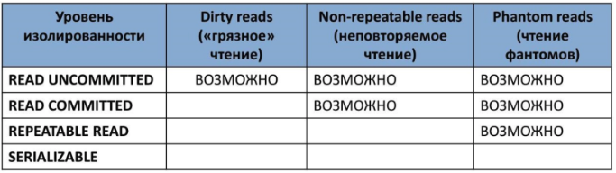
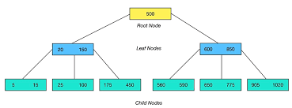

# Databases

## Введение

Здесь собрана общая информация об Базах данных, без сильной опоры на конкретную из них. О деталях конкретных баз данных будет описано в конкретно их папках (например, [Postgres](Postgres))

так же, здесь собраны ответы на вопросы, связанные с БД и СУБД. так сказать, более общие и абтрактные(?). То есть -- SQL будет в другом файле, а тут речь об -- ACID, НФ-ы и так далее и тп. здесь больше про определения, чем про конретные команды

в любом случае -- советую смотреть оба файла, чтобы не потерять контекста

начнем с разбора вопросов с [этого](https://telegra.ph/SQL-i-bazy-dannyh-02-04) источника \
так же я думаю добавить с [поступашек](https://t.me/postypashki_old/1507) \
и так же надо глянуть [лошадь](https://github.com/enhorse/java-interview/blob/master/concurrency.md#%D0%A0%D0%B0%D1%81%D1%81%D0%BA%D0%B0%D0%B6%D0%B8%D1%82%D0%B5-%D0%BE-%D0%BC%D0%BE%D0%B4%D0%B5%D0%BB%D0%B8-%D0%BF%D0%B0%D0%BC%D1%8F%D1%82%D0%B8-java) \

и так же -- [ответы на экзамен по СУБД](https://docs.google.com/document/d/1i617jJxmVs5W80ziFrbM2sB-52tlFR6TSHptC2pUZSg/edit?usp=sharing), думаю не будут лишними


## Содержание 

- [Что такое транзакции? Расскажите про принципы ACID.](#что-такое-транзакции-расскажите-про-принципы-acid)
- [ACID. зачем нужно каждое свойство](#acid-зачем-нужно-каждое-свойство)
- [Расскажите про уровни изолированности транзакций.](#расскажите-про-уровни-изолированности-транзакций)
- [Блокировки](#блокировки)
- [Оптимисчтичные и Пессимистичные блокировки](#оптимисчтичные-и-пессимистичные-блокировки)
- [Индексы: что это, типы, B-tree и Хэши, Советы, Чем много индексов плохо и тд](#индексы-что-это-типы-b-tree-и-хэши-советы-чем-много-индексов-плохо-и-тд)
- [Нормализация. (формы, зачем нужны, их описания. когда нужна денормализация)](#нормализация-формы-зачем-нужны-их-описания-когда-нужна-денормализация)
- [Компромисс между контрактом и производительностью](#компромисс-между-контрактом-и-производительностью)
- [Как база понимает, что она в согласованном состоянии (Postgres)](#как-база-понимает-что-она-в-согласованном-состоянии-postgres)
- [Connection Pool](#connection-pool)

как оптимизировать SQL запрос

## Вопросы

### Что такое транзакции? Расскажите про принципы ACID.

Транзакция -- воздействие на БД, переводящее ее из одного целостного состояния в другое и выражаемое в изменении данных, хранящихся в БД

это N ≥ 1 запросов к БД, которые выполняются успешно все вместе или не выполняются вовсе

Свойства Транзакций (ACID)
- Atomicity (атомарность) -- гарантия, что никакая транзакция не будет зафиксирована в системе частично
- Consistency (согласованность) -- гарантия что, если транзакция достигла Нормального завершения, тем самым фиксирует свои результаты, сохраняет согласованность БД
- Isolation (изолированность) -- гарантия, что параллельные транзакции не могут оказывать влияния на транзакцию
- Durability (долговечность) -- гарантия, что Если транзакция завершена, то не смотря на то, что потом Отрубили свет (проблемы нижнего уровня), изменения от этой успешно завершенной транзакции должны остаться сохраненными после возвращения системы в работу

### ACID. зачем нужно каждое свойство

это набор 4х главных правил, что гарантируют надежность работы с данными в БД.

- A — Atomicity (Атомарность)
    - всё или ничего. Транзакция не может выполниться наполовину.
    - Вы переводите другу 100 рублей. Деньги списались, но другу не зачислились (пропал интернет). База данных отменит первую операцию, вернет 100 рублей

- C — Consistency (Согласованность / Консистентность)
    - Гарантирует, что транзакция переведет БД из одного корректного состояния в другое. Данные не должны нарушать правила бизнес-логики (например, баланс не может стать отрицательным) и технические ограничения (уникальные ключи, типы данных).
    - Если на счету 50 рублей, БД запретит транзакцию на перевод 100 рублей. Данные останутся правильными

- I — Isolation (Изоляция)
    - Гарантирует, что параллельно работающие транзакции не мешают одна одной. Результат одновременного выполнения нескольких транзакций должен быть таким же, как если бы они выполнялись строго по очереди.
    - Если два человека одновременно купят последний билет на концерт, изоляция заставит их встать в "очередь". Первый успеет купить, а второй увидит ошибку, что билетов больше нет.

- D — Durability (Устойчивость / Долговечность)
    - Гарантирует, что если БД сделала COMMIT транзакции, эти данные записаны Точно. Они не пропадут, даже если упадет сервер.
    - Банкомат выдал вам чек об успешном пополнении счета. Даже если сразу после этого сервер банка перезагрузится, деньги не испарятся — они уже сохранены на жестком диске.

### Расскажите про уровни изолированности транзакций.
> баланс между скоростью и гарантиями
> проблемы -- все связаны с чтением
> - lost update -- два меняли одно и тоже, в итоге только у одного изменения сохранились
> - dirty read -- кто-то написал 100, я работал, прочитал 100. но этот кто-то отвалился и его запись не сработала, и теперь там не 100 а 50. но я работаю со 100
> - non-repeatable read -- как dirty read, только изменения все таки зафиксировались
> - phantom read -- был список по определенному фильтру. потом что-то в исходном списке поменялось, но твоя выборка старая
>
> уровни изоляции
> - read uncommitted -- можно читать незакомиченные. решает только одну проблему -- потерю обновлений
> - read commited -- ну хотя бы только закомиченные можно. но решает только Грязное чтение
> - repeatable read -- моя транзакция началась И -- я не вижу никаких изменений извне, даже закоммиченных параллельно. я могу получать одно и тоже в процессе чтения, но выборка то может меняться -- фантомы остались
> - serializable -- все решенно. грубо говоря "все должно быть эквивалентно последовательному выполнению"

при выборе уровня мы думаем об балансе между
- скоростью работы
- обеспечением гарантированной согласованности получаемых из системы данных

проблемы при параллельном выполнении транзакций
- lost update -- при одновременном изменении одного блока данных разными транзакциями теряются все именения, кроме последнего 
- dirty read -- чтение данных, добавленных или измененных транзакцией, которая впоследствии не подтвердиться
- non-repeatable read -- при повторном чтении в рамках одной транзакции ранее прочтенные данные оказываются измененными
- phantom reads -- одна транзакция в ходе выполнения несколько раз выбирает множество строк по одинаковым критериям. другая транзакция в интервалах между этими выбрками добавляет строки или изменяет столбцы некоотрых строк, используемых в критериях выборки первой транзакции, и успешно заканчивается. В результате получиться, что одни и те же выборки в первой транзакции дают разное множество строк

чтобы решить эти проблемы, рассматривают уровни изоляции транзакций. чем изолированность выше, тем больше проблем она решает
- read uncommitted -- чтение незафиксированных данных всеми транзакцими. нельзя потерять изменения, возможно неповторяемое чтение и фантомы
- read committed -- моя транзация читает свои изменения И зафиксированные изменения параллельных. потерянных изменений и грязного чтения не будет, но неповторяемое чтение и фантомы могут
- repeatable read -- чтение всех изменений своей транзакции, любые изменения, внесеные параллельными транзакциями после начала своей, недоступны. из всего возможны только фантомы
- serializable (упорядочиваемость) -- результат параллельного выполнения сериализуемой транзакции с другими транзакциями должен быть логически эквивалентен результату их какого-либо последовательного выполнения. проблем нет

красивая табличка



### Блокировки

Блокировка -- это "захват" объекта БД одной транзакцией, который временно ограничивает доступ к этому объекту для других транзакций, чтобы предотвратить конфликты

виды / режимы:
- Совместная (Shared Lock, S-Lock)
    - для операций чтения
    - Неэксклюзивная (если одна транзакция наложила S-блокировку на объект, другие транзакции также могут наложить S-блокировку на этот объект и читать его)
    - Совместима с другими S-блокировками на этот же объект и читать его

- Монопольная (эксклюзивная) блокировка (Exclusive Lock, X-lock)
    - для операций изменения 
    - Эксклюзивная (если одна транзакция наложила X-блокировку на объект, ни одна другая транзакция не может получить доступ к этому объекту (ни для чтения, ни для записи), пока блокировки не будут сняты)
    - не совместима ни с S-блокировками, ни с другии X-блокировками

Уровни (гранулярность) блокировок: блокировки могут применяться к объектам разного размера
- БД
- Таблицу
- страницу (физический блок на диске)
- строка -- самый гранулярный уровень

чем ниже уровень гранулярности, тем выше параллелизм (больше транзакций могут работать параллельно), но тем больше накладные расходы по управлению блокировками

так же встречается проблема Deadlocks (Транзакция А ждет Б, пока Б ждет А)

современные СУБД имеют механизм по отслеживанию и устранению таких проблем (автоматически завершают одну из транзакций и откатывают ее изменения)

### Оптимисчтичные и Пессимистичные блокировки

это про решение проблемы параллельного доступа

пример
- два оператора одновременно открыли карточку товара, у которого на складе осталось 10 штук. Оба хотят продать по 5 штук. Если не использовать блокировки, в итоге может остаться 5 штук (хотя продали 10), так как один перезапишет изменения другого.

теперь
- Пессимистичная блокировка 
    - Когда читаете данные, то строка блокируется полностью под вас
    - **в SQL:** Обычно через `SELECT ... FOR UPDATE`
    - Если второй пользователь попытается прочитать ту же строку с целью изменения, его запрос будет **ждать**, пока первый пользователь тем или иным не завершит транзакцию (`COMMIT` или `ROLLBACK`)
    - плюсы
        - 100% целостность
        - Исключает конфликты при записи
    - минусы
        - Медленно
        - Риск Deadlock 
            - Когда процесс А ждет ресурс, занятый процессом Б, а процесс Б ждет ресурс, занятый процессом А.
        - Плохо масштабируется на большое количество пользователей.
- Оптимистичная блокировка
    - Вы не блокируете строку в базе. Вместе с данными читаете версию. При сохранении проверяете, совпадает ли версия в базе с той, что вы прочитали в начале.
    - Реализация: Через поле `version` в таблице.
    - Плюсы
        - Быстро: Нет реальных блокировок в БД, ресурсы не простаивают
    - Минусы
        - Если конфликты случаются часто, пользователям придется постоянно переделывать свою работу

### Индексы: что это, типы, B-tree и Хэши, Советы, Чем много индексов плохо и тд

#### Что это

Индекс -- объет БД, что создается для повышения производительности выборки

индекс формируется из значений 1+ полей и указателей на соответствующие записи набора данных

тем самым становится лучше
- ускоряется поиск и сортировка по полю(полям)
- обеспечение уникальности данных

недостатки
- нужно доп место на диске и в RAM. чем больше ключ, тем больше размер индекса
- замедляются операции встаки, обновления, удаления записей -- приходится обновлять и сами индексы

#### типы индексов
как-то их слишком много, ниже будет их поменьше

- где-то потерял 
    - условный
    ```sql
    CREATE INDEX idx_recent
    ON books(year)
    WHERE year > 2015;
    ```

- по порядку сортировки
    - упорядоченные -- индексы, в которых элементы упорядочены

- по источнику данных
    - по предаставлению
    - по выражениям

- по воздействию на источник данных вы можете помещать
    - кластерный индекс -- физическое расположение данных перестраивается в соответсвии со структурой индекса. логическая структура набора данных здесь представляется как словарь. может дать существенное ускорение производительности, особенно заметно если данные последовательны
    - некластерный индекс -- не перестраивают физическую структуру данных, организуют лишь ссылки/указатели на соответствующие записи. что они в себя включают
        - инфу об идентификационном номере файла, где гранится запись
        - идентификационный номер страницы данных
        - номер искомой записи на соответствующей сранице, содержимое столбца

- по структуре
    - B*-деревья
    - B+
    - B
        - работают с операциями сравнения 
        - логарифмическая глубина дереа
        - хорош в большинстве случаев
    - Хэши
        - для операций равенства и только его 

- по количественному составу
    - простой индекс -- по одному ключу
    - составной 
        - 2+ ключа. 
        - важен порядок их следования
    - с включенными столбцами -- неклатеризованный, что также содержит и неключевые столбцы
    - главный индекс (по первичному ключу) -- индексный ключ, под управлением которого в данным момент находится набор данных
        - данные не могут быть отсортированны по нескольким индексным ключам одновременно 
        - но если одни и теже данные находтся на разных рабочих областях, то у каждой копии может быть свой главный индекс
    
- по характеристике содержимого 
    - уникальный -- уникальные значения поля
    - плотный (NoSQL) -- при котором в каждом документе в индексируемой коллекции соответствует запись в индексе, даже если в документе нет индексируемого поля 
    - разреженный (NoSQL) -- в котором те доки, для которых индексируемый ключ имеет некоторое значение
    - пространственный -- для оптимизации георграфических метоположений
    - составной пространственный -- кроме широты и долготы, как в прошлом, хранит и неокторые мета-данные
    - полнотекстовый (инвертированный) -- словарь, в котором перечислены все слова и указано, в каких местах они встрачаются 
    - хэш-индекс --
        - храние хэшей вместо самих значений.
        - можно тем самым уменьшить размер полей. 
        - но мы не можем сравнивать хэш (хэш-функция нелинейна), а следовательно и сортировать по значению. 
        - хэши не уникальны, поэтому применяются методы разрешения коллизий
    - битовый (bitmap) -- создаение битовых карт (0 и 1-цы) для каждого возможного значения столбца, где каждому биту соотвествует запись с индексируемым значением, а его значение равно 1 и означает, что запись, соответсвующая позиции бита содержит индексируемое значение для данного столбца или свойства
    - обратный индекс 
        - B-tree индекс, но с реверсированным ключом, используемый в основном для монотонно возрастающих значений в OLTP системах с целью снятия конкуренции за последний листовой блок индекса
        - благодаря переворачиванию значения две соседние записи индекса попадают в разные блоки индекса.
        - не может использоваться для диапазонного поиска
    - функциональный, по вычисляемому полю
        - ключи которого хранят результат пользовательских функций
        - часто строятся для полей, значение которых проходит предварительную обработку перед сравнением (UPPER для строк, пример)
        - может помочь реализовать любой другой отсутствующий тип индексов СУБД
    - первчиный -- уникальный индекс по первичному ключу
    - вторичный -- по другим полям (кроме первичного)
    - XML -- вырезаное материализованное представление больших двоичных XML-объектов (BLOB) в столбце с типом xml

- по механизму обновлений
    - польностью перестраиваемый -- добавился элемент -- Полностью перестраиваем
    - пополняемый (балансируемый) -- при добавлении перестраивается частично (одна ветвь). переодически балансируется

- по покрытию индексируемого содержимого
    - полностью покрывающий (полный) -- покрывает все содержимое индексируемого объекта
    ```sql
    CREATE INDEX idx_title_inc
    ON books(title) INCLUDE (author, year);
    ```
    - частичный 
        - построен на части набора данных, что удовлетворяют определенному условию самого индеса
        - нужен чтобы уменьшить размер индекса
    - инкрементный (delta) индекс 
        - индексируется малая часть данных (дельта) и , как правило, по итечении определенного времени. 
        - используется при интенсивной записи
        - пример -- полный перестраивается раз в сутки, а дельта индекс каждый час
    - реального вермени 
        - вид инкрементного индекса
        - характерезует высокую скорость построения
        - для часто меняющихся данных
    
- индексы в кластерных системах
    - глобавльный -- по всему содержимому всех сегментов БД (shard)
    - сегментный 
        - глобальный индекс по полю-сегментируемому ключу (shard key)
        - используется для быстрого определения сегмента, на котором хранятся данные в процессе маршруьизации запроа в кластере БД
    - локальный - по содержимому только одного сегмента БД

Имеет ли смысл индексировать данные, имеющие небольшое количество возможных значений?
> Примерное правило, которым можно руководствоваться при создании индекса - если объем информации (в байтах) НЕ удовлетворяющей условию выборки меньше, чем размер индекса (в байтах) по данному условию выборки, то в общем случае оптимизация приведет к замедлению выборки.

еще так же есть понятие

избыточные индексы -- индексы, которые полностью дублируют функциональность другого индекса и не приносят пользы в оптимизации
- когда "на всякий случай" создают новые
- схема меняется, а старые индексы остались
- не согласованы схемы

проблемы, которые появляются
- замедление операций по изменению данных
- база данных увеличивается
- усложняет работу оптимизатора -- пока он там насчитает свои метрики, заебется

пример
```
(a,b)
(a)
хватает только для a,b
```

чем больше индексов, тем
- больше нужно операций, чтобы изменить строку в бд
- больше занимает кеш
- чаще происходит вытеснение страниц из shared buffers
- больше вариантов оптимизатору нужно перебирать и иногда Postgres выбирает неоптимальный план

#### Советы

для каких полей предпочтительны
- поля-считчики -- чтобы и избежать повторений в этом поле
- по которым сортируют
- по которым часто проводится соединение наборов данных. (в этом случае данные располагаются в порядке возрастания индекса)
- primary key
- в котором данные выбираются из некоторого диапазона

для чего нецелесообразно
- редко используемые в запросах поля
- которые содержат всего 2 или 3 значения (мужское и женское, да и нет и тп)


`Почему нельщя навешивать индекс на большую работающую операцию`
- создание индекса -- тяжелая операция (для 1млн+ строк это минуты или часы)
    - прочитать всю таблицу
    - отсортировать 
    - построить структуру индекса
    - записать его на диск
- может блокировать операции
    - чтение можно, но по изменению данных -- будут ждать
- решение
    - создается дольше
    - нельзя внутри транзакции
    - нужно два прохода по данным
    ```sql
    CREATE INDEX CONCURRENTLY idx_name ON table(col)
    ```

`Опасно создавать много индексов подряд или одновременно -- большие нагрузки на диск и CPU`


#### о B-деревьях и Хэшах

B-tree -- это не бинарное дерево



- это широкое дерево. в одном узле хранится не одно значение, а массив отсортированных ключей и указателей

- почему не бинарное? -- чтение диска происходит блоками (страницами, обычно по 8 или 16 Кб). Бинарное дерево было бы слишком "высоким", и нам пришлось бы дедать много прыжков по диску. B-tree делается максимально "плоским" (высота обычно 3-4 уровня даже для миллионов строк), чтобы за 3-4 чтения найти любую запись

- B+ tree -- чаще всего встречается, в промежуточных узлах только ключи для навигации, а сами данные (или ссылки на строки) лежат только в листьях. листья связаны между собой двусвязным списком

- плюсы
    - поддерживает поиск по диапазону
    - сортировку и поиск по префиксу

Hash-индекс 
- это обычная hash-таблица. берется значение колонки -> прогоняется через хэш-функцию -> полчуается адрес корзины (бакеты), где лежат ссылка на строку
- ограничение: хэш функция перемешивает данные, поэтому мы не можем искать диапазоны или сортировать
- плюсы
    - поиск за O(1), если нам нужно строгое равенство
- но в Postgres хеш-индексы редко используются. B-tree выигрывают за счет своей универсальности

### Нормализация. (формы, зачем нужны, их описания. когда нужна денормализация)

[я думаю все ее читали](https://habr.com/ru/articles/254773/).
все примеры можно посмотреть в ней

это процесс организации данных в бд, чтобы исключить избыточность и аномалии (ошибки при вставке, обновлении и удалении)

- 0NF
    - куча фигни

- 1NF 
    - Все атрибуты должны быть атомарными (неделимыми)
    - Нет повторяющихся групп (столбцов типа «Телефон1», «Телефон2»)
    - У таблицы есть первичный ключ (PK)

- 2NF
    - 1NF
    - Все неключевые поля должны зависеть от всего PK целиком, а не от его части. то есть -- это аткуально только для PK с 2+ колонками
    - пример
        - Если ключ — это {Студент + Курс}, а у вас есть поле «Цена курса», то оно зависит только от «Курса»
        - Решение: Вынести «Курс» и «Цена курса» в отдельную таблицу

- 3NF
    - 2NF
    - Неключевые поля не должны зависеть от других неключевых полей. Все поля должны зависеть только от ключа
    - пример
        - `Заказы` {ID заказа (PK), ID клиента, Город клиента}. Город зависит от ID клиента, а не напрямую от ID заказа
        - Вынести данные о клиенте (ID, Город) в таблицу `Клиенты`

- Форма Бойса-Кодда (BCNF)
    - 3NF
    - Любой детерминант (поле, от которого зависят другие поля) должен быть потенциальным ключом.
    - это актуально, когда в таблице несколько перекрывающихся состанвых ключей
    
- остальыне
    - 4NF -- Устраняет многозначные зависимости (когда один ключ независимым образом определяет два и более набора значений, например: «Учитель — Предмет» и «Учитель — Хобби» в одной таблице)
    - 5NF -- Устраняет зависимости соединения. Данные нельзя разбить на еще более мелкие таблицы без потери информации

#### Зачем это нужно?

аномалии
- **Аномалия вставки:** Нельзя добавить город в базу, пока там нет хотя бы одного жителя.
- **Аномалия удаления:** Удаляем последнего жителя — и город «стирается» из системы.
- **Аномалия обновления:** Если клиент сменил фамилию, придется менять её в 100 строках заказов (если забудем хоть одну — данные станут противоречивыми).

#### когда нужно остановиться (денормализация)

прежде всего -- нормализовать, а потом точечно денормализовывать

когда
- Слишком много JOIN-ов
    - Если для выполнения частого запроса (например, отображения профиля пользователя или главной страницы) приходится объединять 5–10 таблиц, это создает огромную нагрузку на CPU и память
    - Решение: Скопировать часто используемые поля из одной таблицы в другую
    - Пример: Добавить `имя_автора` прямо в таблицу `посты`, чтобы не «джойнить» таблицу `пользователи` каждый раз

- Частое вычисление агрегатов (Суммы, счетчики)
    - Если вам нужно постоянно считать количество лайков, сумму заказов или средний балл, делать `COUNT` или `SUM` по миллионам строк при каждом просмотре — плохая идея
    - Решение: Хранить вычисленное значение в отдельной колонке и обновлять его при изменениях
    - Пример: Поле `comments_count` в таблице `статьи`.

- Необходимость хранения истории (Снапшоты данных)
    - В нормализованной БД меняются везде. Но в бизнесе часто нужно «заморозить» состояние данных на момент совершения действия.
    - Решение: Дублировать данные в таблицу фактов.
    - Пример: В таблице `заказы` нужно хранить `цену товара` и `адрес доставки` на момент покупки. Если цена товара в каталоге изменится завтра, цена в старом заказе меняться не должна.

- Фильтрация по полям из связанных таблиц
    - Если вы часто ищете данные в одной таблице, используя условия из другой (связанной), поиск может быть очень медленным.
    - Решение: Продублировать поле, по которому идет фильтрация, в основную таблицу и построить по нему индекс.
    - Пример: Поиск заказов по `названию города` (если город лежит в таблице `адреса`).

- Высокое соотношение Чтение / Запись
    - Если ваше приложение читает данные в 100–1000 раз чаще, чем записывает (например, соцсети, каталоги товаров, новости).
    - Логика: Мы замедляем запись (так как теперь нужно обновлять данные в двух местах), но зато радикально ускоряем чтение для миллионов пользователей.

Чего она стоит
- Риск противоречивости данных
- Замедление записи (INSERT/UPDATE)
- Расход места: Дублирование данных увеличивает объем дискового пространства.

### Компромисс между контрактом и производительностью

- Command Query Responsibility Segregation
    - база делится на две части.
        - Write-модель -- Строго нормализованная. Здесь происходят вставки и обновления.
        - Read-модель -- Денормализованные плоские таблицы или кэш. Данные сюда попадают из Write-модели с небольшой задержкой.
    - Запись идет медленно, но надежно. Чтение — мгновенно.

- Materialized Views
    - «автоматизированная денормализация»
    - пишете сложный запрос с кучей JOIN-ов, а база сохраняет его результат в отдельную физическую таблицу
    - тем самым, исходные таблицы нормализованы, но читаете уже готовый результат
    - но: Данные в представлении могут отставать от реальности на время обновления

- Covering Indexes
    - денормализация без изменения структуры таблиц
    - создаете индекс, что включает в себя не только ключ, но и дополнительные поля, которые вы часто запрашиваете (конструкция `INCLUDE` в SQL)
    - БД берет данные прямо из индекса, не обращаясь к самой таблице (Heap/Clustered Index)
    - Таблицы остаются нормализованными, но база тратит больше места на диске ради скорости

- Вертикальное и горизонтальное секционирование (Partitioning)
    - Вместо того чтобы денормализировать, мы режем таблицу на куски
        - Вертикально: Выносим редко используемые колонки (например, «Биографию пользователя» или «Blob-данные») в отдельную таблицу
        - Горизонтально: Режем таблицу по датам или ID (шардинг)
    - все нормализовано, но БД быстрее, так как сканирует меньшие данных

- Отказ от Foreign Keys на Highload
    - Мы убираем `FOREIGN KEY` на уровне базы, чтобы ускорить `INSERT/UPDATE` (базе не нужно проверять связи)
    - Риск: Целостность данных теперь лежит полностью на плечах программиста
    - делать Только когда БД стала "бутылкой" и другие методы оптимизации уже исчерпаны

### Как база понимает, что она в согласованном состоянии (Postgres)

это понятие живет на трех уровнях: **логическом**, **транзакционном** и **физическом**.
- Логический уровень -- Контракты (Constraints)
    - БД понимает, что она в порядке, если не нарушены правила, что мы сами задали при создании таблиц
        - Foreign Keys -- если вы удаляете строку, на которую кто-то ссылается, Postgres не одобрит
        - Check Constraints (что цена не может быть отрицательной)
        - Unique/Not Null

- Транзакционный уровень -- MVCC и Снапшоты
    - Postgres использует многоверсионность. то есть -- в базе одновременно могут лежать старая и новая версии одной и той же строки
    - как БД понимает, какая версия правильная
        - У каждой строки есть скрытые поля `xmin` (ID транзакции, которая создала строку) и `xmax` (ID транзакции, которая её удалила/обновила)
        - В системе есть Commit Log — это битовая карта в памяти и на диске, где для каждой транзакции хранится статус: `IN_PROGRESS`, `COMMITTED` или `ABORTED`
        - Когда вы делаете `SELECT`, база смотрит туда: «Транзакция, создавшая эту строку, уже закоммичена? Да. А та, что пометила её на удаление? Еще нет. Значит, строка видна»

- Физический уровень -- WAL и контрольный файл
    - Как БД понимает, что она после внезапного падения
    - Postgres Сначала пишет изменения в **WAL-логи** (журнал предзаписи). Это последовательный список всех действий: «вставить X в таблицу Y».
    - файл (`global/pg_control`)
        - В нем хранится **статус системы**.
        - Когда Postgres запускается, он сначала читает его. Там может быть:
            - `DB_SHUTDOWNED` --  БД была выключена штатно. Все данные на диске согласованы. Можно просто работать
            - `DB_IN_PRODUCTION` -- БД упала во время работы. Состояние на диске может быть «битым»
    - Процесс восстановления 
        - Если `DB_IN_PRODUCTION`, БД начинает **Crash Recovery**:
            - Она находит в контрольном файле указатель на последний **Checkpoint** (момент, когда данные гарантированно были сброшены на диск).
            - Начиная с этого момента, она читает WAL-логи и «проигрывает» их заново (**Redo**).
            - Она применяет все изменения из логов к файлам данных.
            - В конце она помечает все незавершенные транзакции как `ABORTED`.

- Как база понимает, что страница данных не «протухла»? (LSN)
    - Внутри каждой страницы данных (блока по 8 КБ) есть Log Sequence Number
        - Это «номер версии» последнего изменения этой страницы.
        - При восстановлении Postgres сравнивает LSN страницы на диске и LSN записи в WAL-логе.
        - Если `LSN_страницы < LSN_лога`, значит, изменение из лога еще не долетело до диска, и его нужно применить.

### Connection Pool

это кэш сетевых соединений с БД. Вместо открывания и закрывания новых соединений для каждого запроса, приложение берет уже открытое соединение из пула, использует его и возвращает обратно.

#### Проблема

Создание нового соединения с БД — это дорого
- Установка TCP-соединения (трехстороннее рукопожатие)
- Установка TLS/SSL (обмен сертификатами)
- Проверка логина/пароля, прав доступа
- В Postgres на каждое соединение выделяется отдельный процесс, что потребляет память (около 10–20 МБ на «пустое» соединение)

#### Как работает

- При старте приложение создает, например, 10 соединений и держит их открытыми
- Когда коду нужно выполнить SQL, он говорит пулу: `getConnection()`
- Ожидание 
    - Если есть свободное соединение — пул отдает его мгновенно
    - Если все заняты — приложение ждет, пока кто-то другой не вернет соединение
- Приложение выполняет запрос
- Приложение вызывает `close()`
    - соединение не закрывается, а помечается в пуле как свободное

#### Где живет?

- Внутри приложения (Client-side pool)
    - Библиотека встроена прямо в ваш код (Java HikariCP, Python SQLAlchemy, Go `database/sql`)
    - **Плюс:** Очень быстро (нулевая задержка между кодом и пулом)
    - **Минус:** Если у вас 50 микросервисов и у каждого пул на 20 соединений, база получит 1000 соединений, что может быть для неё много.

- Отдельный прокси-сервер (Server-side pool)
    - Специальное ПО, которое стоит между приложением и базой (например, **PgBouncer** или **Odyssey** для Postgres)
    - **Плюс:** Позволяет тысячам микросервисов подключаться к базе, эффективно распределяя всего 100 реальных соединений.
    - **Минус:** Дополнительное «звено» в сети