Это абсолютно нормальная ситуация перед собеседованием: в голове каша из терминов. Чтобы всё встало на свои места, нужно увидеть **картину целиком**.

Я подготовил для тебя схему (Mermaid) и подробный справочник. Сначала посмотри на схему, чтобы понять связи, а затем читай описание каждой сущности.

### 🗺 Архитектура Kafka (Mermaid Диаграмма)

Ты можешь скопировать этот код и вставить в любой Markdown-редактор с поддержкой Mermaid (или на сайт `mermaid.live`), но даже здесь она должна отрендериться.

```mermaid
graph TD
    %% ==========================================
    %% ПРОДЮСЕРЫ (Пишут данные)
    %% ==========================================
    subgraph "Producers Layer"
        P1[Producer 1<br>Пишет в Topic A]
        P2[Producer 2<br>Пишет в Topic B]
    end

    %% ==========================================
    %% KAFKA CLUSTER (Хранение и Репликация)
    %% ==========================================
    subgraph "Kafka Cluster"
        direction TB
        
        %% Брокер 1
        subgraph "Broker 1 (Controller)"
            T1_P0_L[Topic A - Part 0<br>⭐ LEADER]
            T1_P2_F[Topic A - Part 2<br>🔄 FOLLOWER]
            T2_P1_L[Topic B - Part 1<br>⭐ LEADER]
        end

        %% Брокер 2
        subgraph "Broker 2"
            T1_P1_L[Topic A - Part 1<br>⭐ LEADER]
            T1_P0_F[Topic A - Part 0<br>🔄 FOLLOWER]
            T2_P0_F[Topic B - Part 0<br>🔄 FOLLOWER]
        end

        %% Брокер 3
        subgraph "Broker 3"
            T1_P2_L[Topic A - Part 2<br>⭐ LEADER]
            T1_P1_F[Topic A - Part 1<br>🔄 FOLLOWER]
            T2_P0_L[Topic B - Part 0<br>⭐ LEADER]
            T2_P1_F[Topic B - Part 1<br>🔄 FOLLOWER]
        end

        %% Репликация внутри кластера (Фолловеры тянут данные у Лидеров)
        T1_P0_L -.->|Replicate| T1_P0_F
        T1_P1_L -.->|Replicate| T1_P1_F
        T1_P2_L -.->|Replicate| T1_P2_F
        T2_P0_L -.->|Replicate| T2_P0_F
        T2_P1_L -.->|Replicate| T2_P1_F
    end

    %% ==========================================
    %% СВЯЗИ ПРОДЮСЕРОВ С ЛИДЕРАМИ
    %% ==========================================
    P1 -->|Пишет в P0| T1_P0_L
    P1 -->|Пишет в P1| T1_P1_L
    P1 -->|Пишет в P2| T1_P2_L

    P2 -->|Пишет в P0| T2_P0_L
    P2 -->|Пишет в P1| T2_P1_L

    %% ==========================================
    %% КОНСЬЮМЕРЫ (Читают данные)
    %% ==========================================
    
    %% Группа 1 читает Topic A (3 консьюмера на 3 партиции)
    subgraph "Consumer Group 1 (Читает Topic A)"
        T1_P0_L -->|Читает из P0| C1_A[Consumer 1A]
        T1_P1_L -->|Читает из P1| C1_B[Consumer 1B]
        T1_P2_L -->|Читает из P2| C1_C[Consumer 1C]
    end

    %% Группа 2 читает Topic A (Независимое чтение того же топика!)
    subgraph "Consumer Group 2 (Analytics - Читает Topic A)"
        T1_P0_L -->|Читает из P0 и P1| C2_A[Consumer 2A]
        T1_P1_L -->|Читает из P0 и P1| C2_A
        T1_P2_L -->|Читает из P2| C2_B[Consumer 2B]
    end

    %% Группа 3 читает Topic B
    subgraph "Consumer Group 3 (Читает Topic B)"
        T2_P0_L -->|Читает из P0| C3_A[Consumer 3A]
        T2_P1_L -->|Читает из P1| C3_B[Consumer 3B]
    end

    %% ==========================================
    %% УПРАВЛЕНИЕ (ZooKeeper/KRaft)
    %% ==========================================
    subgraph "ZooKeeper / KRaft Quorum"
        ZK[Управляет метаданными<br>Выбирает Лидеров]
    end
    ZK -.->|Управляет| Broker1
    ZK -.->|Управляет| Broker2
    ZK -.->|Управляет| Broker3

    %% Стилизация (цвета для наглядности)
    classDef leader fill:#d4edda,stroke:#28a745,stroke-width:2px;
    classDef follower fill:#fff3cd,stroke:#ffc107,stroke-width:1px,stroke-dasharray: 5 5;
    classDef producer fill:#cce5ff,stroke:#007bff,stroke-width:2px;
    classDef consumer fill:#f8d7da,stroke:#dc3545,stroke-width:2px;
    classDef zk fill:#e2e3e5,stroke:#6c757d,stroke-width:2px;

    class T1_P0_L,T1_P1_L,T1_P2_L,T2_P0_L,T2_P1_L leader;
    class T1_P0_F,T1_P1_F,T1_P2_F,T2_P0_F,T2_P1_F follower;
    class P1,P2 producer;
    class C1_A,C1_B,C1_C,C2_A,C2_B,C3_A,C3_B consumer;
    class ZK zk;
```

---

### 📚 Полная Шпаргалка: Кто есть кто и за что отвечает

Давай разберем систему от самых крупных элементов к самым мелким, а потом перейдем к клиентам.

#### 1. Управляющий слой
*   **ZooKeeper (или KRaft в новых версиях):**
    *   **Кто это:** «Мозг» и администратор кластера.
    *   **Ответственность:** Хранит метаданные (какие топики существуют, где лежат их партиции). Следит за тем, какие Брокеры живы. Выбирает Контроллера среди Брокеров.

#### 2. Серверный слой (Узлы)
*   **Kafka Cluster (Кластер):**
    *   **Кто это:** Объединение нескольких серверов (Брокеров) в единую систему.
    *   **Ответственность:** Обеспечение отказоустойчивости и горизонтального масштабирования.
*   **Broker (Брокер):**
    *   **Кто это:** Один физический или виртуальный сервер с запущенной программой Kafka.
    *   **Ответственность:** Принимать сообщения по сети, сохранять их на свой жесткий диск, отдавать сообщения по запросу. Брокер ничего не знает про бизнес-логику, для него это просто байты.
*   **Controller (Контроллер):**
    *   **Кто это:** Один из Брокеров, которого ZooKeeper назначил «главным».
    *   **Ответственность:** Если какой-то Брокер умирает, именно Контроллер переназначает Лидеров для партиций, которые лежали на мертвом брокере.

#### 3. Логический и физический слой данных
*   **Topic (Топик):**
    *   **Кто это:** Логическая категория или «канал» (например, `orders`, `user_clicks`).
    *   **Ответственность:** Группировка сообщений по смыслу.
*   **Partition (Партиция):**
    *   **Кто это:** Физическая часть топика. Топик всегда разбит на 1 или более партиций.
    *   **Ответственность:** **Распараллеливание нагрузки.** Именно партиции позволяют Кафке быть быстрой. Разные партиции лежат на разных брокерах. *Важно: строгий порядок сообщений гарантируется ТОЛЬКО внутри одной партиции.*
*   **Segment (Сегмент):**
    *   **Кто это:** Файл на жестком диске брокера (обычно по 1 ГБ), в котором лежат сообщения партиции.
    *   **Ответственность:** Физическое хранение и удаление данных (Retention Policy удаляет старые данные именно сегментами, а не по одному сообщению).
*   **Offset (Оффсет):**
    *   **Кто это:** Порядковый номер (ID) сообщения внутри конкретной партиции. Он неизменен и всегда растет.

#### 4. Слой надежности (Репликация)
*   **Replica (Реплика):**
    *   **Кто это:** Копия партиции. Если Replication Factor = 3, то у партиции есть 3 реплики на 3 разных брокерах.
*   **Leader (Лидер):**
    *   **Кто это:** Главная реплика партиции.
    *   **Ответственность:** **Вся работа идет только через Лидера.** Продюсеры пишут только в Лидера, Консьюмеры читают только из Лидера.
*   **Follower (Фолловер):**
    *   **Кто это:** Реплика-копия.
    *   **Ответственность:** Просто сидеть и молча скачивать новые данные у Лидера, чтобы быть готовым заменить его в случае аварии.
*   **ISR (In-Sync Replicas):**
    *   **Кто это:** Список Фолловеров, которые скачивают данные быстро и не отстают от Лидера. Только участник ISR может стать новым Лидером.

#### 5. Слой клиентов (Твои приложения)
*   **Producer (Продюсер):**
    *   **Кто это:** Приложение, которое отправляет данные в Kafka.
    *   **Ответственность:** 
        *   Решать, в какую партицию отправить сообщение (через Key-хеширование или Round-Robin).
        *   Группировать сообщения в **Batch** (для скорости).
        *   Определять уровень надежности через **acks** (0, 1, all).
*   **Consumer (Консьюмер):**
    *   **Кто это:** Приложение, которое читает данные из Kafka.
    *   **Ответственность:** 
        *   Читать сообщения (через `poll`).
        *   Сообщать Кафке, что сообщение обработано (делать **Commit** оффсета).
*   **Consumer Group (Группа консьюмеров):**
    *   **Кто это:** Команда из нескольких инстансов твоего приложения (например, 3 запущенных микросервиса `OrderService`).
    *   **Ответственность:** **Разделение труда.** Кафка следит, чтобы одну партицию читал только один консьюмер из группы. Если в топике 3 партиции и в группе 3 консьюмера — каждый получит ровно по 1 партиции. Если один консьюмер умрет, произойдет **Rebalance**, и его партицию отдадут выжившему.

---

### 🎬 Как это работает всё вместе (Сценарий на собеседование)

Представь, что ты отправляешь заказ:
1.  Твой **Producer** создает сообщение `{"orderId": 1}` с ключом `user_123`.
2.  Продюсер хэширует ключ и понимает: *"Ага, это должно лететь в **Партицию №1** Топика `orders`"*.
3.  Продюсер спрашивает у метаданных: *"Кто сейчас **Лидер** Партиции №1?"*. Ответ: **Broker 2**.
4.  Продюсер кладет сообщение в **Batch**, сжимает его и отправляет на Broker 2.
5.  **Broker 2 (Лидер)** записывает сообщение на диск (в **Segment**) и присваивает ему **Offset** (например, 105).
6.  В это время **Broker 3** и **Broker 1** (которые являются **Followers** для этой партиции и входят в **ISR**) скачивают это сообщение себе.
7.  Лидер видит, что копии созданы (т.к. у Продюсера стоит `acks=all`), и отвечает Продюсеру: *"Успешно!"*.
8.  С другой стороны сидит **Consumer Group**. Один из **Consumers** закреплен за Партицией №1. Он делает запрос к Лидеру (Broker 2) и скачивает сообщение с Offset 105.
9.  Консьюмер обрабатывает заказ в БД и отправляет Кафке **Commit**: *"Я успешно обработал оффсет 105"*. Эта цифра сохраняется в системный топик `__consumer_offsets`.

Всё! Теперь у тебя есть полная, логически связанная картина. Прочитай этот сценарий пару раз перед собеседованием, и ты ответишь на любой архитектурный вопрос.