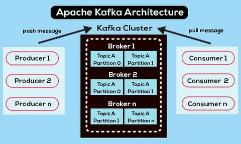

# Kafka (поступашки)

## В общем

Kafka обладает высокой производительностью и стабильностью, обеспечивает надежную долговечность, имеет гибкую публикацию-подписку/очередь, которая хорошо масштабируется с N-числом групп потребителей, имеет надежную репликацию

составляющие
- Records -- могут иметь ключ(optional), значение и метку времени. неизменны 
- Topics -- поток record-ов. можно представить как название канала, у которого есть журнал, что является хранилищем на диске
- Consumers --  API Kafka Consumer нужен для получения потока записей из Kafka
- Producers --  API Kafka Producer используется для создания потоков записей данных
- Brokers -- сервер Kafka, что работает в кластере Kafka
- Logs
- Partitions
- Clusters -- состояит из множества брокеров Kafka, что расположены на многих серверах

чтобы упралвять Cluster-ом используют ZooKeeper -- согласованная файловая система для хранения информации о конфигурации, используется для координации брокеров/кластеров, поэтому каждый узел в кластере знае, когда присоединился новый брокер, умер брокер, была удалена Topic или добавлена Topic и тп

## о компонентах

### Broker

отвеачет за хранение данных. все данные хранятся в бинарном виде, и брокер мало знает про то, что они из себя представляют, и какова их структура

### Topic

каждый логический тип событий обычно находится в своем отдельном topic. его можно рассматривать как классификатор событий

### Partition

далее Topic разбивается на 1+ Partition. туда попадают события. 

если в Cluster более одного Broker, то Partition будут распределены по всем Broker равномерно, что позволит масщтабировать нагрузку на запись и чтение в один Topic сразу на несколько Broker

Offset-номер сообщения в Partition

на диске данные для каждой Partition хранятся в виде файлов сегментов, по умолчанию равных одному гигабайту

важная особенность -- удаление данных из Partition происходит как раз сегментами
(нельзя удалить одно событие из партиции, можно удалить только целый сегмент, причем только неактивный)

### Zookeeper

Zookeeper выполняет роль хранилища метаданных и координатора. Именно он способен сказать, живы ли брокеры, какой из брокеров является контроллером, находятся ли партиции в синхронном состоянии со своими репликами. Также именно к zookeeper сперва пойдут producer и consumer, чтобы узнать, на каком брокере какие топики и партиции хранятся. В случаях, когда для топика задан replication factor больше 1, zookeeper укажет, какие партиции являются лидерами (в них будет производиться запись и из них же будет идти чтение). В случае падения брокера именно в zookeeper будет записана информация о новых лидер-партициях (с версии 1.1.0 асинхронно, и это важно).

### Producer

тот, кто осуществаляет запись данных в Kafka. 

Producer выбирает topic, в котором будут храниться его тематические сообщения, и начинает записывать в него информацию. Каждое событие при этом представляет собой пару ключ-значение.

По умолчанию все события распределяются по партициям топика round-robin`ом, если ключ не задан (теряя упорядоченность), и через MurmurHash (ключ), если ключ присутствует (упорядоченность в рамках одной партиции).

Здесь сразу стоит отметить, что Kafka гарантирует порядок событий только в рамках одной партиции. Но на самом деле часто это не является проблемой. Например, можно гарантированно добавлять все изменения одного и того же объявления в одну партицию (тем самым сохраняя порядок этих изменений в рамках объявления). Также можно передавать порядковый номер в одном из полей события.

### Consumer

отвечает за получение данных из Kafka. Этот сервис будет подписан на топик сервиса объявлений, и при появлении нового объявления будет получать его и анализировать на соответствие некоторым заданным политикам.

Kafka запоминает, какие последние события получил consumer (для этого используется служебный топик __consumer__offsets), тем самым гарантируя, что при успешном чтении consumer не получит одно и то же сообщение дважды. Тем не менее, если использовать опцию enable.auto.commit = true и полностью отдать работу по отслеживанию положения consumer’а в топике на откуп Кафке, можно потерять данные. В продакшен коде чаще всего положение консьюмера контролируется вручную (разработчик управляет моментом, когда обязательно должен произойти commit прочитанного события).

В тех случаях, когда одного consumer недостаточно, можно добавить еще несколько consumer, связав их вместе в consumer group. Consumer group логически представляет из себя точно такой же consumer, но с распределением данных между участниками группы. Это позволяет каждому из участников взять свою долю сообщений, тем самым масштабируя скорость чтения.