# Многопоточность

## Введение
Тут мой "конспект" с лекций и семинаров Т-Академии

Некоторые ссылки сейчас не доступны, так как пока не знаю Можно ли делиться ими или нет. Позже (TODO)

## Содержание
- [Лекция 1](#лекция-1)
- [Семинар 1](#семинар-1)
- [Лекция 2. Основные проблемы многопоточности](#лекция-2-основные-проблемы-многопоточности)
- [Семинар 2](#семинар-2)
- [Лекция 3](#лекция-3)
- [Семинар 3](#семинар-3)
- [Просто от себя у Gemini спросил](#просто-от-себя-у-gemini-спросил)

## Лекция 1

### Многозадачность и многопоточность

`многозадачность` -- это свойство операционной
системы или среды выполнения обеспечивать возможность параллельной (или
псевдопараллельной) обработки нескольких задач. Истинная многозадачность
операционной системы возможна только в распределённых вычислительных системах.

типы:
- Процессарная многозадачность
- Поточная многозадачность

`многопоточность` -- свойвство платформы или приложения, состоящее в том, что процесс, порожденный в операционной системе, может состоять из нескольких потоков, выполняющихся "параллельно", то есть без предписанного порядка во времени. 
Либо это специализированная форма многозадачности

### `средства` "параллельной обработки"
- `аппаратные`
    - многопроцессорность
    - многоядерность
    - многопоточность на уровне процессора
- `программные` 
    - многозадачность
    - многопоточность на уровне ядра ОС
    - многопоточность на пользовательском уровне

###  `Законы` многопоточности

- Закон `Мура`
> количество транзисторов, размещенных на кристалле интегральной схемы, удваивается каждые 24 месяца

- Закон `Амдала`
> В случае, когда задача разделяется на несколько частей, суммарное время ее выполнения на параллельной системе не может быть меньше времени выполнения самого медленного фрагмента

- Закон `Густавсона-Барсиса` (как переоценка Амдала)
> закон Амдала предполагает, что Объем задачи остается неизменным
>
> а закон Густафсона предполагает, что Время, отведенное на выполнение задачи, остается неизменным
>
> Г-Б закон характеризует ситуацию, при которой Время вычислений с расширением системы не меняется, но увеличивается Объем решаемой задачи

- `Universal Scalability Law`
> универсальный закон расширяемости системы гласит, что пропускная способность системы
> - прямо пропорциональна параллелизму системы
> - обратно пропорциональна конкурентности доступа к ресурсам
> - обратно пропорциональна времени становления данных согласованными 

### `Многопоточность на уровне ОС`

приложение состоит из одного или нескольких процессов. в контексте процесса выполняются один или несколько потоков

`поток` -- это базовая единица, которой ОС выделяет процессорное время

поток может выполнять любую часть кода процесса, включая те части, которые в настоящее время выполняются другим потоком

`Типы` потоков:
- `пользовательские`
- `уровня ядра`

на один оптом `уровня ядра` приходится от 1 до нескольких `пользовательских`

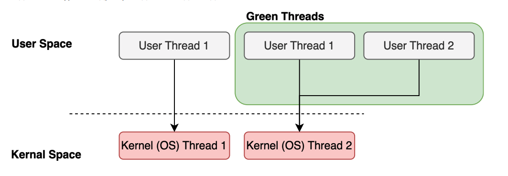

`"зеленные потоки"` - абстракция языка программирования.
пример:
- Java -- виртуальные потоки Project Loom
- Kotlin -- корутины
- Go -- гоурутины

### `Жизненный цикл`


### `Параллелизм и многопоточность`

`Параллелизм` -- свойство системы исполнять инструкуции параллельно

для истинного параллелизма требуется -- 2+ вычислительных ядра и что могут выполнять задачи параллельно

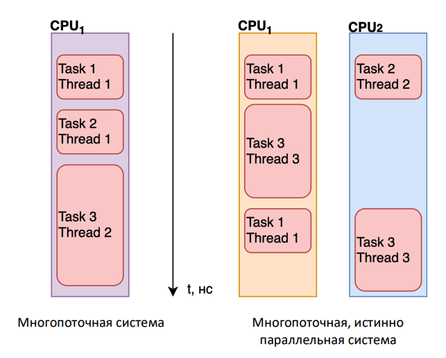

### `Что делали, когда Не было многоядерности`
 
`Квантование времени процессора` -- первый шаг при реализации "псевдо-параллельной" многопоточности -- переход к дискретному процессрному времени, которым гораздо проще управлять

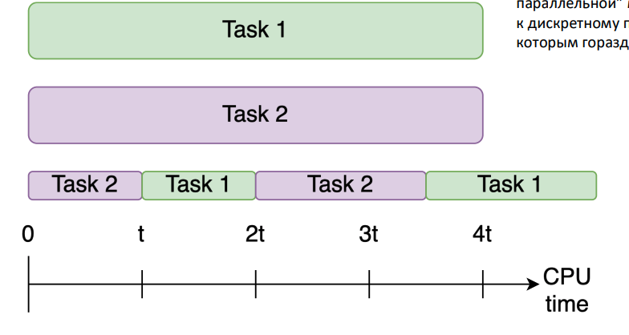

`Thread sheduler` -- второй шаг -- выделение отдельного компонента, основной задачей которого будет распределение квантов времени между потоками

выбор потока зависит от приоритета и алгоритма

пример алгоритма
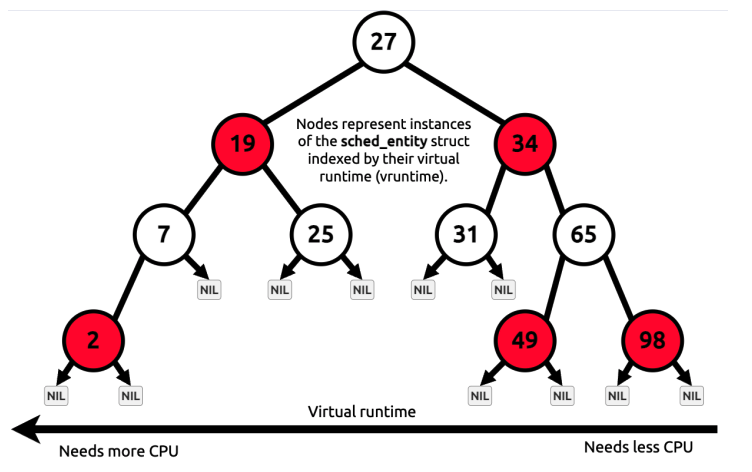

[пример, как работает алгоритм](more-info/thread-scheduler-alg-example.pdf)

`переключение контекса` -- третий шаг -- научиться переключаться между потоками на уровне ядра

[пример](more-info/переключение-контекста-пример.pdf)

### `Memory Model`

```
пример кода, где класс, который инициализирует x = 0, y = 0
есть два метода, которые getX и getY -- присваивают своему параметру 1 И возвращает другой параметр 

далее в функции main вызывается два потока, где один getX, другой getY

вопрос -- какие варианты будут в результате работы?
(x,y) == (1,1), (1,0) , (0,1) , (0,0)?

при чем среди результатов есть (0,0)

почему?
```

`Почему?`
- `instructions reordering` -- оба потока могли поменять местами инструкции записи и чтения, так как эти действия никак не связаны

- `visibility` -- даже если переупорядочивания не было, записи могут быть просто не видны другому потоку из-за оптимизации компилятора или задержки про пропагации записи на уровне (не видно)

в языках программирования есть ключевое слово `volatile`, которое помогает, чтобы потоки не делали локалные копии куска данных, а брали исключительно из общей памяти.

### `Итого`

- `Преимущества` Многопоточности
    - **повышение производительности** 
    - **отзывчивость** -- пока один поток занимается сложными задачами, другой помогает в пользовательском взаимодействии
    - **простота моделирования** 
    - **эффективное использование ресурсов** -- пока один тупит, другие работают

- `Недостатки`
    - **Сложность**
    - **Оверхед** -- добавляется так же создание, упраление и переключение потоков, что тоже занимает время. поэтому иногда это даже наоборот -- съедает производительность
    - **нет единообразности в поддержке многопоточности**
    - **проблемы безопастности данных** -- если не правильно всем управлять, могут возникнуть проблемы с целостностью данных
    - **неконтролируемая работа потоков** -- Во время исполнения потоки работают асинхронно и могут вызывать неожиданные последствия, которые трудно предсказать и контролировать.

## Семинар 1

планы

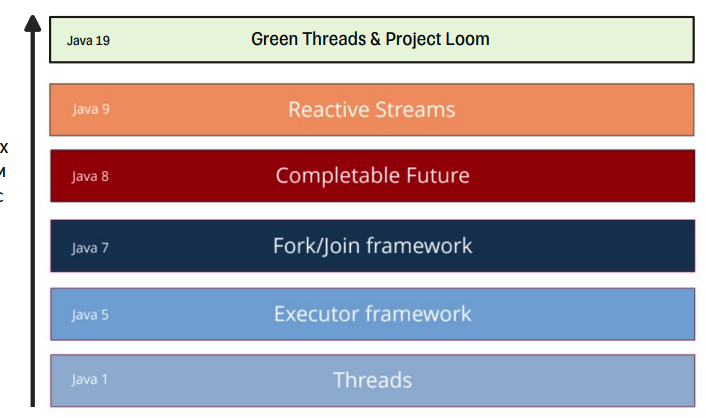

[какая между ними связь](examples/gemini-поясняет-когда-какой-фреймворк-нужен.md)

тут основы, которые были максимально обсосаны [тут](../../Java/multithreading.md), поэтому -- тут я особо ничего расписывать не буду
может максимум как "что было на семинаре..."

тут только новшиства и еще пару важных деталей

```java
// Java 21+
// тут можно методы глянуть и тп

// обычный тяжеловестный
var thread = Thread.ofPlatform()
    .name("platform-thread")
    .priority(Thread.MAX_PRIORITY)
    .daemon(false)
    .start(() -> greetTheWorld(1_000));

// демон-поток
var daemon = Thread.ofPlatform()
    .name("daemon-thread")
    .daemon()
    .start(() -> greetTheWorld(2_000))

// виртуальный
// project loom
var virtual = Thread.ofVirtual()
    .name("virtual-thread")
    .start(() -> greetTheWorld(3_000));
```
Важно отметить
- приоритет Виртуальному потоку задавать нельзя

Зачем нужна синхронизация, пример

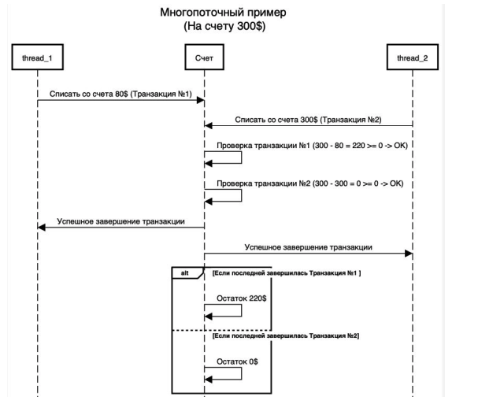

### `Мониторы`

мониторы -- способ синхронизации

у каждошо объекта есть монитор

каждый монитор...
- ... обладает множествами -- EntrySet и WaitSet
- ... ассоциирован с одним или множеством блоков кода
- ... может "принадлежать" только одному потоку в единицу времени

ключевое слово synchronized
- можно метод или блок кода у объекта или класса
- можно На this, на неком Object, а можно и на самом классе

### `wait и notify`
- могут быть вызваны только в блоке synchronized
- wait -- помещает текущий поток в WaitSet объекта-монитора, а notify -- уведомляет, что кому-то надо будет выйти из WaitSet

### `JMM`

#### опять к вопросу о x и y

оптимизация программы происходит не только на уровне кода, но и на уровне компилятора и ОС

оптимизация такая -- переупорядочивание инструкций. на каких уровнях это происходит
- компилятора байт-кода
- компилятора машинного кода
- процессора

#### и что делать? 

для этого есть JMM -- математическая модель, которая строго описывает какое выполнение программы является валидным

и мы используем для этого
- `synchronized`
- `volatile`
- `final`
- `java.util.concurrent.*`

если в нашем примере мы воспользуемся `volatile`, то Не будет варианта (0,0)
и так же это все благодоря семантике `happens before`

`happens before` -- логическое ограничение на порядок выполнения инструкций прогаммы. если указывается, что запись в переменную и последующее ее чтение связаны через эту зависимость, то как бы при выполнении не переупорядочивались инструкции, в момент чтения все связаные с процессом записи результаты уже зафиксированы и видны
(то есть -- все изменения Событие А произошло До события Б. все что сделал поток А до события А ГАРАНТИРОВАННО видно потоку Б в момент события Б)

## `Лекция 2. Основные проблемы многопоточности`

основной источник всех проблем -- общий доступ к распределенным ресурсам, а именно
- исходному коду программы
- памяти процесса
- процессорному времени

### `Основные виды проблем`
(самые частые, список можно продолжить)

- Недостаточность Синхронизации
    - Race Condition
    - Data Race
- Избыточность или некорректность синхронизации
    - Deadlock
    - Livelock
    - деградация производительности
- Нехватка/ некорректная утилизация ресурсов
    - Thread Starvation
    - Деградация производительности

### `Недостаточность Синхронизации`
Вот слайд, который показывает разницу между Гонкой данных И Состоянием гонки

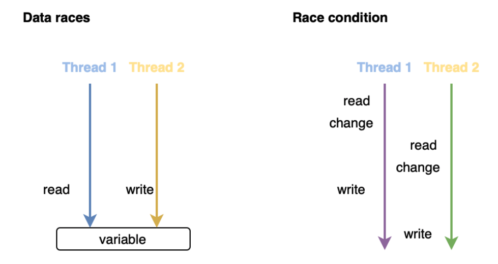

Пример Data Race: 
- наш любимый пример с x и y
- чтение 64 битного значения в 32 битной системе. это просто напросто может быть не атомарной операцией

`Критическая секция` -- участок исполняемого кода программы, в котором производится доступ к общему ресурсу (данным или устройству), который не должен быть одновременно использован более чем одним потоком выполнения. При нахождении в критической секции 2+ потоков возникает состояние гонки

### `Алгоритмы взаимного исключения`

`взаимное исключение` -- свойство построения параллельных программ, которое используется в целях предотвращения состояния гонки. оно требует, чтобы один поток исполнения никогда не входил в критическую секцию одновременно с тем, как другой параллельный поток выполнения вошел в свою критическую секцию

- `Алгоритм Петерсона` -- с помощью блокировов

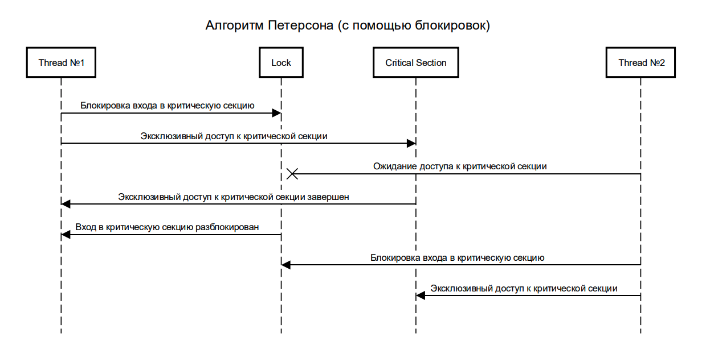

- `Алгоритм Лампорта`

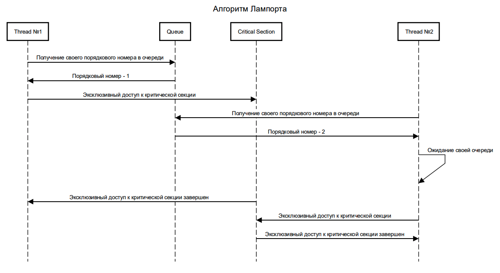

Пример

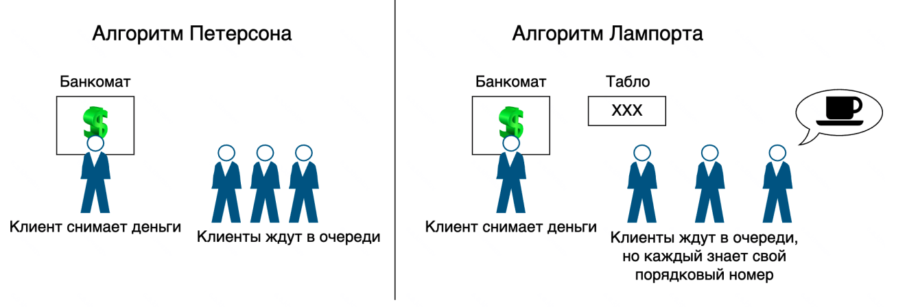

### `Блокирующая синхронизация`

`Семафор` -- примитив синхронизации работы процессов и потоков, в основе которого лежит счетчик, над которым можно проивзодить две атомарные операции: увеличение и уменьшение значения на единицу, при этом операция уменьшения для нулевого значения счетчика является семантически блокирующейся

```java
var semaphore = new Semaphore(1);

startThreas(() -> {
    semaphore.acquire();
    ...
    semaphore.release();
});
```
`Способы реализации` 
- блокирующая 
- не блокирующая

`В чем отличие от мьютекса?`
- двоичный семафор может "симулировать" поведение мьютекса, но не сможет его заменить.
Если мьютексом может управлять только тот поток, который его заблокировал, то значение счетчика в семафоре может изменить любой поток

`Примеры реализаций`
- Semaphore
- CountDownLatch
- Exchanger
- Phaser
- CyclicBarrier

### `Не_блокирующая синхронизация`
Недостатки Блокирующей
- заблокированный поток невозможно переиспользовать
- переключение потоков -- недешевая операция
- некорректная синхронизация может повлечь за собой дедлоки

`Гарантии алгоритмов неблокирующей синхронизации` \
(Gemini описал как "один влючает все предыдущие". типо -- wait-free включает все предыдущие и тд)
- **Obstruction-free (Без препятствий)**
    Любой отдельный поток гарантированно завершит свою операцию за конечное число шагов, если все остальные потоки в этот момент будут приостановлены (отсутствие конкуренции). Если же несколько потоков работают одновременно, они могут бесконечно мешать друг другу (конфликтовать).

- **Lock-free (Без блокировок)**
    Гарантирует, что за любой промежуток времени хотя бы один поток в системе продвинется дальше по шагам алгоритма. Даже если некоторые потоки «зависнут» или будут постоянно конфликтовать, система в целом никогда не остановится и будет показывать прогресс.

- **Wait-free (Без ожидания)**
    Самая сильная гарантия. Любой поток гарантированно завершит свою операцию за конечное число шагов, независимо от того, что делают другие потоки. Никто не ждет, никто не идет на повторный круг из-за конфликтов.

[пример](examples/гарантии-Не-блокирующей-синхронизации.md)

Большой пласт алгоритмов неблокирующей синхронизации построен на использовании атомарных Read-Modify-Write операциях, реализованных на стороне "Железа"

`Атомарная операция` -- операция, которая либо выполняется целиком, либо не выполняется вовсе. Либо -- операция, которая не может быть частично выполнена и частично невыполнена

`Read-Modify-Write операции` -- класс операций, совмещающих в одну атомарную с точки зрения процессора операцию сразу несколько -- чтение и модификацию значения к ним относиться 
- `Compare-And-Swap`(CAS)(сравнение и обмен)
- `Fetch-and-Add`(FAA)(получение и добавление)
- `Load-Link/Store-Conditional`(LL/SC)(загрузить ссылку, сохранить условие?)
- др

Lock-free на примере стека
```python
fun push(x: Int)
    while (true)
        head = H
        if (head == null)
            throw new EmptyStackException()
        newHead = Node {value: x, next: head}
        if (CAS (&H, head, newHead))

fun pop(): Int
    while (true)
        head = H
        if (CAS (&H, head, head.next))
            return head.value

fun CAS (int* p, int old, int new): bool
    if *p != old
        return false
    *p = new 
    return true
```

мои мысли
> то есть, главный принцип тут это: 
> > запиши Новое значение, Если там До сих пор лежит Старое значение 
> >
> > если он видит, что уже другой поток успел, то он идет, берет уже новое значение и повторяет с ним ту же операцию что и до
> >
> > (идет на второй круг)
>
> при это, по ощущениям
> > если я Пишу библиотеку, которая реализует этот принцип, то я Думаю о многопоточности
> >
> >но как пользователь библиотеки, я уже пишу как будто однопоточный код (ну на вид)

> при этом -- может возникнуть ошибка `Check-then-Act ` -- когда два потока зашли в один блок, прошли одновременно проверку if и все -- -100 рублей на балансе

`Итого`
- Преимущества
    - нет блокировок и проблем с приоритетами
    - повышение производительности
    - нет необходимости использовать сложные механизмы блокировок

- Недостатки
    - сложно сделать
    - ошибки могут быть катастрофическими
    - возможность частых и неудачных попыток доступа к данным
    - "голодание" потока

`Пример`
- ConcurrentHashMap
- CopyOnWriteArrayList
- ConcurrentLinkedQueue
- ...

### `Некорректная синхронизация`

- Deadlock

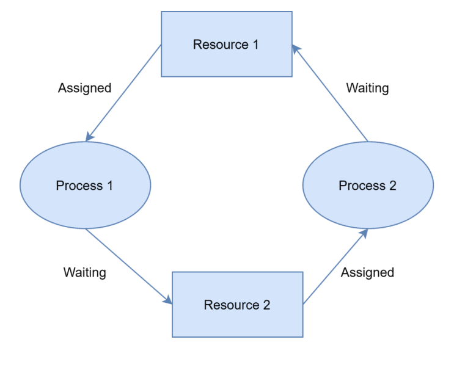

- Livelock

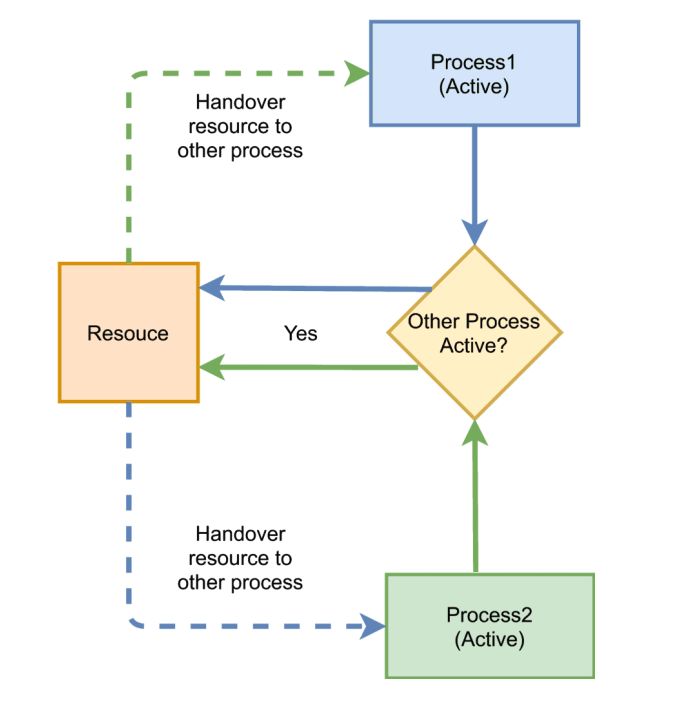

`Как их можно диагностировать?`
Утилиты (пример: VisualVM)

`Что делать?`(рекомендации)
- не использовать синхронизаторы там, где нет необходимости 
- отдавать предпочтение Неблокирующей синхронизации
- делайте блокировки с таймаутами, и в случае чего возникновения тут же освобождайте все ранее заблокированные ресурсы
- при получении блокировок на ресурсы, старайтесь везде придерживаться единного детерминированного порядрка получения

### `Проблемы с утилизацией ресурсов`

`Thread Starvation`(нитевое голодание)
- по причине некорректной приоритизации потоков

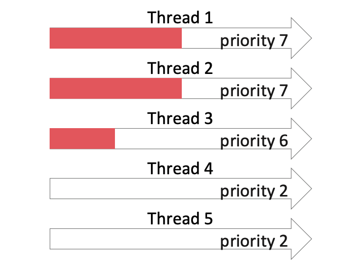

- по причине постоянного переключения

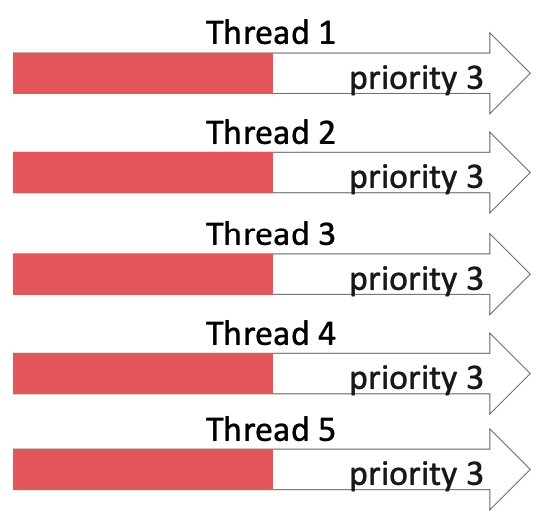

### `Пулы потоков`

`Пул потоков` -- шаблон проектирования, который обеспечаивает приложение набором рабочих потоков, управляемых системой, позволяя пользователю сосредоточиться на выполнении задач приложения, а не на управлении ими

преимущества
- более эффективная утилизацмя ресурсов
- распределение обязанностей
- work Stealing

Как отслеживать и упралять выполнением задач? -- абстракции!
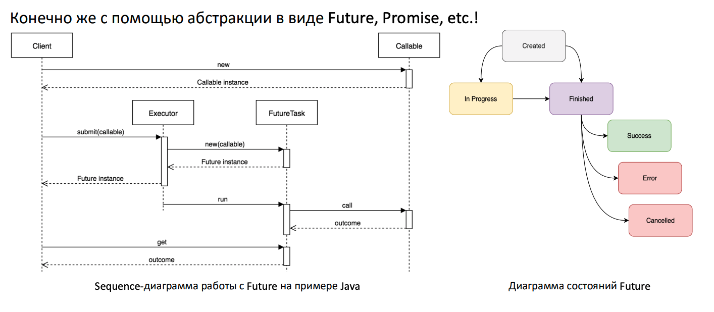

примеры реализаций
- `Thread Pools`
    - `Executer Framework`
    - `ForkJoinPool`
    - и тд
- `Futures`
    - `Future`
    - `CompletableFuture`

## Семинар 2

посмотрели на отличи `BlockingQueue` и `ConcurrentQueue`

### `Синхронизаторы из java.util.concurrent`

`Синхронизаторы` -- вспомогательные утилиты для синхронизации потоков, которые дают возможность разработчику регулировать и/или ограничивать работу потоков и предоставлять более высокий уровень абстракции, чем основные примитивы языка (мониторы)

поговорим об основных
- `CountDownLatch`
    - позволяет 1+ потокам ожидать, пока не будут выполнены определенные действия в других потоках
    - в нем инициализируется "замок" с заданным количеством событий
    - когда событие происходит, происходит `.countDown()` -- уменьшает счетчик
    - когда счетчик = 0 -- ожидающие перестают ожидать

- `Exchanger`
    - предоставляет точку синхронизации, где два потока могут обменяться объектами
    
- `ReentrantLock`
    - высокоуровневый аналог мониторов. Основное отличие помимо реализации -- возможность прерывания попытки блокировки по таймауту
    - де-факто является стандартной реализацией интерфейса `Lock`
    - кроме прочего есть `ReentrantReadWriteLock`, который позволяет разделить блокировки Чтения и Записи

### `Executor Framework`

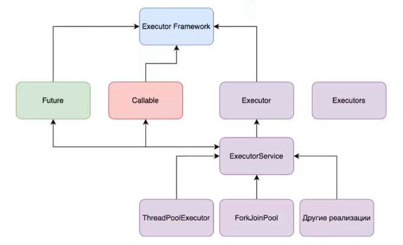

о компонентах 
- `Executor` -- абстракция, призванная разделить логику отправки задачи на исполнение и логику их реальной обработки
- `ExecutorService` -- расширение `Executor`, которое предоставляет набор вспомогательных методов, предназначенных для управления и отслеживания процесса выполнения задач
- `Callable` --  тоже самое, что и `Runnable`, только 
    - может возвращать значение
    - может испускать проверяемые исключения
- `Future` -- не путать с `Promise`.
    - 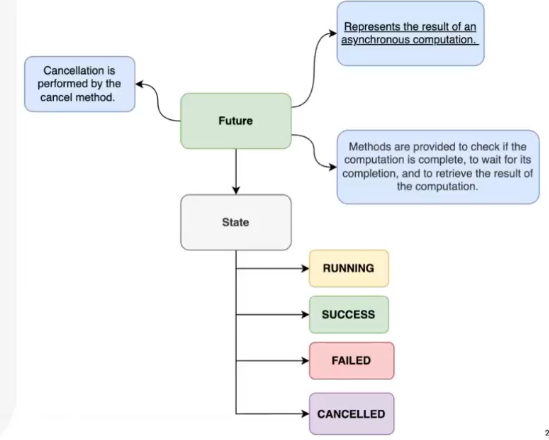
    - `Future` -- это объект, через который ты ждешь результат. а `Promise` -- это про "запись" -- он позволяет сказать "вот результат" или "произошла ошибка".
    - Обычный `Future` (который возвращает `ExecutorService.submit()`) — это пассивный объект. Ты не можешь «заставить» его завершиться. А `CompletableFuture` (`Promise`) — активный, ты сам управляешь его жизненным циклом.

далее речь о асинхронности, но о ней в лекции 3

а сейчас о `ComplerableFuture`
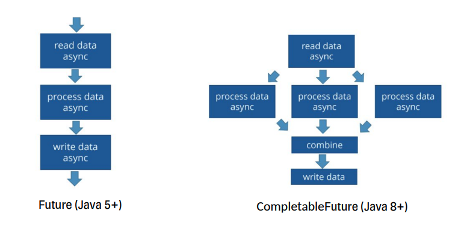

реализует `Future` и `CompletionStage`

о методах `CompletionStage`
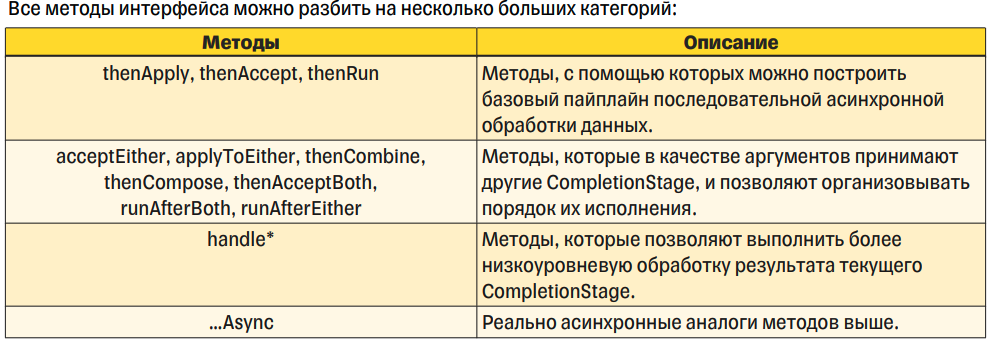


### `ForkJoinPool`

Это специальная реализация `ExecutorService`, предназначенная для выполнения задач, которые можно рекурсивно разбивать на более мелкие части.

**1. Основной принцип: "Разделяй и властвуй" (Divide et Impera)**
Большая задача разбивается на подзадачи до тех пор, пока они не станут достаточно простыми, чтобы выполниться последовательно.
*   **Fork (Разветвление):** процесс запуска подзадачи асинхронно.
*   **Join (Соединение):** ожидание завершения подзадачи и получение результата для объединения с другими результатами.

**2. Иерархия компонентов (согласно схеме):**
*   **ForkJoinPool** — сам менеджер (пул), который управляет рабочими потоками.
*   **ForkJoinTask<V>** — базовая абстракция задачи.
*   **RecursiveTask<V>** — аналог `Callable`. Используется, когда задача **должна вернуть** результат.
*   **RecursiveAction** — аналог `Runnable`. Используется, когда задача **не возвращает** результат (void).

**3. Уникальный механизм: Work-Stealing (Кража работы)**
Это главная "фишка" ForkJoinPool. 
*   У каждого потока в пуле есть своя собственная очередь задач.
*   Если поток выполнил все свои задачи и остался без работы, он не засыпает, а "крадет" задачи из хвоста очереди других, более нагруженных потоков.
*   **Результат:** максимальная загрузка всех ядер процессора и отсутствие простаивающих потоков.

**Когда использовать?**
*   Тяжелые вычислительные задачи (сортировка массивов, обработка изображений, сложные математические расчеты).
*   Рекурсивные алгоритмы.
*   **Важно:** именно на ForkJoinPool работают `Parallel Streams` в Java 8+.


## `Лекция 3`

### `Высокоуровневые дизайн-паттерны (фундамент)`

- `Leader-Follower` -- все рабочие потоки ожидают нового задания в общей очереди
    - `Лидером` становиться тот поток, который забирает задание из очерери и начинает его обрабатывать
    - во время обработки задания, `Лидер` становиться `Работником`, а другой поток автоматически становиться следующим `Лидером` и ожидает нового задания в очереди
    - `Преимущества`
        - эффективаная утилизация ресурсовв (работает минимально необходимое количество потоков)
        - каждый поток отвечает за выполнение своей задачи, никакой дополнительной синхронизации в вызывающем коде не требуется
        - размер нижележащешо пула потоков можно менять согласно нагрузке
        - простота реализации относительно других паттернов
    - `недостатки`
        - блокирующие и длительные синхронные операции могут привести к истощению ресурсов
        - сложность использования возрастает, когда нужно синхронизировать выполнение нескольких задач
    - `где используется?`
        - `пул потоков` -- шаблон, который обеспечивает приложение набором рабочих потоков, что упраляются системой, а пользователь сосредотачивается на выполнении задач приложения, а не на управлении ими

### `Асинхронность`

`Асинхронность` -- способ выполнения программ, при котором длительные операции запускаются и продолжаются позже, не блокируя текущий поток выполнения

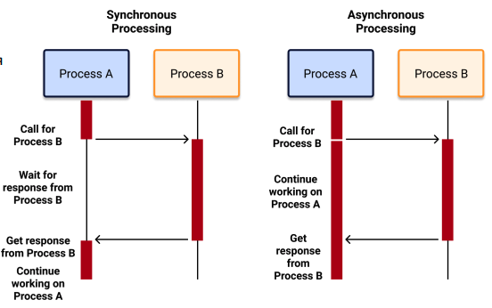

`Зачем Асинхронность?`
- `IO-bound` -- ограничены ожиданием ввода-вывода
- `CPU-bound` -- ограничены вычислительной мощностью процессора
- `Memory-bound `-- ограничены пропускной способностью или латентностью работы с памятью

### `10k problem`

условное название задачи конфигурирования и обслуживания высокопроизводительного сервера, способного обслуживать порядка 10 тыс. соединений одновременно

> «Проблема 10k — это ограничение классической модели "один поток на соединение". Асинхронность и NIO появились именно для того, чтобы обойти это ограничение и позволить серверу обрабатывать десятки тысяч запросов на малом количестве ресурсов».

Преимущества асинхронного подхода
- Высокая масштабируемость
- Эффективное использование ресурсов и меньшие накладные расходы

### `Высокоуровневые дизайн-паттерны (Асинхронные паттерны)`

- `Actor Model`
    - каждый актор -- `вычислитель`, работающий параллельно и обладающий собственным состоянием
    - взаимодействие между акторами происходит с помощью асинхронных каналов
    - масштабирование
        - тк состояние не может быть распределено между несколькими акторами, основной вариант масштабирования -- деление их на более мелкие с точки зрения бизнес-логики вычислители, и сокрытие их за фасадом из еще одного актора, основная задача которого -- распределение запросов между дочерними акторами
    - преимущества
        - нет необходимости в синхронизации потоков исполнения
        - масштабируемость
        - асинхронность обработки задач
        - независимость акторов друг от друга
    - недостатки
        - сложность при реализации и проектировании
        - ограниченная масштабируемость в некоторых случаях
    - [пример](more-info/actor-model-example.pdf)

- `Event-Driven Model` (событийная модель)
    - взаимодействие со внешним миром -- асинхронное, осуществляемое посредством очереди событий
    - `Event Loop` -- единица исполнения, представляющая из себя бесконечный цикл, работающий на небольшом, фиксированном пуле потоков (или вообще на одном потоке), который разбирает поступающие на вход события для их дальнейшей обработки
    - для масштабирования, несколько `Event Loop` могут быть объединены в так называемы `Event Loop Group`
    - преимущества
        - масштабируемость
        - асинхронность обработки задач
        - утилизация ресурсов
        - предсказуемость и отсутствие необходимости синхронизации
    - недостатки
        - одна блокирующая операация может погубить всю систему
        - сложность при реализации и проектировании
        - просадка производительности в случае длительных синхронных или блокирующих операций
- [быстро и простым языком](examples/actor-&-event-driven-model.md)

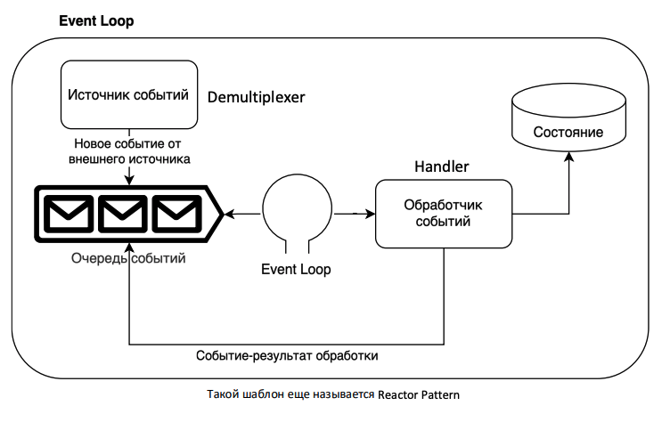
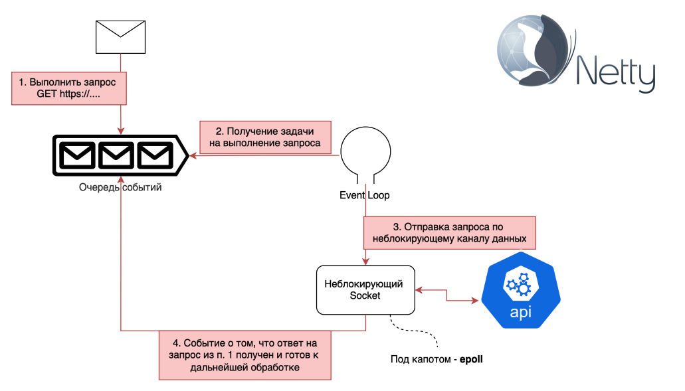

### `Модель многопоточности "Многие ко Многим"`

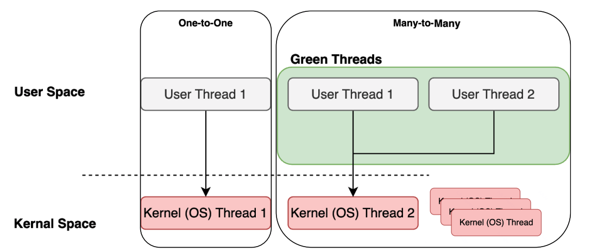

`Зеленые потоки` -- абстракция языка программирования. в Java это виртуальные потоки из Project Loom

`Зачем они нужны?`
- источником прерывания может быть
    - IO
    - Системные вызовы
    - явное жедание виртуального потока передать свои ресурсы кому-то еще с помощью вызова метода `yield`
- поток не простаивает, а его ресурсы утилизируются все время! все прелести асинхронного подхода, только в синхронном виде

`Способы реализации`
- `Continuation Passing Style` -- Kotlin Coroutines, async/await и тп
- `Виртуальные потоки` -- Goroutines, Project Loom
    - их основное отличие -- тот уровень абстракции, на котором данные подходы реализованы
    - однако, оба подхода так или иначе базируются на использовании сущности `Continuation`

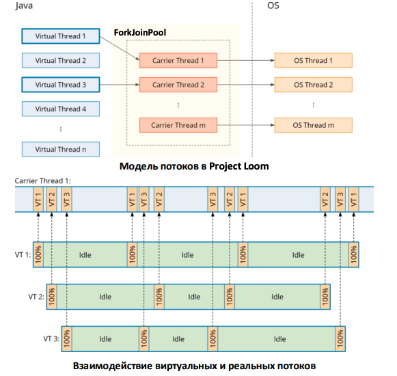

[тут про процесс "парковки" и "разблокировки" потока](examples/virtual-threads-java-parking-and-unblocking.md)

## `Семинар 3`

### Reactive Streams

`Какие проблемы решает реактивщина`
- как было раньше
    - для обработки каждого пользовательского запроса выделяется поток
    - количество потоков ограничено, следовательно пропускная способность системы напрямую зависит от количества потоков в ней
    - в случае обращения к БД или к какой-то смежной системе поток блокируется до тех пор, пока не получит ответ
    - возможна ситуация, когда все потоки в системе "заняты" ожиданием ответа от смежных компонентов
- как оно с реактивщиной
    - для обработки пользовательских запросов (и не только), выделяется специализированный пул потоков
    - в случе обращения к БД или какой-то смежной системе поток Не блокируется, а перенаправляется на выполнение других задач. таким образом потоки не простаивают и мы не совершаем затратные операции их переключения
    - обработка запроса продолжается после того, как приходит сигнал о получении ответа от смежной системы (завершение "блокирующей" операции)
    - количество потоков ограничено, но пропускная способность способность системы напрямую от количества потоков в ней Не зависит

`Но какие проблемы пораждает реактивщина`
- сложность во всем
    - изучении
    - разработке
    - отладке

[ответ gemini по всему этому поводу](examples/is-reactive-programming-good-today.md)

### `Модель многопоточности Многие ко Многим как светлое будущее многопоточности в Java`

при использовании модели `Many-to-Many` эффктивность утилизации ресурсов возрастает по тем же причинам6 что и в случае реактивного программирования

`Project Loom` -- реализация виртуальных потоков в Java

`Основные компоненты Project Loom`
- `Virtual Thread`
- `Carrier Thread`
- `Scheduler` (i.e. -- `ForkJoinPool`)
- `Continuation`

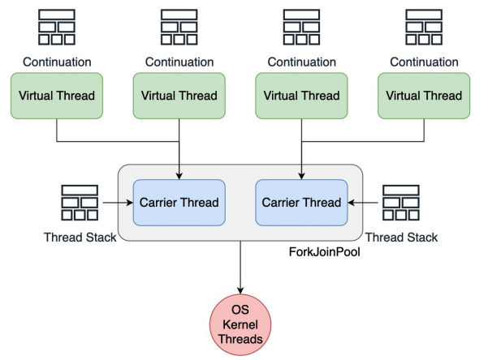

`Continuation` -- структура данных, которая хранит информацию о том, на каком моменте остановилось исполнение виртуального потока

это своего рода "виртуальный stack" виртуального потока

таким образом, стэк вирутального потока сохраняется в `heap` во время приостановки работы потока

когда же поток возобновляет свою работу, этот виртуальный стэк внедряется JVM в стэк `carrier`-потока

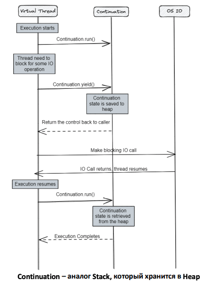

`Так ли хорош Project Loom?`
- достоинства
    - простота кода и его отладки
    - совместимость со всей экосистемой из коробки
    - высокая масштабируемость 
    - низкий порог входа
    - поддержка комьюнити
- недостатки 
    - не в полной мере покрывает все "реактивные" кейсы
    - CPU-intensive задачи -- все еще "Ахиллесова Пята"
    - Есть возможность заблокировать `carrier`-поток
    - необдуманное использование все еще может повлечь `OOM`
    - не во всех библиотеках и фреймворках поддерживается

[примеры кода с Project Loom (спойлер: не отличается особо от старого)](examples/project-loom-example.md)

## `Просто от себя у Gemini спросил`
- [что выбрать для написания многопоточной программы сегодня? (java 25)](examples/what-choose-to-write-multithread-program.md)
- [почему Project Loom назвали Project Loom](examples/why-project-loom-called-project-loom.md)