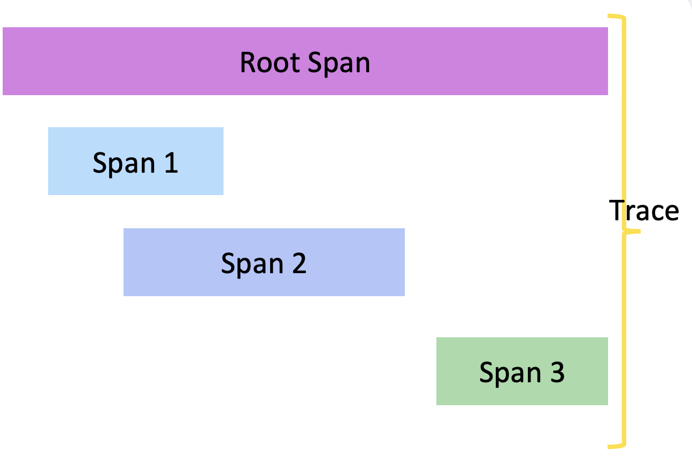
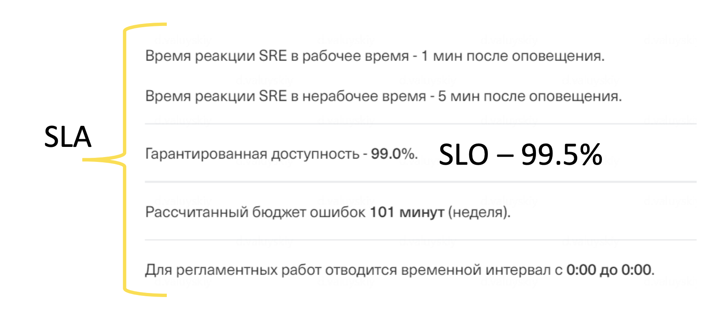
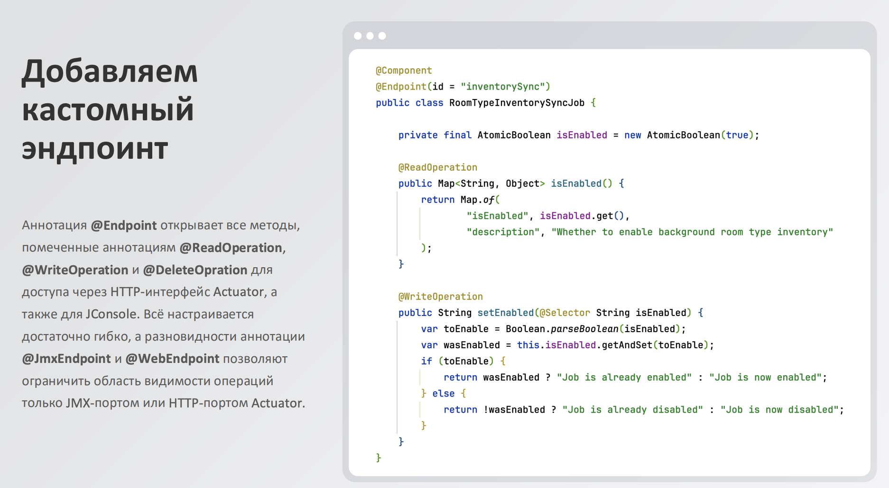

# Observality

## Введение

основано на материале Т-Академиии и детелизироавно в некоторых местах

## Содержание 
- и так далее

## Что это

мера того, что мы можем понять о внутреннем состоянии системы на основе внешних данных и проявлений, которая генерирует система


## Сбой 
- частичная или полная недоступность сервиса для клиента
- критический рост времени ответа сервиса или отдельных его компонентов
- нарушение логики работы сервиса или отдельных его компонент

Куда смотреть
- Логи
- Метрики
- Трейсинг
- Визуализация

## Логирование
это 
- запись истории операций и событий, обрабатываемых сервисом 
- возможно локальное хранение логов в потоках I/O, файлах или журнале ОС
- записи агрегируются с помощью централизированных хранилищ

Зачем
- посмотреть контрольне точки программы
- отслеживтаь ошибки или проблемы сервиса
- строить статистику или проводить анализ работы

виды
- структурированные (JSON, например)
- неструктурированные 2024-01-01 09:15:23.123 [main] INFO Request processed with parameters [query 1, query2] in 131 ms

частые ошибки
- не имеют полезной нагрузки
- чувствительные данные
- нехватка инфы в полях структуры или самих логах
- слишком большой объем

уровни 
- Fatal
    - которые приводят к прекращению работы сервиса
- Error
    - продолжает работать, то функционал теряется
- Warn
    - предупреждения или ошибки, что не влияют на функционал сервиса
- Info
    - важные контрольные точки в работе сервиса
- Debug
    - для отладки. тут больше контрольных точек
- Trace
    - максимум информации о событии

Инструменты
- Shipping -- для перевозки
    - Filebeat, Fluentd
- Preprocessing -- предобработка
    - Logstash
- Storage -- хранение
    - Elasticsearch
- Visualization
    - Kibana
    - Zabbix
    - Grafana

## Метрики
это 
- мера наблюдения процесса, выполнения вычислений или пользовательских событий
- название, набор лейблов, привязанное ко времени значение. образуют временной ряд
- data point -- отдельная ассоциированная пара "значение" - "время"

Виды
- Counter
    - целочисленный неубывающий счетчик
    - пример: задачи завершившие выполнение
- Gauge
    - значение, которое может уменьшаться и увеличиваться. состояние процесса
    - пример: выполнение задач за минуту, счетчик обращений в DaData и Redis
- Histogram
    - набор counter-ов для отслеживания дисперсии и квантилей наблюдаемой величины
- Summary
    - аналогично Histogram, но для заранее рассчитанных квантилей

Сценарий использования
- Мониторинг
- Поиск и обнаружение. корреляция между величинами
- Выявление тентенций, Прогназирование
- Отслеживание превышений

RED
- Rate
    - количество запоросов в единиицу времени, которые обрабатывает сервис (RPS)
- Errors
    - Количество ошибочных запросов в единицу времени
- Duration 
    - время обработки запроса

USE
- Utilization
    - процент использования ресурса
- Saturation 
    - количество задач в очереди
- Errors
    - same shit 

Four Golden Signals
- первый вариант
    - Latency
    - Errors
    - Traffic
    - Saturation
- второй вариант
    - Availability 
    - health
    - request rate
    - usage

Модели выгрузки метрик
- Pull
    - контролер метрик сам ходит в наш сервис и запрашивает из него инфу
    - плюсы
        - легко детектировать падение
        - защита от перегрузки системы мониторинга
        - простотая отладка -- открыл нужный url и смотришь метрики
        - сервису не нужно знать адреса сервисов мониторинга -- слабая связанность
    - минусы
        - короткие задачи, о которых информация может не сохраниться до того момента, как придет сервис
        - системе мониторинга нужен прямой доступ к портам сервиса
- push
    - сервис Сам кидает метркии в Контроллер метрик
    - плюсы
        - для короткоживучих круто
        - меньше приколов с безопасностью и сетью
        - мгновенная доставка, сразу по факту события
    - минусы
        - риск дудоса мониторинговой системы
        - не всегда понятно, жив ли сервис
        - и каждому нашему сервису нужно попросить информацию -- куда в мониторинг кидать

## Tracing
это 
- структуры данных. что фиксируют весь путь прохождения запроса в системе по всем ее состовляющим частям 

Tracing и Span



инструменты (примеры)
- Open Telemetry
- Spring Cloud Sleutch
- Zipkin

## Средства визуализации

Алерты 
- автоматическое оповещение о возникающих в сервисе неполадках
- задача алерта -- своевременное информирование ответсвенного о проблеме
- условия срабатывания алертов -- триггеры

Триггеры
- превышение величиной порога
    - количество ошибок
    - утилизация CPU
    - ...
- относительное изменение двух величин
    - рост процента ошибок 
- остуствие изменения величины 
    - не растет счетчик отправленных сообщений
- аномальное поведение величин 
    - анализ тем или прочим образом
- false-positive triggers

## SLA, SLO, SLI

SLA
- соглашение между поставщиком услуг и клиентом об измеряемых показателях

SLO
- цель, идеальное значение, к которому следует стремиться для измеряемых показателей

SLI
- индикатор измерения соответсвия цели уровня SLO



## В контексте JVM

### JMX

Java Management Extensions (JMX) -- очень древняя штука
- что дает
    - получать информацию из MBean-ов
    - изменять внутреннее состояние приложения или другое через методы MBean
    - отправлять уведомления другим MBean

### Spring Boot Actuator

Но его современным решением -- Spring Boot Actuator
- интегриурет возможности JMX
- расширяет специфичным для Spring
- предоставляет HTTP интерфейс

Что оно может
- проверить liveness (живо ли) и readiness (готово ли принмимать трафик)
- изменять уровень логирования на лету
- очистить runtime кэши
- получать метрики. их может тот же Prometheus обрабатывать
- изменить ENV параметры
- снять Heap / thread dump

Желательно для него делать отдельный порт

пример yaml в конце

так же можно делать свои ручки и возвращать свои данные



структурированные логи

как включить -- в yaml в конце

по умолчанию модель выгрузки метрик в Spring Actuator -- pull

### Prometheus

Prometheus -- мониторинговая система и база данных временных рядов, которая стала де-факто стандартом для хранения и сбора метрик

использует pull модель и ожидает метрики в специфичном для себя формате

позднее на основе ожидаемого Prometheus формата метрик был разработан стандарт Openmetrics

Собираются они же с помощью Micrometer SDK

### Tracing

Contex Propagation -- как механизм связывания действий в различных сервисах с единым трейсом

сервисы, что управляют трейсами, как правило, имеют push-модель

для выгрузки нужно две вещи
- micrometer-tracing -- библиотека сбора трейсов
- opentelemetry -- библиотека для выгрузки собранных трейсов в нужном формате

### Opentelemetry

это тоже отдельная зависимость

предположим, у нас разные сервисы, стеки -- как быть?

Opentelemetry -- фреймворк, набор спецификаций и инструментов с открытым кодом, что берет на себя все взаимодействие с логами, метриками, трейсами приложения. также доставку этих данных до конечной мониторинговой системы в понятном для них виде он тоже берет на себя

работает в трех плоскостях
- унифицирует и стандартизирует
    - библиотеки, что собирают метрики и прочее
    - протоколы взаимодействия с системами мониторинга и тп
- предоставляет готовые библиотеки и zero-code решения
    - готовые SDK 
    - zero-code -- позволяет настроить сбор и икспорт без необходимости изменения исходного кода
- предоставляет инструментарий для интеграции с различными решениями
    - типо -- спец коллетор, что получает разного формата данные, приводит к единому формату и оправляет куда надо

чтобы подключить всего лишь нужно
- подключить зависимость 
- настроить немного в yaml

### YAML конфиг

пример некоторого yaml конфига
```yaml
managment:
    server:
        port: 9464
    endpoints:
        web:
            exposure:
                include:
                    - health
                    - loggers
                    - info
                    - beans
                    - prometheus # там нужно еще dependency добавить
                    - '*'
    tracing:
        sampling:
            probability: 1.0
    otlp:
        tracing:
            endpoint: <url>

logging:
    structured:
        format:
            console: logstash
```