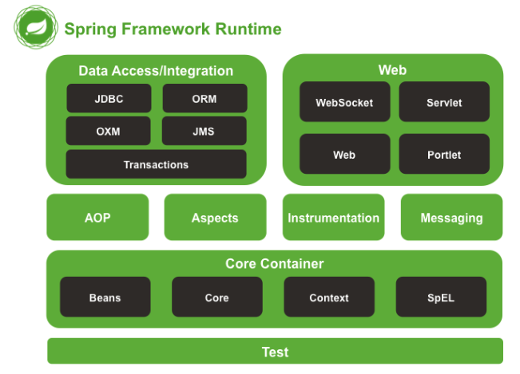
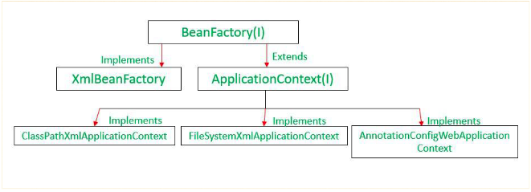
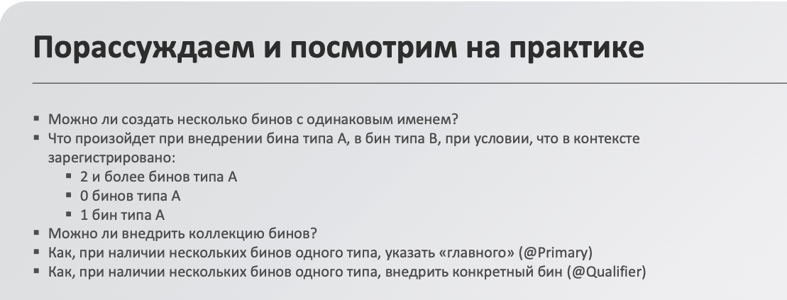
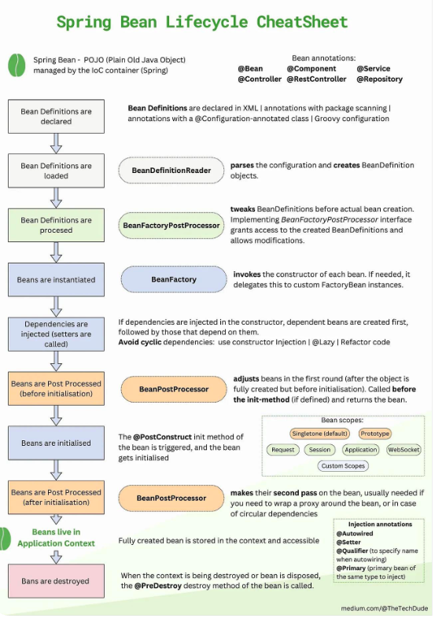

# 1С. Spring Core: IoC и конфигурация

## Введение 

я наконец вставил этот файл, ура. но -- с доработками (больше деталей, внешних ссылок). поэтому -- может будет полезно

## Ссылки
- [сатья](https://habr.com/ru/articles/720794/) -- короткая. можно быстро вспмонить про основные понятия, ЖЦ-ы 

## Что такое Spring

Spring -- мощный фреймворк для разработки приложений на Java, что предоставляет средства для создания масштабируемых, модульных и легко поддержимываемых программ

преимущества
- IoC
- DI
- повышение тестируемости
- имеет много модулей
    - Core -- основа для DI и IoC
    - MVC -- веб-приложения
    - Data -- для баз данных
    - Security -- для безопастности API
    - Boot -- для упрощенной и быстрой конфигурации приложений
- активно развивается и поддерживается большим количеством разработчиков

## Inversion of Control

это принцип, при котором управление объектами передается внешнему контейнеру, а не реализуется вручную 

Связь SOLID
- SRP -- классы отвечают только за свои задачи, а не инициализацию
- DIP -- классы зависят от абстракции

Преимущества
- гибкость -- легко подменять
- тестируемость -- DI позволяет моки использовать
- повторное использование кода

Основные механизмы
- Dependency Injection
    - зависимости передаются через
        - конструктор
        - setter-ы
        - свойства объекта
    - используется внешний механизм, что отвечает за создание и внедрение зависимостей
    - зависимости не знаю о внешнем механизме
- Service Locator
    - нужные зависимости запрашиваются через специальный объект локаторр напрямую из объекта, которму нужна определеная зависимость
    - у классов появляется зависимость от локатора, что усложняет тестирование и нарушает SRP

Контейнер Spring -- реализация IoC, что управляет жизненным циклом и конфигурацией объектов приложения (Spring bean-ов). То, что отвечает за автоматическое связывание и зависимости

Обзор контейнеров

- BeanFactory -- самая простая реализация, что предоставляет DI
- ApplicationContext -- более продвинутая реализация, что предоставляет возможность 
    - загрузки нескольких иерархическх контекстов, 
    - публиковать события и обрабатывать их через слушателей, 
    - возможность разрешения сообщений, поддерживающая интернационализацию. 
    - расширяет BeanFactory 

в приложении можно содержать несколько ApplicationContext-ов. Это применимо в ситуациях:
- обеспечение модульности и изоляции конфигураций
- при необходимости создать иерархию контекстов
- переиспользование конфигураций

## Dependency Injection

это принцип, при котором зависимости объекта передаются извне. 

Зависимость -- это объект, необходимый для работы другого объекта. Зависимости видны на момент компиляции и являются своего рода инструкцией по настройке объектов. \
Объекты, которые являются результатом работы подобных объектов (сущности из БД, ответы API), не участвуют в DI. DI нужен для построения / связывания логики придожения, а не результатов его работы

Виды Injection (используют аннотацию @Autowired)
- Constructor
    - Преимущества
        - Обязательные зависимости -- объект создается только в полном готовом состоянии
        - иммутабельность -- поля можно объявить как Final
        - тестируеумость -- удобно использовать заглушки/ моки
        - прозрачность -- зависимости легко распознать по сигнатуре конструктора
- Setter
    - Преимущества
        - гибкость -- подходит для необязательных зависимостей
        - поздняя настройка -- можно изменить зависимости объекта после его создния.
- Field
    - Преимущества
        - Простота

## Spring Beans

это объект, который создается, настраивается и управляется IoC-контейнером Spring. В ином случае бин -- это просто один из многих объектов в вашем приложении. 

Бины и зависимости между ними отражены в конфигурационных метаданных, используемых контейнером

Bean-ы, в свою очередь, создаются из Bean Definition-ов -- конфигурационные метаданные, что нужны для создания Bean

Отличия с Java Bean / POJO
- Spring Bean
    - многократно используемый объект
    - зависим от фреймфорка. он управляет жизненным циклом бина
- Java Bean / POJO
    - короткоживущий объект для передачи информации
    - не зависит от фреймворка

Способы создания 
- XML
    - старый
    - преимущества
        - поддержка старых версий
        - полная независимость от аннотаций в коде
- Java Config
    - специальные конфигурационные классы с аннотацией @Configuration
    - преимущества
        - гибкость -- тоже полный контроль над созданием и настройкой объектов
        - подходит для интеграции сторонних библиотек
        - поддерживает явное указание зависимостей через параметры метода
- Аннотации
    - с использованием аннотации @Componentn (или спец производных @Service, @Repository, @Controller), Spring автоматически обнаружит и создаст бин
    - преимущества
        - простота
        - подходит для большинства сценариев
        - производные аннотации упрощают чтение кода

## Жизненный цикл Spring Bean

об этом я либо узнаю на семинаре, либо в своем разборе [вопросов](../../../Spring/notes.md)

Scope бинов
- Singleton (по умолчанию)
    - свойства
        - один экземпляр бина для всего контекста Spring
        - Spring полностью управляет их жизненным циклом, так как хранит ссылки на них
    - когда использовать
        - для объектов, что не зранят состояние или используются многократно
- Prototype 
    - свойтсва
        - новый экземпляр бина каждый раз, когда выполняется запрос на этот конкретный бин
        - Spring отвечает только за создание и настройку таких бинов. Уничтожением не управляет. работает по принципу Отдал -- забыл
    - когда использовать
        - для зависимостей, которым нужен новый объект, хранящий состояние

