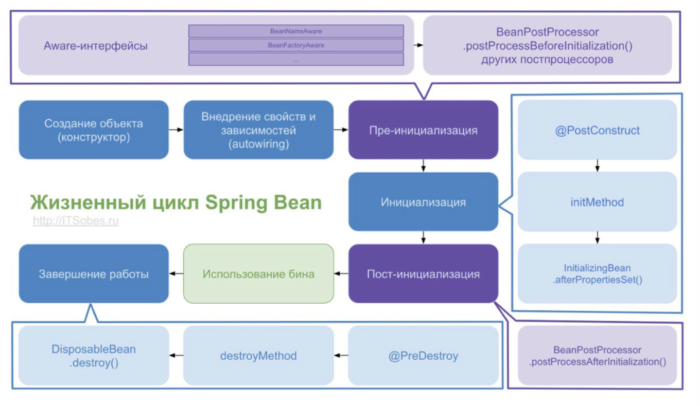
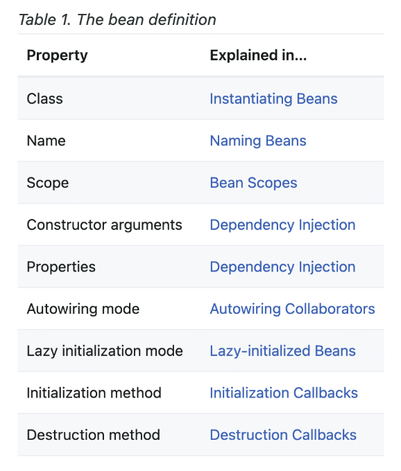
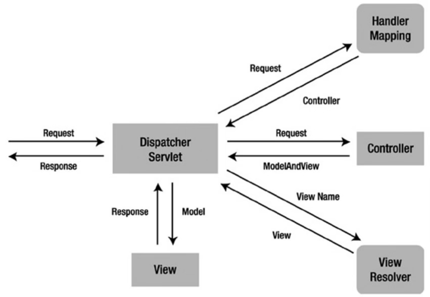

# Spring

## Введение

здесь собраны ответы на вопросы, Spring

начнем с разбора вопросов с [этого](https://telegra.ph/Voprosy-po-Spring-02-04) источника \
так же я думаю добавить с [поступашек](https://t.me/postypashki_old/1507) \
и так же надо глянуть [лошадь](https://github.com/enhorse/java-interview/blob/master/concurrency.md#%D0%A0%D0%B0%D1%81%D1%81%D0%BA%D0%B0%D0%B6%D0%B8%D1%82%D0%B5-%D0%BE-%D0%BC%D0%BE%D0%B4%D0%B5%D0%BB%D0%B8-%D0%BF%D0%B0%D0%BC%D1%8F%D1%82%D0%B8-java) \

так же я мог некоторые темы раскрыть лучше засчет лекций с Т-Академии. второй семестр начался с семенара по [Spring](<../T-Academy/2-semestr/1С. Spring Core: IoC и конфигурация/notes.md>). Поэтому -- прочитайте этот файл И возможно следующие лекции тоже про Spring

я не успевал уже нормально все переписать руками и проработать, поэтому уже вставил как есть. И не все вопросы. С этим я еще обязательно разберусь

в основном брал ответы от поступашек

## Содержание
- в [этом](<../T-Academy/2-semestr/1С. Spring Core: IoC и конфигурация/notes.md>) файле разобраны
    - IoC
    - DI -- что это и виды Injection
    - Что-то про Spring Bean (не жизненый цикл, а Scope)
    - Контейнеры в Spring (BeanFactory и ApplicaitonContext)

- В этом файле
    - [Жизненный цикл Spring Bean, аннотации @PostConstruct и @PreDestroy](#жизненный-цикл-spring-bean)
    - [Расскажите про ApplicationContext и BeanFactory, чем отличаются? В каких случаях что стоит использовать?](#расскажите-про-applicationcontext-и-beanfactory-чем-отличаются-в-каких-случаях-что-стоит-использовать)
    - [Расскажите про скоупы бинов? Какой скоуп используется по умолчанию? Что изменилось в Spring 5?](#расскажите-про-скоупы-бинов-какой-скоуп-используется-по-умолчанию-что-изменилось-в-spring-5)
    - [Чем отличаются Model, ModelMap и ModelAndView?](#чем-отличаются-model-modelmap-и-modelandview)
    - [Расскажите про паттерн MVC, как он реализован в Spring?](#расскажите-про-паттерн-mvc-как-он-реализован-в-spring)
    - [Что такое АОП? Как реализовано в спринге?](#что-такое-аоп-как-реализовано-в-спринге)
    - [Как работает Spring Security? Как сконфигурировать? Какие интерфейсы используются?](#как-работает-spring-security-как-сконфигурировать-какие-интерфейсы-используются)

- Аннотации
    - [аннотации @PostConstruct и @PreDestroy](#аннотации-postconstruct-и-predestroy)
    - [Расскажите про аннотацию @Bean?](#расскажите-про-аннотацию-bean)
    - [Расскажите про аннотацию @Component?](#расскажите-про-аннотацию-component)
    - [Чем отличаются аннотации @Bean и @Component?](#чем-отличаются-аннотации-bean-и-component)
    - [Расскажите про аннотации @Service и @Repository. Чем они отличаются?](#расскажите-про-аннотации-service-и-repository-чем-они-отличаются)
    - [Расскажите про аннотацию @Autowired](#расскажите-про-аннотацию-autowired)
    - [Можно ли вставить бин в статическое поле? Почему?](#можно-ли-вставить-бин-в-статическое-поле-почему)
    - [Расскажите про аннотации @Primary и @Qualifier](#расскажите-про-аннотации-primary-и-qualifier)
    - [Как заинжектить примитив?](#как-заинжектить-примитив)
    - [Как заинжектить коллекцию?](#как-заинжектить-коллекцию)
    - [Как спринг работает с транзакциями? Расскажите про аннотацию @Transactional.](#как-спринг-работает-с-транзакциями-расскажите-про-аннотацию-transactional)
    - [Расскажите про аннотации @Controller и @RestController. Чем они отличаются? Как вернуть ответ со своим статусом (например 213)?](#расскажите-про-аннотации-controller-и-restcontroller-чем-они-отличаются-как-вернуть-ответ-со-своим-статусом-например-213)
    - [Можно ли передать в запросе один и тот же параметр несколько раз? Как?](#можно-ли-передать-в-запросе-один-и-тот-же-параметр-несколько-раз-как)

## Вопросы

### Жизненный цикл Spring Bean



важно -- "_" просто чтобы отделить имя

1. Парсирование конфигурации и создание всех BeanDefinition

BeanDefinition -- это набор метаданных будущего бина, макет, по которому нужно будет создать бин.

что хранит
- имя класса с указанием пакета
- элементы поведенческой конфигурации бина, которые определяют, как бин должен вести себя в контейнере
- звисимости -- ссылки на другие бин-компоненты
- другие параметры конфигурации для установки во вновь созданном объекте



при конфигурации через аннотации с указанием пакета для сканирования или JavaConfig используется класс AnnotationConfigApplicationContext
- регистрируются все классы с @Configuration для парсирования
- далее регистрируется BeanDefinition_RegistryPostProcessor (специальный BeanFactory_PostProcessor), 
- который при помощи классы Configuration_ClassParser парсирует JavaConfig, загружает BeanDefinition, создает граф зависимостей между бинами
- и создает Map \<String, BeanDefinition> beanDefinitionMap

2. Настройка BeanDefinition

BeanFactory_PostProcessor на этапе создания BeanDefinition могут их настроить как нам надо.

кроме этого BeanFactory_PostProcessor могут сами натсроить BeanFactory до того как она начнет создание бинов

```java
public interface BeanFactoryPostProcessor {
  void postProcessBeanFactory(ConfigurableListableBeanFactory beanFactory) throws BeansException;
}
```

3. создание кастомных FactoryBean (только для XML-конфигурации)

4. Создание экземпляров Бинов

BeanFactory достает из коллекции Map \<String, BeanDefinition> те, которые создает все BeanPostProcessor-ы, что нужно для настройки обычных бинов

создаются экземпляры бинов через BeanFactory на основе ранее созданных BeanDefinition

5. Настройка созданных бинов

бины созданы, нужно донастроить

для этого есть интерфейс BeanPostProcessor, который позволяет вклиниться в процесс настройки бинов до того, как они попадут в контейнер

ApplicationContext автоматически обнаруживают любые бины с реализацией BeanPostProcessor и помечает их как "post-processors"

в Spring есть специальные реализации BeanPostProcessor-ов, которые обрабатывают @Autowired, @Inject, @Value и @Resource

интерфейс BeanPostProcessor сотоит из двух методов
- postProcessBeforeInitialization(Object bean, String beanName)  -- вызывается До init-метода
- postProcessAfterInitialization(Object bean, String beanName) -- после 

прикольно заметить
> BeanPostProcessor-ы, что заполняют бины через маркерные интерфейсы и тп, реализуют Before-метод
> а которые оборачивают в proxy, обычно After-метод (для этого даже есть конвенция у Spring)

Proxy -- класс-декорация над бином. Например, мы хотим добавить логику нашему бину, но джава-код уже скомпилирован, поэтому нам нужно на лету сгенерировать новый класс

как сделать этоот класс
- либо он должен наследоваться от оригинального класса (Code Generation LIB) и пееропределять его методы, добавляя нужную логику
- либо он должен имплементировать те же самые интерфейсы, что и первый класс (Dynamic Proxy)

итого, такая хронология
- сначала postProcessBeforeInitialization() всех BeanPostProcessor-ов
- (если есть) вызывается метод @PostConstruct
- (если есть)(устарел) InitializingBean, то вызовет метод afterPropertiesSet()
- (если есть) метод initMethod из @Bean
- postProcessAfterInitialization. на этом этапе создают прокси стандартными Bean_PostProcessor-ы. Потом наши кастомные BeanPostProcessor-ы и наша логика для прокси объекта. потом все бины оказались в контейнере и контейнер будет обновлен методом refresh
- мы можем даже донастроить бины с помощью ApplicationListener-ами
- все

6. Бины готовы к использованию 

их можно получить с помощью ApplicationContext.getBean()

7. Закрытие контекста

когда контекст закрывается (метод close() из ApplicationContext), бин уничтожается

если в бине есть метод, аннотированный @PreDestroy, то перед уничтожением вызовется этот метод

(устарел) если бин имплементирует DisposibleBean, то Spring вызовет метод destroy()

если в @Bean определен destroyMethod, то будет вызван он

### аннотации @PostConstruct и @PreDestroy

#### @PostConstruct

аннотирует метод

этот метод вызывается только один раз, сразу после инициализации свойств компонента

за данную аннотацию отвечает один из BeanPostProcessor-ов

важно о сигнатуре такого метода
- может иметь любой уровень доступа
- может иметь любой тип возвращаемого значения (Spring его проигнорирует)
- Но -- не должен принимать аргументов
- может быть статическим

пример использования -- заполнение базы данных

#### @PreDestroy

тоже методы

тоже вызывается один раз, но непосредственно перед удалением нашего компонента из контекста

в сигнатуре метода все индентично, но -- Не может быть статическим

зачем такой метод -- освободить ресурсы/ задачи очистки, закрытие соединения с БД и тп

аннотации сами из Java EE, потом были удалены из базового пакета, поэтому надо добавлять внешнюю зависимость

### Расскажите про ApplicationContext и BeanFactory, чем отличаются? В каких случаях что стоит использовать?

ApplicationContext -- наследник BeanFactory, полностью реализует его функционал и добавляет больше специфических функций. Может работать с бинами всех скоупов.

BeanFactory - это фактический контейнер, который создает, настраивает и управляет рядом bean-компонентов. Эти бины обычно взаимодействуют друг с другом и, таким образом, имеют зависимости между собой. 

Эти зависимости отражены в данных конфигурации, используемых BeanFactory. Может работать с бинами singleton и prototype.

BeanFactory обычно используется тогда, когда ресурсы ограничены (мобильные устройства), так как он легче по сравнению с ApplicationContext. Поэтому, если ресурсы не сильно ограничены, то лучше использовать ApplicationContext.
ApplicationContext загружает все бины при запуске, а BeanFactory по требованию.


В контексте Spring Framework, процесс инициализации ApplicationContext (контекста приложения) включает следующие этапы:

- Создание экземпляра ApplicationContext: Первый этап инициализации - это создание экземпляра определенного класса, реализующего ApplicationContext. На этом этапе еще не производится загрузка конфигурации и создание бинов.

- Загрузка конфигурации: После создания экземпляра ApplicationContext, он загружает конфигурацию из указанных источников. Это могут быть XML-файлы, классы с аннотациями @Configuration, классы с аннотациями @Component и другие.

- Создание бинов: После загрузки конфигурации ApplicationContext создает экземпляры бинов, описанных в конфигурации. В этом процессе могут быть выполнены дополнительные действия, такие как инъекция зависимостей и выполнение методов инициализации.

- Постобработка бинов: Существуют специальные интерфейсы и аннотации, которые позволяют бинам выполнять некоторые действия после создания и инъекции зависимостей. Например, бины могут реализовать интерфейс InitializingBean или использовать аннотацию @PostConstruct для указания методов инициализации.

- Запуск бинов: Некоторые бины могут реализовать интерфейс Lifecycle или иметь методы, аннотированные как @EventListener, чтобы получить события от ApplicationContext. Это позволяет им выполнять некоторые действия после того, как все бины были созданы и инициализированы.

### Расскажите про аннотацию @Bean?

Аннотация @Bean используется для указания того, что метод создает, настраивает и инициализирует новый объект, управляемый IoC-контейнером. Такие методы можно использовать как в классах с аннотацией @Configuration, так и в классах с аннотацией @Component(или её наследниках).

Имеет следующие свойства:
- destroyMethod, initMethod — варианты переопределения методов инициализации и удаления бина, указав их имена в аннотации.
- name — имя бина. По умолчанию именем бина является имя метода.
- value — алиас для name()

### Расскажите про аннотацию @Component?

@Component - используется для указания класса в качестве компонента spring. Такой класс будет сконфигурирован как spring Bean.

### Чем отличаются аннотации @Bean и @Component?

- @Bean -- ставиться над методом и позволет добавить bean, уже реализованного сторонней библиотекой класса

- @Component -- используется для указания класса, что написан нами

### Расскажите про аннотации @Service и @Repository. Чем они отличаются?

 - @Repository - указывает, что класс используется для работы с поиском, получением и хранением данных. Аннотация может использоваться для реализации шаблона DАО.

 - @Service - указывает, что класс является сервисом для реализации бизнес-логики.
 
 @Repository, @Service, @Controller и @Configuration являются алиасами @Component, их также называют стереотипными аннотациями.

Задача @Repository заключается в том, чтобы отлавливать определенные исключения персистентности и пробрасывать их как одно непроверенное исключение Spring Framework. Для этого в контекст должен быть добавлен класс PersistenceExceptionTranslationPostProcessor.

### Расскажите про аннотацию @Autowired

@Autowired – автоматическое внедрение подходящего бина:
1) Контейнер определяет тип объекта для внедрения
2) Контейнер ищет соответствующий тип бина в контексте(он же контейнер)
3) Если есть несколько кандидатов, и один из них помечен как @Primary, то внедряется он
4) Если используется @Qualifier, то контейнер будет использовать информацию из @Qualifier, чтобы понять, какой компонент внедрять
5) В противном случае контейнер внедрит бин, основываясь на его имени или ID
6) Если ни один из способов не сработал, то будет выброшено исключение

Контейнер обрабатывает DI с помощью AutowiredAnnotationBeanPostProcessor. В связи с этим, аннотация не может быть использована ни в одном BeanFactoryPP или BeanPP.

В аннотации есть один параметр required = true/fals - указывает, обязательно ли делать DI. По умолчанию true. Либо можно не выбрасывать исключение, а оставить поле c null, если нужный бин не был найден - false.

При циклической зависимости, когда объекты ссылаются друг на друга, нельзя ставить над конструктором.

Однако при внедрении прямо в поля вы не предоставляете прямого способа создания экземпляра класса со всеми необходимыми зависимостями. Это означает, что:
    
Существует способ (путем вызова конструктора по-умолчанию) создать объект с использованием new в состоянии, когда ему не хватает некоторых из его обязательных зависимостей, и использование приведет к NullPointerException
    
Такой класс не может быть использован вне DI-контейнеров (тесты, другие модули) и нет способа кроме рефлексии предоставить ему необходимые зависимости
    
Неизменность

В отличие от способа с использованием конструктора, внедрение через поля не может использоваться для присвоения зависимостей final-полям, что приводит к тому, что ваши объекты становятся изменяемыми

### Можно ли вставить бин в статическое поле? Почему?

Spring не позволяет внедрять бины напрямую в статические поля. Это связано с тем, что когда загрузчик классов загружает статические значения, контекст Spring ещё не загружен. Чтобы исправить это, создайте нестатический сеттер-метод с @Autowired:

### Расскажите про аннотации @Primary и @Qualifier

@Qualifier применяется если кандидатов для автоматического связывания несколько, она позволяет указать в качестве аргумента имя конкретного бина, который следует внедрить. Она может быть применена к отдельному полю класса, к отдельному аргументу метода или конструктора

@Primary тоже используется, чтобы отдавать предпочтение бину, когда есть несколько бинов одного типа, но в ней нельзя задать имя бина, она определяет значение по умолчанию, в то время как @Qualifier более специфичен.
Если присутствуют аннотации @Qualifier и @Primary, то аннотация @Qualifier будет иметь приоритет. 

### Как заинжектить примитив?

Для этого можно использовать аннотацию @Value. Можно ставить над полем, конструктором, методом.
Такие значения можно получать из property файлов, из бинов, и т.п.

@Value("${some.key}")
public String stringWithDefaultValue;

В эту переменную будет внедрена строка, например из property или из view.
Кроме того, для внедрения значений мы можем использовать язык SpEL (Spring Expression Language)

### Как заинжектить коллекцию?

Если внедряемый объект массив, коллекция, или map с дженериком, то используя аннотацию @Autowired, Spring внедрит все бины подходящие по типу в этот массив(или другую структуру данных). В случае с map ключом будет имя бина.

Используя аннотацию @Qualifier можно настроить тип искомого бина.

Бины могут быть упорядочены, когда они вставляются в списки (не Set или Map) или массивы. Поддерживаются как аннотация @Order, так и интерфейс Ordered.

### Расскажите про скоупы бинов? Какой скоуп используется по умолчанию? Что изменилось в Spring 5?

Существует 2 области видимости по умолчанию.
- Singleton - область видимости по умолчанию. В контейнере будет создан только один бин, и все запросы на него будут возвращать один и тот же бин.

- Prototype - приводит к созданию нового бина каждый раз, когда он запрашивается.

Для бинов со scope “prototype” Spring не вызывает метод destroy(), контейнер просто отдал и забыл о нем. spring не следит за жизненным циклом prototype

И 4 области видимости в веб-приложении.
- Request - Область видимости — 1 HTTP запрос. На каждый запрос создается новый бин
- Session - Область видимости — 1 сессия. На каждую сессию создается новый бин
- Application - Область видимости — жизненный цикл ServletContext 
- WebSocket - Область видимости — жизненный цикл WebSocket
Жизненный цикл web csope полный.

В пятой версии Spring Framework не стало Global session scope. И появились Application и WebSocket

### Как спринг работает с транзакциями? Расскажите про аннотацию @Transactional.

Для работы с транзакциями Spring использует AOP-прокси:
чтобы включить поддержку @Transactional мы добавляли над конфигурацией аннотацию @EnableTransactionManager
у нее есть настройки:

- proxyTargetClass(по умолчанию, false) - будет ли прокси создаваться через CGLIB (true) или через interface-based proxies (false). Обратите внимание, что, если поставить true, ВСЕ объекты Spring (beans) будут создаваться через CGLIB, не только те, что помечены @Transactional

- mode (по умолчанию AdviceMode.PROXY) - как будут применены Advise. Возможные варианты - AdviceMode.PROXY или AdviceMode.ASPECTJ. Если выбрать AspectJ и корректно его настроить, то при компиляции будет сгенерирован код так, что тело метода будет уже обернуто кодом, управляющим транзакцией. Если выбран AdviceMode.PROXY , то будет использован стандартный механизм создания proxy объектов.

order - указывает, когда будет применен advice. По умолчанию, LOWEST_PRECEDENCE - т.е. он будет вызван последним в цепочке advice. Это может быть важно, когда вы добавляете собственные advice, в которых есть работа с базой данных

@Transactional помечаются классы либо любой из методов класса. Spring создает прокси этих классов. Это позволяет вводить транзакционную логику до и после вызываемого метода. При вызове такого метода происходит следующее:
- proxy поднимает контекст, открывает в нём транзакцию и сохраняет всё это в контексте потока исполнения (натурально, в ThreadLocal).
- По мере надобности всё сохранённое достаётся и внедряется в бины.

Таким образом, если в вашем коде есть несколько параллельных нитей, у вас будет и несколько параллельных транзакций, которые будут взаимодействовать друг с другом согласно уровням изоляции.

#### Что произойдёт, если один метод с @Transactional вызовет другой метод с @Transactional?

Если это происходит в рамках одного сервиса, то второй транзакционный метод будет считаться частью первого, так как вызван у него изнутри, а так как спринг не знает о внутреннем вызове, то не создаст прокси для второго метода.

#### Что произойдёт, если один метод БЕЗ @Transactional вызовет другой метод с @Transactional?

Так как spring не знает о внутреннем вызове, то не создаст прокси для второго метода.

#### Будет ли транзакция откачена, если будет брошено исключение, которое указано в контракте метода?

Если в контракте описано это исключение, то она не откатится. Unchecked исключения в транзакционном методе можно ловить, а можно и не ловить.

Остальные атрибуты:

- rollbackFor = Exception.class - если какой-либо метод выбрасывает указанное исключение, контейнер всегда откатывает текущую транзакцию. По умолчанию отлавливает RuntimeException

- noRollbackFor = Exception.class - указание того, что любое исключение, кроме заданных, должно приводить к откату транзакции.

- rollbackForClassName и noRollbackForClassName - для задания имен исключений в строковом виде.

- readOnly - разрешает только операции чтения.

- В свойстве transactionManager хранится ссылка на менеджер транзакций, определенный в конфигурации Spring.

- timeOut - По умолчанию используется таймаут, установленный по умолчанию для базовой транзакционной системы. Сообщает менеджеру tx о продолжительности времени, чтобы дождаться простоя tx, прежде чем принять решение об откате не отвечающих транзакций.

- isolation - уровень изолированности транзакций

#### "Жизненный цикл" транзакции

Слой логики(Service) - лучшее место для @Transactional.
Помечая @Transactional класс @Service, то все его методы станут транзакционными. Так, при вызове, например, метода save() произойдет примерно следующее:

1. Вначале мы имеем:
- класс TransactionInterceptor, у которого вызывается метод invoke(...), внутри которого вызывается метод класса-родителя TransactionAspectSupport: invokeWithinTransaction(...), в рамках которого происходит магия транзакций.

- TransactionManager: решает, создавать ли новый EntityManager и/или транзакцию.

- EntityManager proxy: EntityManager - это интерфейс, и то, что внедряется в бин в слое DAO на самом деле не является реализацией EntityManager. В это поле внедряется EntityManager proxy, который будет перехватывать обращение к полю EntityManager и  делегировать выполнение  конкретному EntityManager в рантайме. Обычно EntityManager proxy представлен классом SharedEntityManagerInvocationHandler.

2. TransactionInterceptor

В TransactionInterceptor отработает код до работы метода save(), в котором будет определено, выполнить ли метод save() в пределах уже существующей транзакции БД или должна стартовать новая отдельная транзакция. 

TransactionInterceptor сам не содержит логики по принятию решения, решение начать новую транзакцию, если это нужно, делегируется TransactionManager. Грубо говоря, на данном этапе наш метод будет обёрнут в try-catch и будет добавлена логика до его вызова и после:

```java
try {
    transaction.begin();         // логика до
    service.save();         
    transaction.commit();      // логика после
} catch(Exception ex) {
    transaction.rollback();
    throw ex;
}
```

3. TransactionManager

Менеджер транзакций должен предоставить ответ на два вопроса:
- Должен ли создаться новый EntityManager?
- Должна ли стартовать новая транзакция БД?

Решение принимается, основываясь на следующих фактах:
- выполняется ли хоть одна транзакция в текущий момент или нет;
- атрибута «propagation» в @Transactional.

Если TransactionManager решил создать новую транзакцию, тогда:
- Создается новый EntityManager;
- EntityManager «привязывается» к текущему потоку (Thread);
- «Получается» соединение из пула соединений БД; 
- Соединение «привязывается» к текущему потоку.

И EntityManager, и это соединение привязываются к текущему потоку, используя  переменные ThreadLocal.

4. EntityManager proxy
Когда метод save() слоя Service делает вызов метода save() слоя DAO, внутри которого вызывается, например, entityManager.persist(), то не происходит вызов метода persist() напрямую у EntityManager, записанного в поле класса DAO. Вместо этого метод вызывает EntityManager proxy, который достает текущий EntityManager для нашего потока, и у него вызывается метод persist().

5. Отрабатывает DAO-метод save().

6. TransactionInterceptor

Отработает код после работы метода save(), а именно будет принято решение по коммиту/откату транзакции.

Кроме того, если мы в рамках одного метода сервиса обращаемся не только к методу save(), а к разным методам Service и DAO, то все они буду работать в рамках одной транзакции, которая оборачивает этот метод сервиса.

### Расскажите про аннотации @Controller и @RestController. Чем они отличаются? Как вернуть ответ со своим статусом (например 213)?

@Controller - специальный тип класса, обрабатывает HTTP-запросы и часто используется с аннотацией @RequestMapping.

@RestController ставится на класс-контроллер вместо @Controller. Она указывает, что этот класс оперирует не моделями, а данными. Она состоит из аннотаций @Controller и @ResponseBody. Была введена в Spring 4.0 для упрощения создания RESTful веб-сервисов.

@ResponseBody сообщает контроллеру, что возвращаемый объект автоматически сериализуется (используя Jackson message converter) в json или xml и передается обратно в объект HttpResponse.

ResponseEntity используется для формирования кастомизированного HTTP-ответа с пользовательскими параметрами (заголовки, код статуса и тело ответа). Во всех остальных случаях достаточно использовать @ResponseBody.

Если мы хотим использовать ResponseEntity, то просто должны вернуть его из метода, Spring позаботится обо всем остальном.

return ResponseEntity.status(213);

### Чем отличаются Model, ModelMap и ModelAndView?

Model - интерфейс, представляет коллекцию пар ключ-значение Map\<String, Object>.

Содержимое модели используется для отображения данных во View.

Например, если View выводит информацию об объекте Customer, то она может ссылаться к ключам модели, например customerName, customerPhone, и получать значения для этих ключей.

Объекты-значения из модели также могут содержать бизнес-логику.

ModelMap - класс, наследуется от LinkedHashMap, тоже используется для передачи значений для визуализации представления.

Преимущество ModelMap заключается в том, что он дает нам возможность передавать коллекцию значений и обрабатывать эти значения, как если бы они были внутри Map.

ModelAndView - это просто контейнер для ModelMap, объект View и HttpStatus. Это позволяет контроллеру возвращать все значения как одно.

View используется для отображения данных приложения пользователю.

Spring MVC поддерживает несколько поставщиков View(они называются шаблонизаторы) — JSP, JSF, Thymeleaf, и т.п.

Интерфейс View преобразует объекты в обычные сервлеты.

### Расскажите про паттерн MVC, как он реализован в Spring?

MVC — это шаблон проектирования, делящий программу на 3 вида компонентов:
- Model — модель отвечает за хранение данных.
- View — отвечает за вывод данных на фронтенде.
- Controller — оперирует моделями и отвечает за обмен данными model с view.

Основная цель следования принципам MVC — отделить реализацию бизнес-логики приложения (модели) от ее визуализации (view).

Spring MVC - это веб-фреймворк, основанный на Servlet API, с использованием двух шаблонов проектирования - Front controller и MVC.

Spring MVC реализует четкое разделение задач, что позволяет нам легко разрабатывать и тестировать наши приложения. Данные задачи разбиты между разными компонентами: 
- Dispatcher Servlet, 
- Controllers, 
- View Resolvers, 
- Views, 
- Models, 
- ModelAndView, 
- Model and Session Attributes

которые полностью независимы друг от друга, и отвечают только за одно направление. Поэтому MVC дает нам довольно большую гибкость. Он основан на интерфейсах (с предоставленными классами реализации), и мы можем настраивать каждую часть фреймворка с помощью пользовательских интерфейсов.

Основные интерфейсы для обработки запросов:
- DispatcherServlet -- является главным контроллером, который получает запросы и распределяет их между другими контроллерами. @RequestsMapping указывает, какие именно запросы будут обрабатываться в конкретном контроллере. Может быть несколько экземпляров DispatcherServlet, отвечающих за разные задачи (обработка запросов пользовательского интерфейса, REST служб и т.д.). Каждый экземпляр DispatcherServlet имеет собственную конфигурацию WebApplicationContext.
- HandlerMapping. Выбор класса и его метода, которые должны обработать данный входящий запрос на основе любого внутреннего или внешнего для этого запроса атрибута или состояния.
- Controller — оперирует моделями и отвечает за обмен данными model с view.
- ViewResolver. Выбор, какое именно View должно быть показано клиенту на основе имени, полученного от контроллера.
- View. Отвечает за возвращение ответа клиенту в виде текстов и изображений. Используются встраиваемые шаблонизаторы (Thymeleaf, FreeMarker и т.д.), так как у Spring нет родных. Некоторые запросы могут идти прямо во View, не заходя в Model, другие проходят через все слои.
- HandlerAdapter. Помогает DispatcherServlet вызвать и выполнить метод для обработки входящего запроса.
- ContextLoaderListener - слушатель при старте и завершении корневого класса Spring WebApplicationContext. Основным назначением является связывание жизненного цикла ApplicationContext и ServletContext, а также автоматического создания ApplicationContext. Можно использовать этот класс для доступа к бинам из различных контекстов спринг.



### Что такое АОП? Как реализовано в спринге?

Аспектно-ориентированное программирование (АОП) — это парадигма программирования, целью которой является повышение модульности за счет разделения междисциплинарных задач. Это достигается путем добавления дополнительного поведения к существующему коду без изменения самого кода.

АОП предоставляет возможность реализации сквозной логики в одном месте - т.е. логики, которая применяется к множеству частей приложения - и обеспечения автоматического применения этой логики по всему приложению.

Аспект в АОП - это модуль или класс, реализующий сквозную функциональность. Аспект изменяет поведение остального кода, применяя совет в точках соединения, определённых некоторым срезом.

Совет (advice) – дополнительная логика — код, который должен быть вызван из точки соединения.

Точка соединения (join point) — место в выполняемой программе (вызов метода, создание объекта, обращение к переменной), где следует применить совет;

Срез (pointcut) — набор точек соединения.

Подход Spring к АОП заключается в создании "динамических прокси" для целевых объектов и "привязывании" объектов к конфигурированному совету для выполнения сквозной логики.

Есть два варианта создания прокси-класса:
1. либо он должен наследоваться от оригинального класса (CGLIB) и переопределять его методы, добавляя нужную логику;
2. либо он должен имплементировать те же самые интерфейсы, что и первый класс (Dynamic Proxy).

пример кода: 

Представим, что у нас есть сервис для выполнения платежей, и мы хотим логировать каждый платеж, не меняя код самого сервиса.

```java
// 1. ЦЕЛЕВОЙ КЛАСС (Target)
@Service
public class PaymentService {
    
    public void processPayment(String account, double amount) {
        // Здесь только бизнес-логика
        System.out.println("Проведение платежа для " + account + " на сумму " + amount);
    }
}

// 2. АСПЕКТ (Aspect)
@Aspect
@Component
public class LoggingAspect {

    // СРЕЗ (Pointcut) 
    // Это "фильтр", который говорит: "Применяй логику ко всем методам processPayment в классе PaymentService"
    @Pointcut("execution(* com.example.service.PaymentService.processPayment(..))")
    public void paymentMethod() {}

    // СОВЕТ (Advice)
    // Это сама логика, которая будет выполнена. В данном случае - "Перед" (Before) началом метода.
    @Before("paymentMethod()")
    public void logBeforePayment(JoinPoint joinPoint) { // joinPoint - это точка соединения
        
        // ТОЧКА СОЕДИНЕНИЯ (Join Point) 
        // В Spring AOP это всегда выполнение метода. 
        // Через объект joinPoint мы можем узнать детали: имя метода, аргументы и т.д.
        String methodName = joinPoint.getSignature().getName();
        Object[] args = joinPoint.getArgs();
        
        System.out.println("АОП ЛОГ: Вызывается метод " + methodName + " с аргументами: " + Arrays.toString(args));
    }
}
```

---

#### Разбор терминов на этом примере:

1.  **Аспект (Aspect):** Весь класс `LoggingAspect`. Это модуль, который объединяет в себе то, **где** мы хотим что-то сделать (Pointcut), и **что** именно мы хотим сделать (Advice).
2.  **Совет (Advice):** Метод `logBeforePayment`. Это "добавочный код". В примере мы выбрали тип `@Before` (выполнить до), но бывают также `@After` (после), `@AfterThrowing` (если упала ошибка) и самый мощный — `@Around` (до и после).
3.  **Точка соединения (Join Point):** Это конкретный момент выполнения программы. В Spring AOP это **всегда вызов метода**. В коде выше `joinPoint` — это объект, который «прилетает» в совет и содержит инфу о том, какой именно метод сейчас вызван (в нашем случае `processPayment`).
4.  **Срез (Pointcut):** Выражение `"execution(* ...)"`. Это правило. Без него Spring не знал бы, в какой именно из тысячи методов вставить наш совет.

---

#### Про Прокси (то, что ты писал в конце)

Когда Spring видит `@Aspect`, он не просто создает бин `PaymentService`. Он создает **Прокси**.

##### Как это работает в рантайме:

Когда ты в другом классе вызываешь `paymentService.processPayment(...)`:

1.  Вызывается **Proxy**.
2.  Прокси смотрит: "Так, для этого метода у меня есть совет `logBeforePayment`".
3.  Прокси выполняет **Advice**.
4.  Прокси вызывает метод **реального** объекта `PaymentService`.

### Можно ли передать в запросе один и тот же параметр несколько раз? Как?

Да, можно принять все значения, используя массив в методе контроллера:

http://localhost:8080/login?name=Ranga&name=Ravi&name=Sathish
public String method(@RequestParam(value="name") String[] names){...}

http://localhost:8080/api/foos?id=1,2,3
public String getFoos(@RequestParam List\<String> id){...}

### Как работает Spring Security? Как сконфигурировать? Какие интерфейсы используются?

В кратце, основными блоками Spring Security являются:

- SecurityContextHolder, чтобы обеспечить доступ к SecurityContext.

- SecurityContext, содержит объект Authentication и в случае необходимости информацию системы безопасности, связанную с запросом.

- Authentication представляет принципала с точки зрения Spring Security.

- GrantedAuthority отражает разрешения выданные доверителю в масштабе всего приложения.

- UserDetails предоставляет необходимую информацию для построения объекта Authentication из DAO объектов приложения или других источника данных системы безопасности.

- UserDetailsService, чтобы создать UserDetails, когда передано имя пользователя в виде String (или идентификатор сертификата или что-то подобное).

Подробно:
@EnableWebSecurity

Самым фундаментальным явлется SecurityContextHolder. В нем мы храним информацию о текущем контексте безопасности приложения, который включает в себя подробную информацию о пользователе, работающем с приложением. По умолчанию SecurityContextHolder использует MODE_THREADLOCAL для хранения такой информации, что означает, что контекст безопасности всегда доступен для методов исполняющихся в том же самом потоке, даже если контекст безопасности явно не передается в качестве аргумента этих методов:

SecurityContextHolder.getContext().getAuthentication().getPrincipal();

UserDetails выступает в качестве принципала.

Интерфейс UserDetailsService - подход к загрузке информации о пользователе в Spring Security. Единственный метод этого интерфейса принимает имя пользователя в виде String и возвращает UserDetails. Он представляет собой принципала, но в расширенном виде и с учетом специфики приложения.

В случае успешной аутентификации, UserDetails используется для создания Authentication объекта, который хранится в SecurityContextHolder.

Ещё одним важным методом Authentication явлется getAuthorities() - предоставляет массив объектов GrantedAuthority(роли).

Credentials - под ними понимаются пароль пользователя, но им может быть и отпечаток пальца, фото сетчатки и т.п.

Процесс аутентификации:
1. UsernamePasswordAuthenticationFilter получают имя пользователя и пароль и создает экземпляр класса UsernamePasswordAuthenticationToken (экземпляр интерфейса Authentication).
2. Токен передается экземпляру AuthenticationManager для проверки.
3. AuthenticationManager возвращает полностью заполненный экземпляр Authentication в случае успешной аутентификации.
4. Устанавливается контекст безопасности путем вызова SecurityContextHolder.getContext().setAuthentication(...), куда передается вернувшийся экземпляр Authentication.
5. При успешной аутентификации можно использовать successHandler

